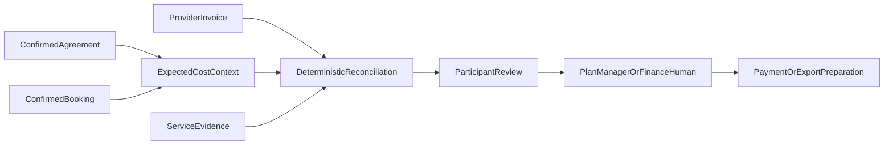

# AbilityPay financial coordination

AbilityPay separates organisation subscription billing, provider invoices,
participant funding context, reconciliation and payment-provider transactions.
All values use integer cents where practical.

Reconciliation uses neutral difference codes. It may identify a possible
duplicate, missing service evidence or a difference from expected cost, but it
does not determine fraud, funding eligibility or payment approval.

Participant decisions are recorded as immutable receipts. Payment execution
and NDIS claim submission are hard-disabled. A plan manager or authorised
finance professional remains responsible for regulated payment and claiming
workflows.
