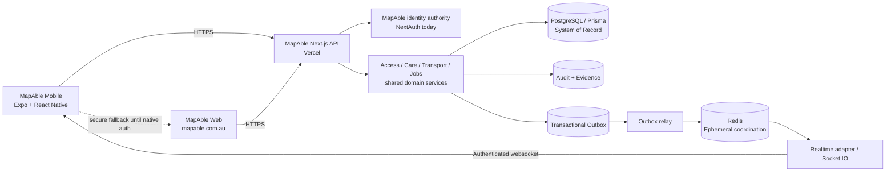

# MapAble Mobile Architecture

**Status:** In development  
**Canonical client:** `apps/independence`  
**System of record:** `ausdisau/mapableau-new`  
**Public MapAble brand origin:** `https://mapable.com.au`

## Decision

Build one accessibility-first React Native MapAble application over the existing MapAble web/API platform. Do not create a second participant database, a second identity authority, or mobile-only Care, Transport or Jobs business logic.

## Evidence ledger

| Item | Status | Evidence | Consequence |
| --- | --- | --- | --- |
| Expo/RN mobile foundation | Implemented, not independently verified | `apps/independence` uses Expo 57, React Native 0.86 and React Navigation 7 | Extend this app rather than start a third mobile codebase |
| Legacy Companion foundation | Implemented, not independently verified | `apps/companion` is Expo 52 and contains Visit Pack / Stop AURA foundations | Port useful functions after SDK/storage convergence; do not keep two divergent participant apps |
| Access search API | Implemented, not independently verified in production | `GET /api/access/search`; native runtime already validates its response | R1 native Access search can be first live vertical slice |
| Care API domain | Implemented, not independently verified in production | `/api/care/*` routes for bookings, requests, schedules, shifts, service logs and incidents | Native Care must reuse server contracts |
| Transport API domain | Implemented, not independently verified in production | `/api/transport/*` routes for quotes, bookings, trips, routing, accessibility and continuity | Native Transport must reuse server contracts |
| Jobs API domain | Implemented, not independently verified in production | `/api/jobs` and job-detail routes | Native Jobs must reuse server contracts |
| Protected API auth | Verified in repository | `requireApiSession()` resolves a NextAuth server session | Native protected calls stay gated until a reviewed session exchange exists |
| PostgreSQL authority | Verified architectural intent and current Prisma use | Prisma domain routes + cloud platform architecture | Redis must never become participant/booking/consent SoR |
| Redis infrastructure module | Implemented, not independently verified in production | `infra/modules/redis/main.tf` | Server-side Redis can be introduced behind provider-neutral flags after security/recovery testing |
| Realtime server | Implemented, not independently verified in production | `apps/realtime-server` uses Socket.IO with room authorization | Mobile realtime should subscribe through authenticated server channels, never Redis directly |

## Target topology

## Mobile information architecture

R1 bottom navigation uses five participant-facing destinations:

1. **Today** — cross-module orientation and connected journeys.
2. **Access** — accessibility place discovery with provenance/confidence.
3. **Care** — requests, bookings, shifts and support evidence.
4. **Travel** — accessible journey coordination, quotes, bookings and trip status.
5. **Jobs** — inclusive jobs with candidate-controlled disclosure and optional support/transport planning.

This is deliberately narrower than the full MapAble ecosystem. Foods, Moves, Marketplace, Kids, Age, Navigate, Academy and other verticals can be added only when their shared Core dependencies and operating controls are ready.

## Authority boundaries

### PostgreSQL / Prisma: authoritative

Keep durable, participant-impacting state here:

- user and organisation membership;
- participant profile and communication/accessibility preferences;
- delegate grants and consent receipts;
- Care requests, bookings, shifts, service agreements and evidence;
- Transport quotes, bookings, trips, vehicles and trip events;
- Jobs, applications, adjustment requests and disclosure receipts;
- invoices, payments, reconciliation and funding metadata;
- complaints, incidents, credential evidence and audit records.

### Redis: ephemeral only

Redis is a coordination and latency layer, not a second database.

| Need | Redis structure | Key pattern | TTL / retention |
| --- | --- | --- | --- |
| Tenant realtime events | Stream | `tenant:<tenantId>:mobile:events` | Bounded by consumer/retention policy |
| Presence | Hash | `tenant:<tenantId>:mobile:presence:<userId>` | 90 seconds |
| Idempotency | String | `tenant:<tenantId>:mobile:idempotency:<actionId>` | 10 minutes |
| Room membership | Set | `tenant:<tenantId>:mobile:room:<roomId>:members` | Session lifecycle |
| Public Access search cache | String | `public:access:search:<sha256>` | 5 minutes |

Do not place participant narratives, clinical notes, full support plans, raw search text, passwords, tokens or billing records in Redis.

Redis Cluster hash tags are intentionally absent from the R1 keyspace. No R1 operation requires atomic multi-key access. Add a scoped hash tag only when a concrete transaction, Lua script or multi-key command requires same-slot placement.

## Redis runtime rules

Production adapters must:

- use persistent pooled or multiplexed connections, not one TCP connection per request;
- use TLS and dedicated ACL credentials with least-privilege key patterns;
- remain network-restricted rather than internet-exposed;
- pipeline independent bulk operations;
- use `SCAN`/`SSCAN`/`HSCAN` for iteration, never `KEYS` or unbounded container reads in request paths;
- set connect/read timeouts and bounded retries appropriate to the caller;
- degrade gracefully when Redis is unavailable: durable domain writes stay in PostgreSQL/outbox and non-critical presence/cache features may fail open;
- never use a Redis replica read for strict-freshness state such as idempotency or service confirmation.

Minimum observability: used memory, connected/blocked clients, operations/sec, keyspace hit ratio, rejected connections, replication/persistence health, `SLOWLOG`, and alerting before memory/client exhaustion.

## Event contract

Realtime events are notifications of durable state changes, not the state itself. A mobile event contains identifiers and minimal structured metadata so the client can refetch authorised current state.

Initial event families:

- `care.booking.updated`
- `care.shift.updated`
- `transport.trip.updated`
- `transport.booking.updated`
- `jobs.application.updated`
- `notification.created`

An event must never expand the receiving user's authority. Server-side authorization applies both when publishing into a user/tenant channel and when the client joins a realtime room.

## Authentication and native session exchange

### Current state

Protected Care, Transport and Jobs APIs call `requireApiSession()`, which uses the MapAble NextAuth server session. The R1 Expo client therefore must not invent a bearer token or copy a browser session secret into application code.

### Required native bridge

Before native protected reads/writes are enabled:

1. authenticate through the existing MapAble identity authority using a system-browser/PKCE or equivalent reviewed first-party flow;
2. exchange the authorization result server-side for a short-lived, revocable mobile session credential;
3. store only the mobile credential in OS-protected secure storage;
4. bind the credential to the user/device/session and retain server-side revocation capability;
5. have API guards resolve exactly the same `CurrentUser`, role, organisation membership, participant authority and permissions as web requests;
6. enforce MFA/passkey requirements for risk-sensitive operations;
7. test logout, lost-device revocation, refresh rotation, expired credentials, tenant boundary attacks and replay.

Until this exists, protected native tabs may provide information architecture but live participant data continues through the secure responsive web flow.

## Consent and participant control

Mobile does not weaken MapAble Core controls:

- direct communication with the participant remains the default;
- delegates receive explicit scoped and revocable authority only;
- location, health/safety information, employment disclosure, analytics and cross-module reuse remain separate purposes;
- Care and Transport confirmations are independent even when shown as one connected journey;
- no AI suggestion automatically assigns a worker, books transport, sends an application, changes consent or releases payment;
- complaints, incidents and human escalation remain reachable without an AI or smartphone dependency.

## Accessibility acceptance criteria

Accessibility is a release gate.

R1 must maintain:

- WCAG 2.2 AA-equivalent mobile interaction principles plus Apple/Android accessibility APIs;
- minimum 48dp touch targets for interactive controls;
- native screen-reader roles/labels/state and logical focus order;
- system text scaling without clipped critical content;
- no gesture-only critical action;
- no mandatory camera, QR, speech, biometric or live-location interaction for an essential journey;
- visible text status/error information that does not rely on colour alone;
- reduce-motion/system appearance compatibility;
- plain-language content and AAC-compatible alternatives;
- responsive web fallback for essential MapAble functions.

## Offline posture

Do not implement a broad offline mirror of MapAble participant records.

A later bounded encrypted offline pack may contain only the minimum participant-authorised communication/access information required for a specific visit, with explicit expiry, device revocation and deletion. Reuse the useful Companion Visit Pack model only after migrating it onto Expo 57 and verified secure storage; plain AsyncStorage is prohibited for sensitive material.

## Vercel boundary

The MapAble web/API remains a Vercel-hosted Next.js platform. `apps/realtime-server` is already separated as a realtime server project. The mobile binary is distributed through native app channels; it consumes MapAble APIs and realtime endpoints but is not itself a Vercel server deployment.

Vercel preview deployments are appropriate for server/API changes on pull requests. Production mobile builds must point only to an explicitly configured and verified MapAble API origin.

## Feature flags

Incomplete or not-yet-verified server capabilities default off:

- `MAPABLE_MOBILE_NATIVE_AUTH_ENABLED`
- `MAPABLE_MOBILE_REALTIME_ENABLED`
- `MAPABLE_MOBILE_REDIS_ENABLED`

Flags declare configuration intent only. They do not prove a production adapter, partner integration, security review, recovery test or service SLA exists.

## R1 release gates

Before any public pilot:

- native app typecheck and CI pass;
- Access search verified against the intended environment;
- screen reader + text scaling + keyboard/switch-access test pass for essential screens;
- native identity exchange implemented and permission-tested before protected data appears in-app;
- no mobile secrets in `EXPO_PUBLIC_*` configuration;
- Redis TLS/ACL/network controls and failover/degradation tests pass if Redis is enabled;
- realtime room authorization/IDOR tests pass;
- push notification previews are redacted by default;
- privacy/consent text reflects the actual data sent by each flow;
- web fallback remains available;
- rollback is documented: disable mobile auth/realtime/Redis flags without losing PostgreSQL domain state.

## Next vertical slice

The smallest safe next slice is **participant Today timeline**:

1. native sign-in/session exchange;
2. read-only Care bookings and Transport trips authorised for the current participant;
3. merge them client-side into a chronological Today view;
4. optionally receive minimal Redis/realtime invalidation events and refetch authoritative state;
5. no create/accept/cancel/payment operation in that slice;
6. measure usability, accessibility, API latency, reconnect behaviour and Redis cache/event performance before expanding write authority.
