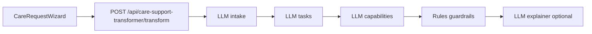

# Care and Support LLM

Domain-specialized gpt-oss layer for the **MapAble Care** request wizard. When enabled, structured LLM steps augment the rule-based care transformer pipeline while **deterministic guardrails always run last**.

## Prerequisites

1. **MapAble Agent model runtime** — same stack as `/agent`:
   - Local: Ollama with `gpt-oss:20b` (or configured model)
   - Production/Vercel: HTTPS `VLLM_BASE_URL` pointing to an OpenAI-compatible endpoint
2. `MAPABLE_AGENT_ENABLED=true`
3. PostgreSQL (unchanged — no new migrations for care LLM)

## Environment variables

| Variable | Default | Description |
|----------|---------|-------------|
| `CARE_AGENT_LLM_ENABLED` | `false` | Master switch for LLM intake/task/capability/explainer steps |
| `CARE_AGENT_LLM_FALLBACK_TO_RULES` | `true` | Fall back to regex/rules on LLM failure or low confidence |
| `CARE_AGENT_LLM_CONFIDENCE_THRESHOLD` | `0.75` | Minimum LLM confidence before fallback |

Reuses `MAPABLE_AGENT_MODEL_PROVIDER`, `OLLAMA_BASE_URL`, `VLLM_BASE_URL`, and related MapAble Agent vars.

## Local setup

```bash
# In .env.local
MAPABLE_AGENT_ENABLED=true
MAPABLE_AGENT_MODEL_PROVIDER=ollama
OLLAMA_BASE_URL=http://127.0.0.1:11434
MAPABLE_AGENT_MODEL=gpt-oss:20b

CARE_AGENT_LLM_ENABLED=true
CARE_AGENT_LLM_FALLBACK_TO_RULES=true
```

```bash
pnpm dev
# Visit /care/request and submit a care description
```

## Pipeline behaviour



| Step | LLM when enabled | Fallback |
|------|------------------|----------|
| Intake | `generateObject` → request type, risks, scheduling | [`careIntakeAgent`](../../server/agents/care/careIntakeAgent.ts) regex |
| Tasks | Structured task list | [`careTaskTransformer`](../../server/agents/care/careTaskTransformer.ts) |
| Capabilities | Suggests extra capability ids; rules merge | [`workerCapabilityAgent`](../../server/agents/care/workerCapabilityAgent.ts) |
| Guardrails | **Always rules** | [`careGuardrailAgent`](../../server/agents/care/careGuardrailAgent.ts) |
| Explainer | Plain-language summary | [`carePlanExplainer`](../../server/agents/care/carePlanExplainer.ts) templates |

Pipeline version in audit:
- `care-support-transformer-v1` — rules only
- `care-support-transformer-v2` — LLM enabled

## Safety

- Structured JSON only (`generateObject` + Zod) — no free-form parsing
- Booking remains blocked until participant confirmation
- Guardrails cannot be bypassed by LLM output
- Audit records include `llm.enabled`, `llm.provider`, `llm.fallbackUsed`, `llm.minConfidence`
- Agent decisions include `source: "llm" | "rules"`

## Vercel deployment

Same constraints as MapAble Agent:

1. Set `MAPABLE_AGENT_MODEL_PROVIDER=vllm`
2. Set `VLLM_BASE_URL` to a reachable HTTPS endpoint
3. Enable `CARE_AGENT_LLM_ENABLED=true` only after health check passes:
   ```bash
   curl https://your-app.vercel.app/api/mapable-agent/health
   ```

## Module layout

```
lib/care-agent/
  config.ts
  prompts.ts
  schemas.ts
  intake-llm.ts
  task-llm.ts
  capability-llm.ts
  explainer-llm.ts
```

## Tests

```bash
pnpm test tests/care-agent
pnpm test tests/care-support-transformer
```
