# CareOS architecture

```mermaid
flowchart LR
  participant[Participant] --> dashboard[MapAbleDashboard]
  dashboard --> api[CareOSRouteHandlers]
  api --> context[ServerBuiltContext]
  context --> policy[ConsentAuthorityPolicy]
  policy --> registry[GovernedReadOnlyTools]
  registry --> services[ExistingCareTransportAccessServices]
  services --> mission[MissionComposer]
  mission --> result[RecommendationsEvidenceUncertainty]
  result --> participant
```

Trust boundaries: browser input is treated as a request only; participant ID,
roles, permission, authority and consent are constructed on the server. Tools
never receive a Prisma client from an agent. The mission composer owns all
tool selection and no specialist may perform peer-to-peer handoffs.
