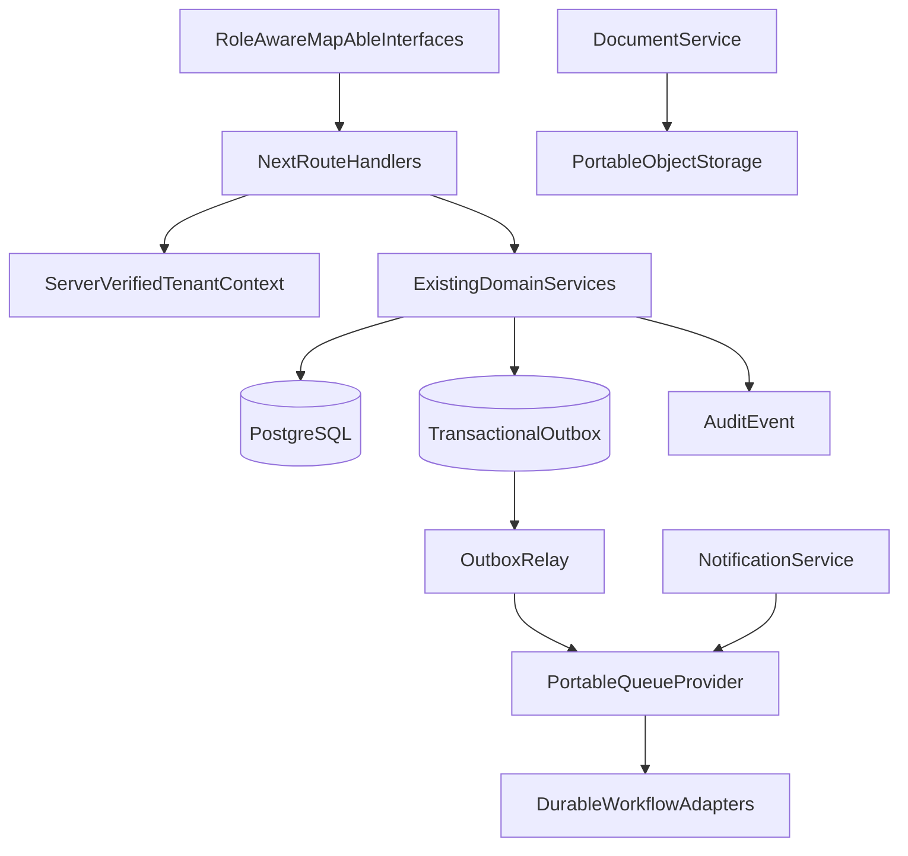

# CareOS cloud platform architecture

The initial topology remains Vercel plus managed PostgreSQL. Redis, object
storage and managed queues are introduced only through provider-neutral
interfaces and after production adapters, access controls and recovery tests
exist.

## Tenant isolation

Tenant context is resolved from authenticated user membership and an
organisation workspace. Client-supplied tenant IDs are never authoritative.
Participant authority remains separate from organisation membership.

## Event delivery

Domain state and an outbox event must be written in one Prisma transaction.
The relay retries with bounded exponential backoff and dead-letters after five
failed attempts. Event payloads contain identifiers and minimal structured
data, not participant narratives.

## Rollback

Disable `CLOUD_OUTBOX_ENABLED` and `CLOUD_WORKFLOWS_ENABLED` to stop new cloud
automation while preserving domain state and pending events. Recording
providers are prohibited in production.
