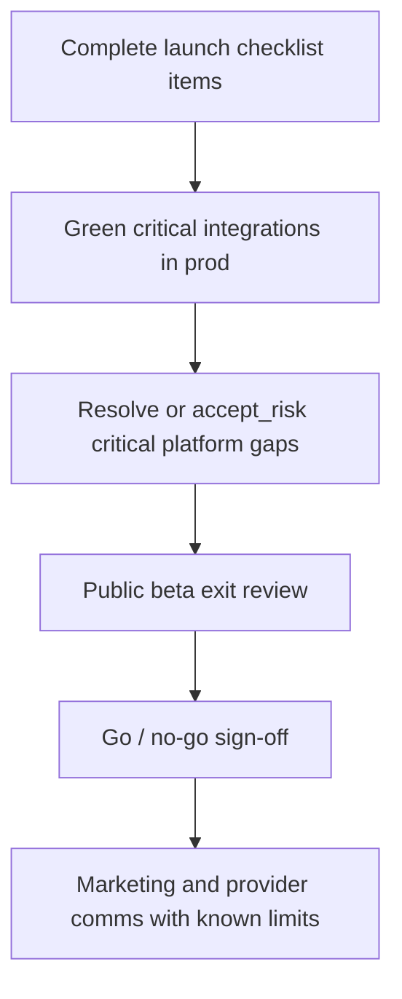

# Full public launch (MapAble)

This guide defines what **full public launch** means for MapAble: an openly marketed, participant- and provider-facing platform on Vercel with production billing, safeguarding, and operational support — not a private pilot or beta cohort only.

Use it with:

| Surface | Purpose |
|---------|---------|
| [`/admin/launch-readiness`](https://github.com/ausdisau/mapableau-new/blob/main/app/admin/launch-readiness/page.tsx) | Executable checklist (`LaunchReadinessItem`) — **gate for `productionReady`** |
| [`/admin/platform-gaps`](https://github.com/ausdisau/mapableau-new/blob/main/app/admin/platform-gaps/page.tsx) | Product, integration, tenancy, and mirrored launch gaps |
| [`/admin/integrations`](https://github.com/ausdisau/mapableau-new/blob/main/app/admin/integrations/page.tsx) | Live connector health |
| [`/admin/ndia-readiness`](https://github.com/ausdisau/mapableau-new/blob/main/app/admin/ndia-readiness/page.tsx) | NDIA API posture (submission off until approved) |
| [`/admin/security-readiness`](https://github.com/ausdisau/mapableau-new/blob/main/app/admin/security-readiness/page.tsx) | Security control scaffolding (not certification) |
| [`/admin/public-beta`](https://github.com/ausdisau/mapableau-new/blob/main/app/admin/public-beta/page.tsx) | Beta feedback exit criteria |

Canonical checklist codes live in [`lib/launch-readiness/public-launch-checklist.ts`](../lib/launch-readiness/public-launch-checklist.ts).

---

## Launch gate

**Public launch is allowed when:**

1. **Launch readiness** reports `productionReady: true` — every checklist item is `ready` or `waived`, and the database contains the full checklist (seeded from `PUBLIC_LAUNCH_CHECKLIST`).
2. **Critical platform gaps** are `mitigated`, `closed`, or explicitly `accepted_risk` with notes — especially Stripe, incident escalation, NDIA submission policy, and Care/billing limitations communicated.
3. **No undeclared P0** defects in Care, auth, consent, or payment flows.

Run seed after deploy if checklist rows are missing:

```bash
# From app bootstrap or a one-off script that calls seedDefaultLaunchItems()
# Requires MOBILE_PRODUCTION_READINESS_ENABLED !== "false" (default on)
```

---

## Checklist categories (22 items)

| Category | Focus |
|----------|--------|
| **safeguards** | Incident escalation tested |
| **resilience** | DR exercise with restore evidence |
| **operations** | Dispatch runbook, support SLAs, provider onboarding, oncall, status comms |
| **mobile** | A11y test pass, app store privacy labels |
| **accessibility** | Public web WCAG audit |
| **legal** | Privacy policy, terms, consent flow review |
| **infrastructure** | Stripe prod, integration health, backup/restore, observability, load review |
| **security** | Security controls reviewed (admin frameworks) |
| **community** | Peer moderation ready |
| **governance** | Beta exit review, executive go / no-go |

Each item syncs to **Platform gaps** (`launch_ops`) with detector `launch_item_sync`.

---

## Beyond the checklist (platform gaps)

Full launch also requires honest posture on **documented limitations**:

### Product (Master BP + modules)

- **Care MVP** — manual roster, no GPS/recurring bookings, NDIS pricing and invoices are placeholders ([`README_CARE_MODULE.md`](../README_CARE_MODULE.md)).
- **Transport** — no live GPS / route optimisation ([`README_TRANSPORT_MODULE.md`](../README_TRANSPORT_MODULE.md)).
- **Jobs** — foundation only, not full ATS ([`README_JOBS_FOUNDATION.md`](../README_JOBS_FOUNDATION.md)).
- **Satellite apps** — Independence, Moves, Emergency, Foods, News are roadmap-only on `/core#ecosystem`.
- **Core UI** — optional Phase 4 polish (ecosystem header, signed-in hero CTA).

### Integrations

- **Live:** Postgres, Stripe, Xero, NDIA readiness module, MapLibre (when env configured).
- **Stubs:** Keycloak, Temporal, n8n, Directus, Metabase, FHIR, telehealth, Cal.com, ERPNext, etc. — do not market until adapters ship.
- **Auth0 social** — optional; verify env per [`docs/integrations/environment.md`](integrations/environment.md).

### Tenancy & providers

- **Provider Pro** is billed to the **user** `BillingAccount`, not the organisation row — document for multi-org admins.
- **Provider auth** bridges `OrganisationMember` and legacy `ProviderUserRole` — unified model incomplete.

### Compliance & NDIS

- **No real NDIA API submission** until formally approved (`phase5Config.ndiaRealSubmissionEnabled` must stay false in pilot).
- **No automatic** NDIS claims or Quality and Safeguards Commission submission — human approval only ([`docs/safety.md`](safety.md)).

### Billing

- Plan-managed NDIS uses export flows, not Stripe Checkout ([`docs/billing.md`](billing.md)).
- Multi-provider payment splits are stubbed for a later release.
- PayPal via Stripe depends on Stripe account region ([`docs/billing-paypal-via-stripe.md`](billing-paypal-via-stripe.md)).

---

## Recommended launch sequence



1. **Technical** — production env, Stripe webhooks, backups, observability, load review.
2. **Safeguards** — incident escalation, DR, peer moderation, consent copy.
3. **Legal** — privacy, terms, app store labels.
4. **Commercial** — provider onboarding runbook, support SLAs, Provider Cloud + Care scope messaging.
5. **Governance** — beta exit + go/no-go recorded on checklist item `PUBLIC_LAUNCH_GO_NO_GO`.

---

## What full public launch does *not* require (v1)

- Shipping all five satellite apps
- Enabling OSS stub integrations in production
- NDIA live API submission
- Org-scoped Provider Pro billing (may follow as accepted-risk gap)
- Full transport GPS or Care AI matching

---

## Adding or changing checklist items

1. Edit [`lib/launch-readiness/public-launch-checklist.ts`](../lib/launch-readiness/public-launch-checklist.ts).
2. Re-run `seedDefaultLaunchItems()` (upserts by `code`).
3. Platform gap mirror updates automatically via `buildLaunchGapCatalogEntries()`.
4. Update this doc if the launch scope meaningfully changes.

See also [`docs/platform-gap-analysis.md`](platform-gap-analysis.md).
