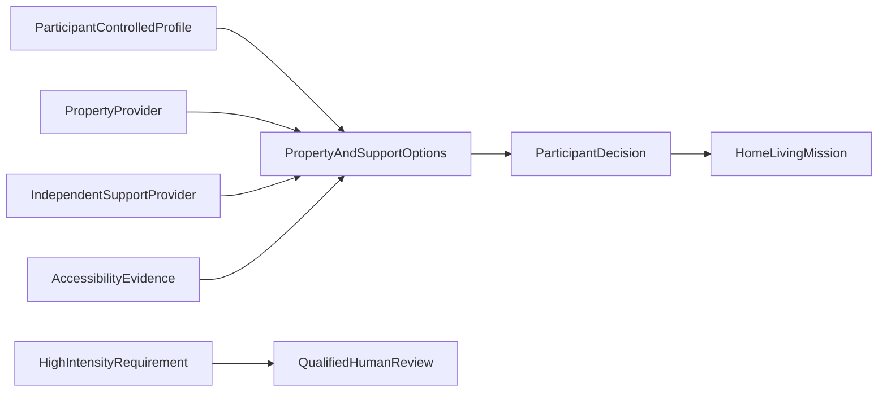

# Home and Living platform

Property, tenancy, accommodation, personal support, transport, equipment and
community participation remain separate dependencies. Property and support
providers do not need to be the same organisation; conflicts of interest must
remain visible.

Home and Living profiles preserve participant preferences, privacy choices,
dignity-of-risk choices and non-negotiables. The profile does not determine
funding eligibility or infer living preference from diagnosis.

Property marketing claims remain unverified until supported by separately
recorded accessibility evidence with source, observation date and verification
status.
