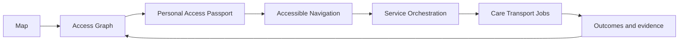

# MapAble Innovation Portfolio

**Programme:** MapAble — Australian Disability Ltd  
**Document type:** Delivery-ready innovation portfolio (reviewable SoT)  
**Status:** Documentation pass — **not** a production-ready or Verified live claim  
**Repository:** MapAbleAU (Next.js 15 + Prisma/PostgreSQL + NextAuth + pnpm)

---

## North star

MapAble evolves into:

**ACCESSIBILITY INFRASTRUCTURE** + **PARTICIPANT-CONTROLLED SERVICE ORCHESTRATION**

### Strategic flywheel



### Programme decision rule

> Does this capability give disabled people more reliable information, more control over decisions, or a substantially easier path to participation?

If not, reduce priority. Avoid expanding into operationally complex verticals merely because they are technically possible.

---

## Core operating principles

Every Epic is designed around:

- Participant choice, autonomy, and decision ownership
- Dignity of risk — not paternalistic risk elimination
- Supported decision-making
- Purpose-bound consent
- Privacy and minimum-necessary disclosure
- Accessible communication, including AAC
- WCAG 2.2 AA as a release criterion
- Screen-reader, keyboard, switch, and alternative-input compatibility
- Plain-language and Easy Read pathways where appropriate
- Human escalation for consequential decisions
- Auditable provenance
- Feature flags and safe rollback
- Non-AI fallback paths
- Evidence before prediction

### Claim states (mandatory)

| State | Meaning |
|-------|---------|
| **Verified live** | Independently verified in production |
| **Implemented, not independently verified** | Code/schema exists; not externally verified |
| **In development** | Partial, flagged, or pilot |
| **Proposed** | Documented; little/no product implementation |
| **Exploratory** | Research/synthetic sandbox |
| **Historical** | Superseded stack |

**Source of truth:** repository and deployed implementation — not strategy documents alone.

---

## Portfolio index

| # | Epic | Priority | Horizon | Claim state | Spec |
|---|------|----------|---------|-------------|------|
| 01 | MapAble Access Graph | P0 | Foundation | In development | [epics/01-access-graph.md](./epics/01-access-graph.md) |
| 02 | Personal Access Passport | P0 | Foundation | Implemented, not independently verified | [epics/02-personal-access-passport.md](./epics/02-personal-access-passport.md) |
| 03 | MapAble Navigate | P1 | Experience | In development | [epics/03-navigate.md](./epics/03-navigate.md) |
| 04 | Access Intelligence Vision | P3 | R&D | Exploratory | [epics/04-access-intelligence-vision.md](./epics/04-access-intelligence-vision.md) |
| 05 | Accessibility Digital Twins | P3 | R&D | In development | [epics/05-accessibility-digital-twins.md](./epics/05-accessibility-digital-twins.md) |
| 06 | MapAble Accreditation OS | P0 | Foundation | Implemented, not independently verified | [epics/06-accreditation-os.md](./epics/06-accreditation-os.md) |
| 07 | Participant Orchestration Agent | P2 | Controlled Intelligence | In development | [epics/07-participant-orchestration-agent.md](./epics/07-participant-orchestration-agent.md) |
| 08 | Accessible Communications Fabric | P1 | Experience | In development | [epics/08-accessible-communications-fabric.md](./epics/08-accessible-communications-fabric.md) |
| 09 | Trust & Credential Network | P0 | Foundation | Implemented, not independently verified | [epics/09-trust-credential-network.md](./epics/09-trust-credential-network.md) |
| 10 | Funding & Payment Integrity Engine | P2 | Controlled Intelligence | In development | [epics/10-funding-payment-integrity.md](./epics/10-funding-payment-integrity.md) |
| 11 | Employment Accessibility Graph | P2 | Participation | In development | [epics/11-employment-accessibility-graph.md](./epics/11-employment-accessibility-graph.md) |
| 12 | Circular Assistive Technology Network | P3 | R&D | Exploratory | [epics/12-circular-assistive-technology.md](./epics/12-circular-assistive-technology.md) |
| 13 | MapAble Access API | P2 | Commercialisation | Proposed | [epics/13-access-api.md](./epics/13-access-api.md) |
| 14 | MapAble Access Observatory | P2 | Commercialisation | Proposed | [epics/14-access-observatory.md](./epics/14-access-observatory.md) |
| 15 | MapAble Academy + Capability Passport | P2 | Participation | Exploratory | [epics/15-academy-capability-passport.md](./epics/15-academy-capability-passport.md) |

### Programme documents

- [architecture-baseline.md](./architecture-baseline.md) — as-built snapshot (Prompt 00)
- [gap-analysis.md](./gap-analysis.md) — gaps vs target architecture
- [implementation-roadmap.md](./implementation-roadmap.md) — sequenced PR programme
- [research-translation-model.md](./research-translation-model.md) — MRFF-informed sequencing rationale
- [Superpowers phase plans](../superpowers/plans/README.md) — executable prompt series
- [co-design-governance.md](./co-design-governance.md) — disability-led research governance (Prompt 01)
- [PORTFOLIO_DEPENDENCY_MAP.md](./PORTFOLIO_DEPENDENCY_MAP.md)
- [PORTFOLIO_STAGE_GATES.md](./PORTFOLIO_STAGE_GATES.md)
- [PORTFOLIO_KPIS.md](./PORTFOLIO_KPIS.md)
- [PORTFOLIO_RISK_REGISTER.md](./PORTFOLIO_RISK_REGISTER.md)
- [PORTFOLIO_ROADMAP.md](./PORTFOLIO_ROADMAP.md)
- [AZURE_DEVOPS_IMPORT.md](./AZURE_DEVOPS_IMPORT.md)
- [azure-devops-portfolio.json](./azure-devops-portfolio.json)

---

## Repository reuse matrix (REUSE / EXTEND / REFACTOR / NEW / DEFER)

| Capability | Classification | Repo anchor | Claim state |
|------------|----------------|-------------|-------------|
| Identity & auth | REUSE | NextAuth, `lib/auth/*`, passkeys | Implemented |
| Roles & permissions | REUSE | `lib/auth/roles.ts`, permissions | Implemented |
| Organisation tenancy | REUSE | `Organisation`, `OrganisationMember` | Implemented |
| Multi-tenant v2 | EXTEND | `Tenant`, flagged | In development |
| Consent | REUSE/EXTEND | `ConsentRecord`, `lib/consent/*` | Implemented, flagged |
| Disclosure receipts | EXTEND | `ParticipantAccessReceipt`, Trust Fabric | Implemented, flagged |
| Audit events | REUSE | `AuditEvent`, `lib/audit/*` | Implemented |
| Feature flags | REUSE | `lib/config/*`, domain flags | Implemented |
| Access place SoT | EXTEND | `AccessPlace`, `lib/access/*` | Implemented (discovery) |
| Access Passport schema | EXTEND | `AccessPassport`, infrastructure types | Implemented, not verified |
| Access observations | EXTEND | `AccessObservationRecord`, envelopes | In development |
| Living Access Fabric | EXTEND | `lib/access/intelligence-next/*` | In development / synthetic |
| Accreditation scaffold | EXTEND | `lib/access/accreditation*`, QMS | Implemented, flagged |
| Transport trips | REUSE | `TransportTrip*`, `lib/transport/*` | Controlled pilot |
| Care bookings | REUSE | `CareRequest*`, `lib/care/*` | Controlled pilot |
| Jobs foundation | REUSE | `Job*`, jobs participation flags | Implemented / flagged |
| Messaging | REUSE | `Conversation`, `Message` | Implemented |
| Communication prefs | EXTEND | `lib/communication/*` | In development |
| Complaints | REUSE | Engagement `Complaint` | Implemented |
| Incidents | REUSE | `IncidentReport*` | Implemented |
| Billing / Stripe | REUSE | `lib/billing/*`, Stripe | Implemented, gated |
| Billing copilot | EXTEND | deterministic copilot | Implemented |
| NDIA live claiming | DEFER | `BILLING_NDIA_OFFICIAL_ENABLED=false` | Blocked |
| AI search interpreters | REUSE | `search.nl_interpreter` | Production_supported w/ keys |
| Navigator pilot | EXTEND | governed pilot flags off | Experimental |
| Vision AI | NEW | deferred in CURRENT_STATE | Exploratory |
| AT equipment | EXTEND | `AtEquipmentAsset` | In development |
| Academy | EXTEND | `AcademyCompetencyProposal` | Exploratory |
| Developer API keys | EXTEND | partner API migration | In development |
| Indoor / floor plans | EXTEND | `AccessFloorPlan` | In development |
| Starting Work slice | REUSE | synthetic pilot | Controlled pilot |
| Co-design protocol | REUSE | `docs/co-design-protocol.md` | Policy implemented |
| A11y CI | REUSE | Playwright a11y, accessibility.yml | Implemented |

**Rule:** Do not create parallel identity, consent, messaging, audit, complaints, credential, billing, or accessibility place systems inside verticals.

---

## Shared MapAble Core (target entities)

All Epics align to shared Core rather than vertical duplicates:

User, Organisation, Role, Membership, DelegateGrant, ParticipantProfile, AccessibilityPreference, CommunicationPreference, MobilityAid, ConsentRecord, DataPurpose, DisclosureReceipt, Provider, Worker, Credential, Place, AccessFeature, AccessObservation, Verification, AccreditationAssessment, ServiceOffering, Availability, CareRequest, CareShift, ServiceAgreement, Task, Timesheet, Trip, Vehicle, Driver, RouteEstimate, TripEvent, Employer, Job, Application, AdjustmentRequest, MessageThread, Notification, SupportTicket, Complaint, Incident, FundingSource, Quote, Invoice, Payment, Reconciliation, Document, EvidenceItem, AuditEvent, FeatureFlag.

---

## First vertical slice

**Accessible Appointment / Employment Journey** — minimum Epic set: **E01 + E02 + E03 + E08** + thin Care/Transport REUSE + optional E11 disclosure gates.

See [PORTFOLIO_ROADMAP.md](./PORTFOLIO_ROADMAP.md) and [Starting Work pilot](../productisation/STARTING_WORK_PILOT.md).

---

## AI governance (programme-wide)

**Architectural rule:** MODEL PROPOSES → POLICY SERVICES VALIDATE → PARTICIPANT DECIDES → AUTHORISED SYSTEM EXECUTES

- One orchestrating agent first (E07); no multi-agent swarm without eval benefit
- Minimum 15-case eval set for AI Epics (see E04, E07, E10 specs)
- `MAPABLE_AI_PUBLIC_CLAIM_ENABLED` remains false until ConvergenceOS approves per capability

---

# Final report (documentation pass)

## 1. Repository state inspected

Inspected MapAbleAU monorepo: Next.js 15 App Router, Prisma 6.x (~721 models), PostgreSQL/Neon, NextAuth, pnpm workspace, Vercel deploy, Vitest (~322 suites) + Playwright a11y CI, feature-flagged controlled pilots. Historical Replit/Drizzle twin present but not canonical.

## 2. Architecture discovered

**Primary pattern:** Next.js route handlers + domain services in `lib/**` + unified Prisma schema. Verticals (care, transport, jobs, access, billing) share org-centric tenancy, consent, audit, and messaging. Access Infrastructure framework documented in `docs/access-infrastructure/` with Prisma foundation. AI platform registry in `docs/ai-platform/` with honesty gates.

## 3. Existing capabilities that can be reused

Identity/auth, consent, audit, feature flags, messaging, complaints/incidents, billing centre, access place discovery map, Access Passport schema, accreditation scaffolds, transport/care/jobs pilots, co-design protocol, a11y CI, Starting Work synthetic vertical slice, developer API key patterns.

## 4. Material gaps

Canonical verified Access Graph with full taxonomy/freshness/dispute; passport recipient-type sharing UX; Navigate suitability routing; operational Accreditation OS end-to-end; programme orchestration agent (distinct from Navigator pilot); multi-channel AAC comms fabric; public Access API; privacy-preserving Observatory; Vision CV pipeline; digital twin evidence pipeline; circular AT marketplace; Capability Passport separate from course completion.

## 5. 15-Epic portfolio summary

Fifteen Epics defined with 42 sections each, 7 stage-gate Features + 4–8 product Features per Epic, REUSE classifications, MVP/pilot/scale criteria. Priority 0 Foundation: E01, E02, E06, E09. See portfolio index above.

## 6. Dependency order

Foundation (01, 02, 09, 06) → Experience (03, 08) → Controlled Intelligence (07, 10) → Participation (11, 15) → Commercialisation (13, 14) → R&D (04, 05, 12). See [PORTFOLIO_DEPENDENCY_MAP.md](./PORTFOLIO_DEPENDENCY_MAP.md).

## 7. First recommended vertical slice

Accessible Appointment/Employment Journey using E01+E02+E03+E08 + Care/Transport reuse; E07 thin approve-execute when ready.

## 8. Stage-gate structure

G0–G6 defined in [PORTFOLIO_STAGE_GATES.md](./PORTFOLIO_STAGE_GATES.md) with pass/fail criteria aligned to co-design protocol and controlled pilot patterns.

## 9. Top programme risks

R01 inferred access as verified; R02 passport as universal disclosure; R03 autonomous orchestration; R04 unauthorised disclosure; R09 funding overclaim; R10 re-identification in API/Observatory. See [PORTFOLIO_RISK_REGISTER.md](./PORTFOLIO_RISK_REGISTER.md).

## 10. Accessibility blockers

Manual AT testing required before G5; Easy Read for consent/plans; voice-independent comms; no Epic complete on automated tests alone.

## 11. Privacy/consent blockers

Recipient-type sharing matrix + revocation load testing (E02); agent context boundaries (E07); employer zero-disclosure default (E11); API/Observatory passport exclusion (E13/E14).

## 12. Safeguarding blockers

AI prohibited from abuse/reportability/restrictive practice decisions; emergency escalation boundaries in E08; break-glass audited.

## 13. AI-governance blockers

15-case eval suite before E07 G4; CV locked to UNVERIFIED; public AI claims off; one orchestrator only.

## 14. Azure DevOps items created

**None.** ADO PAT/org unset. Import-ready JSON and strategy in [AZURE_DEVOPS_IMPORT.md](./AZURE_DEVOPS_IMPORT.md).

## 15. Items deliberately not created

~15 Epics, ~180 Features, zero User Stories/Tasks/Tests — awaiting portfolio validation and ADO credentials.

## 16. Recommended next implementation Epic

**E01 — MapAble Access Graph** (Priority 0). Immediately followed by E02 and E06 (with E09 for assessor credentials).

**G3 status:** Engineering proof landed — see [E01_ACCESS_GRAPH_G3_STATUS.md](./E01_ACCESS_GRAPH_G3_STATUS.md). Enable with:

```
MAPABLE_ACCESS_INFRASTRUCTURE_ENABLED=true
MAPABLE_ACCESS_GRAPH_ENABLED=true
```

Still required before pilot: formal G0/G1/G2 human gates; dispute workflow Feature; E06 verification promotion path.

## 17. Exact next Codex action

1. Programme review of this portfolio with Product + DRO co-design sign-off for Foundation wave G1.  
2. Authorise Azure DevOps import using `azure-devops-portfolio.json` and ProgrammeKey idempotent create (**still blocked** — ADO credentials unset).  
3. **E01 G3 landed** (observation→store→read behind flags) — see [E01_ACCESS_GRAPH_G3_STATUS.md](./E01_ACCESS_GRAPH_G3_STATUS.md). Next engineering: G4 pilot runbook + dispute/correction Feature; do not promote claim state without G5.  
4. Do **not** claim Verified live or production-ready until G5 evidence and ConvergenceOS claim gates pass.

---

*This document does not constitute a production-ready claim. Documentation and work item proposals alone are not operational capability.*
