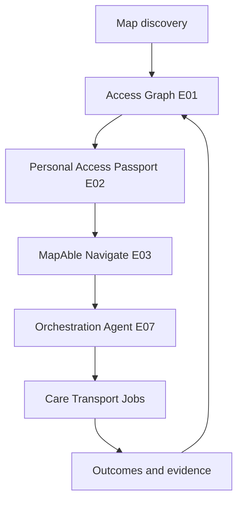
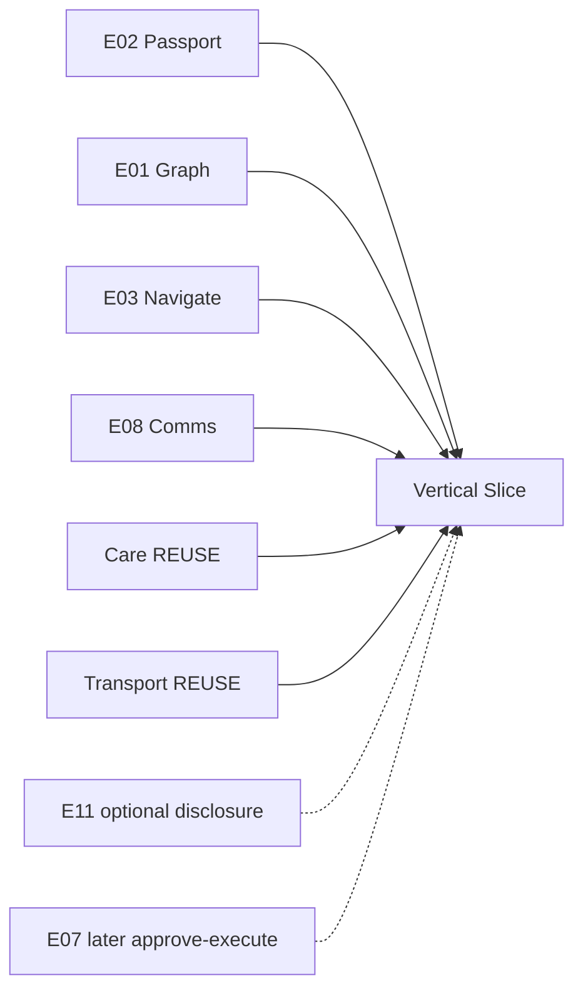

# MapAble Innovation Portfolio — Dependency Map

**Last updated:** Portfolio documentation pass  
**Purpose:** Cross-Epic dependencies, Shared Core usage, and delivery sequencing constraints.

---

## Programme flywheel

---

## Wave dependency order

| Wave | Epics | Depends on |
|------|-------|------------|
| **Foundation** | E01, E02, E06, E09 | Shared Core (identity, consent, audit) |
| **Experience** | E03, E08 | E01, E02; E09 for worker/driver comms trust |
| **Controlled Intelligence** | E07, E10 | E01–E03, E08; billing Shared Core |
| **Participation** | E11, E15 | E01–E03, E02, E09; thin E08 |
| **Commercialisation** | E13, E14 | E01, E06 verified graph; E03 for route resources |
| **R&D** | E04, E05, E12 | E01 observation pipeline; E02 for passport preview |

---

## Cross-Epic dependency matrix

| Epic | Upstream (must exist first) | Downstream (enabled by this) |
|------|----------------------------|------------------------------|
| **E01 Access Graph** | Shared Core: Place, AccessObservation, Audit | E02–E07, E11–E14 |
| **E02 Passport** | E01 (compatibility targets); ConsentRecord | E03, E07, E11, E05 preview |
| **E03 Navigate** | E01 graph; E02 passport optional | E07, E11 commute, E14 heatmaps |
| **E04 Vision** | E01 observation ingestion | E01 enriched proposals |
| **E05 Digital Twins** | E01 spatial entities; indoor partial | E03 indoor stitch; E06 venue planning |
| **E06 Accreditation OS** | E01, E09 assessor credentials | E01 verified facts; E13 API |
| **E07 Orchestration** | E02, E03, E08; vertical APIs read-only | Vertical slice demonstrator |
| **E08 Comms Fabric** | Messaging, CommunicationPreference | E07 status updates; all verticals |
| **E09 Credentials** | Shared Core Worker/Provider/Credential | E06, E15, transport/care gates |
| **E10 Funding Integrity** | Billing Centre, quotes, invoices | Care/transport billing pilots |
| **E11 Employment Graph** | E01 workplace access; E02 disclosure; E03 commute | E14 employment clusters |
| **E12 Circular AT** | AtEquipmentAsset; E09 trust | E07 equipment coordination (future) |
| **E13 Access API** | E01 + E06 published facts | External ecosystem |
| **E14 Observatory** | E01 coverage; E03 barriers; E11 clusters | Policy/planning users |
| **E15 Academy** | E09 credentials; evidence docs | E09 capability passport; Starting Work |

---

## Shared Core — do not duplicate

All Epics **REUSE** these programme capabilities (see [MAPABLE_INNOVATION_PORTFOLIO.md](./MAPABLE_INNOVATION_PORTFOLIO.md) reuse matrix):

- User, Organisation, Role, Membership, DelegateGrant
- ParticipantProfile, AccessibilityPreference, CommunicationPreference
- ConsentRecord, DataPurpose, DisclosureReceipt (ParticipantAccessReceipt)
- AuditEvent, FeatureFlag, Document, EvidenceItem
- MessageThread (Conversation/Message), Notification, SupportTicket, Complaint, Incident
- Provider, Worker, Credential, Trip, Vehicle, Driver (vertical orchestration only)

**Explicit prohibition:** No Epic may introduce parallel identity, consent, messaging, audit, complaints, credential, billing, or accessibility place SoT.

---

## First vertical slice dependencies

**Accessible Appointment / Employment Journey** minimum Epic set:

**Not required for slice:** E04, E05, E12, E13, E14, full E07 autonomy, E10 funding AI.

---

## Azure DevOps dependency link types

When importing to Azure DevOps, use **Predecessor** links:

- `E02` → predecessor `E01` (soft: compatibility needs place capabilities)
- `E06` → predecessors `E01`, `E09`
- `E03` → predecessors `E01`, `E02`
- `E07` → predecessors `E02`, `E03`, `E08`
- `E13` → predecessors `E01`, `E06`
- `E14` → predecessors `E01`, `E03`, `E11` (partial)

Gate Features chain within each Epic: G0 → G1 → … → G6.
