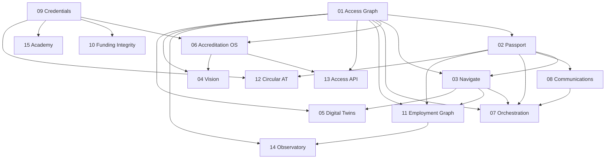

# Portfolio Dependency Map

## Epic dependency graph

## Shared Core links (do not rebuild)

- Identity/auth — lib/auth
- Consent/receipts — lib/consent
- Authority/delegates — lib/authority + DelegateInvitation
- Audit — lib/audit
- Messaging — lib/messages
- Complaints/incidents — Complaint / IncidentReport
- Credentials — WorkerTrustCredential
- Feature flags — fail-closed env flags
- Access place identity — AccessPlace C-011
- Access passport — AccessPassport C-010

## Feature-level predecessor notes

| Epic | Must precede Features in |
| --- | --- |
| 01 | 02 taxonomy refs, 03 journey evaluate, 06 graph publish, 11 workplace profiles, 13/14 aggregates, 04/05 evidence |
| 02 | 03 fit, 07 tools, 08 prefs, 11 disclosure, 12 AT share |
| 09 | 06 assessor identity, 10 trust signals, 15 credential link, 12 partner trust |
| 03 + thin 08 | 07 first vertical slice |
| 06 | 04 assessor validation, 13 verified payloads |
