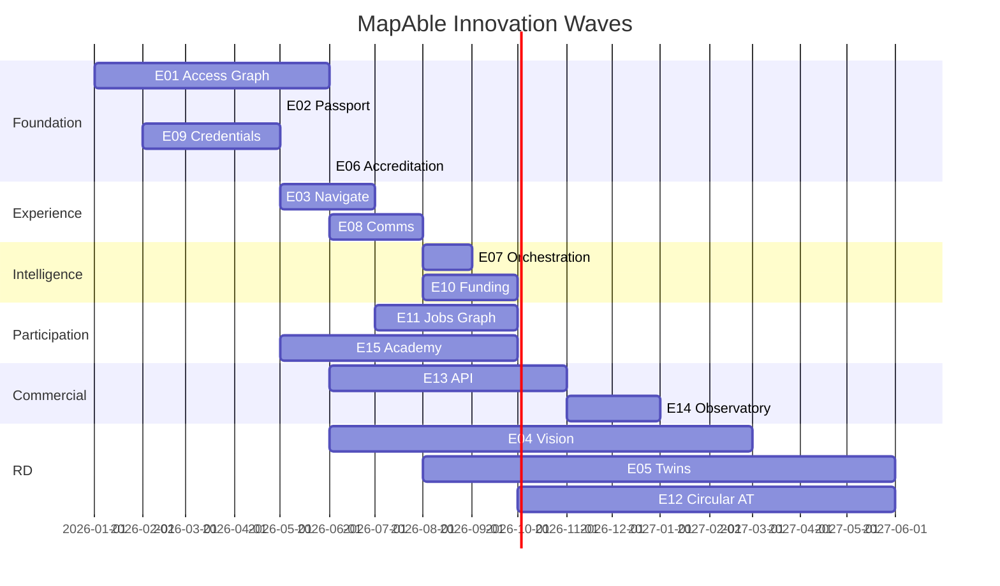

# MapAble Innovation Portfolio — Roadmap

**Horizon model:** Programme waves (not calendar dates)  
**Decision rule:** Prefer work that strengthens Access Evidence → Participant Control → Accessible Journey → Service Coordination → Participation → Better Evidence.

---

## Delivery waves

### Wave 1 — Foundation (Priority 0 start)

| Order | Epic | Rationale |
|-------|------|-----------|
| 1 | **E01 Access Graph** | Priority 0; canonical evidence SoT; blocks flywheel |
| 2 | **E02 Personal Access Passport** | Participant control layer; depends on graph targets |
| 3 | **E09 Trust & Credential Network** | Assessor/worker trust for accreditation and services |
| 4 | **E06 Accreditation OS** | Verified fact pipeline into graph |

**Exit criteria:** Pilot region with feature-level evidence, passport sharing with receipts, one accreditation cycle publishing to graph.

---

### Wave 2 — Experience

| Order | Epic | Rationale |
|-------|------|-----------|
| 5 | **E03 MapAble Navigate** | Suitability routing using graph + passport |
| 6 | **E08 Accessible Communications Fabric** | Status, escalation, AAC for journey coordination |

**Exit criteria:** Accessible route with uncertainty UI; comms escalation without phone tree for pilot cohort.

---

### Wave 3 — Controlled Intelligence

| Order | Epic | Rationale |
|-------|------|-----------|
| 7 | **E07 Participant Orchestration Agent** | Propose-only planning after E02/E03/E08 |
| 8 | **E10 Funding & Payment Integrity** | Advisory billing layer; deterministic rules first |

**Exit criteria:** Orchestration eval suite pass; no silent bookings; funding language advisory-only verified.

---

### Wave 4 — Participation

| Order | Epic | Rationale |
|-------|------|-----------|
| 9 | **E11 Employment Accessibility Graph** | Jobs + access + transport compatibility |
| 10 | **E15 Academy + Capability Passport** | Workforce capability; course ≠ competence |

**Exit criteria:** Interview journey with disclosure control; capability credentials linked not conflated with course completion.

---

### Wave 5 — Platform Commercialisation

| Order | Epic | Rationale |
|-------|------|-----------|
| 11 | **E13 MapAble Access API** | External verified access data product |
| 12 | **E14 MapAble Access Observatory** | Privacy-preserving aggregate intelligence |

**Exit criteria:** Partner API with provenance; observatory with k-anonymity proof review.

---

### Wave 6 — R&D

| Order | Epic | Rationale |
|-------|------|-----------|
| 13 | **E04 Access Intelligence Vision** | CV proposals; human verification only |
| 14 | **E05 Accessibility Digital Twins** | Spatial models when evidence exists |
| 15 | **E12 Circular Assistive Technology Network** | Equipment passport; no clinical overclaim |

**Exit criteria:** R&D gates passed; no production claims without G5 evidence.

---

## First vertical slice — Accessible Appointment / Employment Journey

Evolve from [Starting Work pilot](../productisation/STARTING_WORK_PILOT.md).

### Minimum Epic involvement

| # | Capability | Epic / reuse |
|---|------------|--------------|
| 1 | Understand chosen accessibility requirements | E02 |
| 2 | Destination accessibility evidence | E01 |
| 3 | Evidence confidence displayed | E01, E03 |
| 4 | Accessible route options | E03 |
| 5 | Compatible transport | Transport REUSE + E03 |
| 6 | Optional support requirements | Care REUSE + E02 |
| 7 | Propose coordinated plan | E07 thin OR deterministic planner |
| 8 | Participant approval | E02 consent + E07 gates |
| 9 | Execute approved actions only | Care/Transport REUSE |
| 10 | Accessible status updates | E08 |
| 11 | Cancellation/change | E08 + vertical APIs |
| 12 | Escalate to person | E08 |
| 13 | Outcomes and corrections | E01 dispute + audit |

### Explicitly out of slice scope

E04 Vision, E05 Twins, E12 AT marketplace, E13 API productisation, E14 Observatory, full E10 funding AI.

---

## Recommended next implementation Epic

**E01 — MapAble Access Graph** (after this portfolio documentation is approved).

Then **E02** and **E06** in parallel only where E09 credential dependencies for assessors are satisfied.

---

## Parallel work constraints

- Do **not** start E13/E14 before E01 has verified observation pipeline and E06 publish path.
- Do **not** start E07 G4 before E02 sharing controls and E08 escalation exist.
- E04/E05/E12 may proceed in R&D sandbox without blocking Foundation wave.

---

## Milestone map (programme level)

*Note: Gantt illustrates wave overlap only — not committed calendar delivery dates.*
