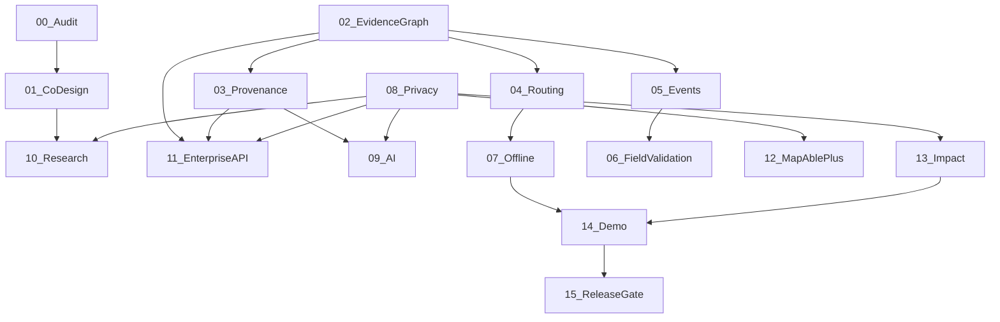

# MapAble Innovation — Implementation Roadmap

**Document type:** Sequenced PR programme (one prompt = one PR)  
**Status:** Prompt 00 baseline  
**Date:** 2026-09-02  
**Execution plans:** [docs/superpowers/plans/](../superpowers/plans/README.md)

> **MRFF disclaimer:** Historical 2016–2021 MRFF references are architecture precedents only — not 2026 funding policy.

---

## Execution model

1. Read [00-orchestrator.md](../superpowers/plans/00-orchestrator.md)
2. Create branch: `cursor/<descriptive-name>-dee8`
3. Implement **only** the target prompt scope
4. Run verification checklist (typecheck, tests, Playwright/axe as applicable)
5. Commit with the **exact** message from the plan
6. Open PR; **stop** until reviewed before starting the next prompt

**Prompt 00** (this document's parent) is documentation only. **Prompt 15** is review only.

---

## Hard dependencies

| Dependency | Rule |
|------------|------|
| **01** before **10** | Research governance before health-access pilot |
| **02** before **03, 04, 05, 11** | Evidence graph before ingestion, routing, events, API |
| **03** before **09, 11** | Provenance before AI pipeline and enterprise API |
| **08** before **09, 10, 11, 12, 13** | Privacy lanes are a hard gate |
| **14** requires **07–13** | Materially complete or explicitly risk-documented |
| **15** requires **01–14** | Merged or waived with evidence |

---

## Deferred epic track (archived plans)

| Archived plan | Epic | Disposition |
|---------------|------|-------------|
| [archive/02-personal-access-passport.md](../superpowers/plans/archive/02-personal-access-passport.md) | E02 | Absorbed into Prompts 04 + 08 |
| [archive/04-access-intelligence-vision.md](../superpowers/plans/archive/04-access-intelligence-vision.md) | E04 | Superseded by Prompt 09 |
| [archive/05-accessibility-digital-twins.md](../superpowers/plans/archive/05-accessibility-digital-twins.md) | E05 | Deferred post-demonstrator |
| [archive/06-accreditation-os.md](../superpowers/plans/archive/06-accreditation-os.md) | E06 | Parallel track; feeds graph via publication |

---

## Prompt 01 — Disability-Led Co-Design & Governance

| Field | Detail |
|-------|--------|
| **PR scope** | First-class co-design and research participation domain |
| **Reuse** | `docs/co-design-protocol.md`, `ResearchProject` (`prisma/schema.prisma`), `lib/research/research-project-service.ts`, `lib/consent/consent-service.ts` |
| **New** | `packages/research/`, `app/web/app/research/`, `app/admin/research/`, entities: `CoDesignProgramme`, `CoDesignParticipant`, `ResearchRole`, `ResearchConsent`, `ResearchContribution`, `ContributionPayment`, `ResearchDecision`, `CommunityReview`, `AccessibilityFinding` |
| **Schema** | Co-design and research participation models with granular consent, withdrawal, payment records |
| **API** | Research participation APIs with role separation |
| **Mobile** | Accessible participation interfaces (future phases) |
| **Privacy** | Research consent ≠ service consent; no unnecessary diagnoses; functional access requirements |
| **Migration risks** | Forward-only migrations; seed co-design programmes separately |
| **Deployment** | Feature-flagged research UI |
| **Tests** | Audit tests: consent separation, withdrawal stops collection, governance records auditable |
| **Epic cross-ref** | New domain; supports E01–E15 governance |
| **Prerequisites** | Prompt 00 merged |
| **Commit** | `feat: establish disability-led research governance` |
| **Plan** | [01-co-design-governance.md](../superpowers/plans/01-co-design-governance.md) |

---

## Prompt 02 — Accessibility Evidence Graph

| Field | Detail |
|-------|--------|
| **PR scope** | Production v1 of evidence-backed accessibility graph (no routing UI) |
| **Reuse** | `lib/access/infrastructure/`, `lib/access/intelligence-next/evidence/`, `AccessObservationRecord`, `AccessPathNode`, `AccessPathSegment`, archived [01-access-graph.md](../superpowers/plans/archive/01-access-graph.md) |
| **New** | Domain types: `AccessibilityNode`, `AccessibilityEdge`, `AccessibilityFeature`, `AccessibilityObservation`, `EvidenceSource`, `EvidenceClaim`, `EvidenceConfidence`, `EvidenceFreshness`, `TemporaryCondition`, `AccessConstraint`, `FunctionalPreference`; provenance states |
| **Schema** | PostGIS evaluation; indexes for bbox, nearest-feature, route-segment, freshness, source lookup |
| **API** | Internal typed service interfaces before public endpoints |
| **Mobile** | None in this PR |
| **Privacy** | No participant PII in graph assertions |
| **Migration risks** | Reversible migrations; fix pre-existing freshness test failures |
| **Deployment** | `MAPABLE_ACCESS_EVIDENCE_PERSISTENCE_ENABLED` flag |
| **Tests** | unknown vs inaccessible; conflicting observations; source precedence; freshness decay; temporary barriers |
| **Epic cross-ref** | E01 (primary) |
| **Prerequisites** | Prompt 00 merged |
| **Commit** | `feat: add accessibility evidence graph foundation` |
| **Plan** | [02-accessibility-evidence-graph.md](../superpowers/plans/02-accessibility-evidence-graph.md) |

---

## Prompt 03 — Provenance, Licensing & Data Ingestion

| Field | Detail |
|-------|--------|
| **PR scope** | Geospatial ingestion and provenance pipeline |
| **Reuse** | `lib/access/infrastructure/provenance.ts`, `lib/integrations/adapters/openstreetmap-adapter.ts`, `lib/integrations/adapters/maplibre-adapter.ts` |
| **New** | `packages/data-ingestion/`, `packages/provenance/`, adapters (OSM, Overture, GTFS, GTFS-RT, municipal GIS, venue, community), evidence resolution service, idempotent ingestion |
| **Schema** | Source, license, attribution, acquisition timestamp, geographic precision, permitted uses, validation state, ingestion version |
| **API** | Internal ingestion + resolution services |
| **Mobile** | None |
| **Privacy** | License metadata preservation; no silent overwrite of conflicting evidence |
| **Migration risks** | Ingestion version tracking for rollback |
| **Deployment** | Ingestion workers; Temporal only if multi-step durability justified |
| **Tests** | Duplicate ingestion; license preservation; conflicting sources; authoritative updates; stale reports; source deprecation |
| **Epic cross-ref** | E01 infrastructure |
| **Prerequisites** | Prompt 02 merged |
| **Commit** | `feat: add provenance-aware accessibility ingestion` |
| **Plan** | [03-provenance-data-ingestion.md](../superpowers/plans/03-provenance-data-ingestion.md) |

---

## Prompt 04 — Personalised Accessible Routing

| Field | Detail |
|-------|--------|
| **PR scope** | Profile-based accessible routing with evidence explanations |
| **Reuse** | `lib/access/navigate/route-planner.ts`, `lib/access/navigate/scoring.ts`, `lib/go/route-service.ts`, `lib/go/profile-service.ts`, archived [03-navigate.md](../superpowers/plans/archive/03-navigate.md), E02 passport via `AccessPassport` |
| **New** | `FunctionalMobilityProfile`, hard/soft constraints, route strategies (Reliable, Easier, Simpler, Fastest), per-segment evidence explanation |
| **Schema** | Mobility profile extensions; route plan evidence snapshots |
| **API** | Extend `app/api/go/routes/plan/`, `app/api/access/navigate/route/` |
| **Mobile** | Route display with evidence state (Android travel feature) |
| **Privacy** | Profile data purpose-bound; not exposed on public API |
| **Migration risks** | Sandbox → live graph transition behind flag |
| **Deployment** | Extend existing routing; do not replace transport vehicle routing |
| **Tests** | Stairs exclusion; slope preference; lift outage; stale penalty; conflicting observations; no route available; never invent evidence |
| **Epic cross-ref** | E03 (primary), E02 (absorbed) |
| **Prerequisites** | Prompts 02, 03 merged |
| **Commit** | `feat: add evidence-aware personalised routing` |
| **Plan** | [04-personalised-accessible-routing.md](../superpowers/plans/04-personalised-accessible-routing.md) |

---

## Prompt 05 — Real-Time Accessibility Event Network

| Field | Detail |
|-------|--------|
| **PR scope** | Waze-like accessibility event layer |
| **Reuse** | `AccessTemporaryBarrier`, `app/api/go/barriers/` |
| **New** | `packages/accessibility-events/`, event types (lift outage, blocked ramp, construction, etc.), moderation, corroboration, route invalidation, notifications |
| **Schema** | Generalised accessibility events with verification state, expiry, confidence |
| **API** | Event ingestion, moderation, authoritative override |
| **Mobile** | Event reporting + notifications |
| **Privacy** | Anti-poisoning; unverified reports cannot permanently alter infrastructure |
| **Migration risks** | Event schema versioning |
| **Deployment** | Temporal only for durable multi-step processing |
| **Tests** | Duplicate/contradictory reports; expiry; authoritative reopening; rapid reports; route recalculation |
| **Epic cross-ref** | E01, E03 |
| **Prerequisites** | Prompt 02 merged |
| **Commit** | `feat: add real-time accessibility event layer` |
| **Plan** | [05-real-time-accessibility-events.md](../superpowers/plans/05-real-time-accessibility-events.md) |

---

## Prompt 06 — Field Validation & Community Reporting

| Field | Detail |
|-------|--------|
| **PR scope** | Accessible evidence contribution workflow |
| **Reuse** | Observation APIs, `lib/access/intelligence-next/evidence/` |
| **New** | Structured observations, photo pipeline with metadata stripping/redaction, evidence states (submitted → verified), contributor reputation (quality only, not public scores) |
| **Schema** | Contribution records, moderation queue |
| **API** | Contribution submission, moderation |
| **Mobile** | Screen-reader, voice-control, switch-access, large targets UI |
| **Privacy** | Face/plate redaction; avoid private-location exposure |
| **Migration risks** | Image quarantine until redacted |
| **Deployment** | Moderation workflow behind flag |
| **Tests** | Anonymous/identified boundaries; image privacy; revocation; moderation; duplicates; malicious submissions |
| **Epic cross-ref** | E01 community evidence |
| **Prerequisites** | Prompt 05 merged |
| **Commit** | `feat: add accessible evidence contribution workflow` |
| **Plan** | [06-field-validation-community-reporting.md](../superpowers/plans/06-field-validation-community-reporting.md) |

---

## Prompt 07 — Offline & Resilient Mobile Navigation

| Field | Detail |
|-------|--------|
| **PR scope** | Downloadable regional packs; resilient accessible travel |
| **Reuse** | `lib/accesscast/offline-store-contract.ts`, `mobile-contracts/schemas/accesscast-offline.ts`, `apps/android/` |
| **New** | Regional packs (map, routing graph, evidence, POIs, barriers), secure local persistence, freshness UI |
| **Schema** | Pack versioning, checksum |
| **API** | Pack download endpoints |
| **Mobile** | Android + Expo; no auth tokens in AsyncStorage; offline state labels |
| **Privacy** | Encrypted local route state |
| **Migration risks** | Pack schema versioning |
| **Deployment** | Pack CDN or API-served bundles |
| **Tests** | Network loss; app restart; expired evidence; corrupt pack; large text; screen reader |
| **Epic cross-ref** | E03 + mobile |
| **Prerequisites** | Prompt 04 merged |
| **Commit** | `feat: add resilient offline accessible navigation` |
| **Plan** | [07-resilient-offline-navigation.md](../superpowers/plans/07-resilient-offline-navigation.md) |

---

## Prompt 08 — Privacy, Consent & Mobility Data Separation

| Field | Detail |
|-------|--------|
| **PR scope** | Four-lane privacy architecture |
| **Reuse** | `lib/consent/*`, `lib/platform/privacy/*`, `lib/trust/fabric/*`, archived E02 passport patterns |
| **New** | `lib/platform/privacy/data-lanes.ts`, `posthog-sanitizer.ts`, retention policies, participant export/deletion, location-sharing expiry |
| **Schema** | `dataLane` on consent records |
| **API** | Lane-scoped consent, export, deletion |
| **Mobile** | Active-sharing indicator |
| **Privacy** | **Critical gate** — research/marketing/commercial isolation |
| **Migration risks** | Backfill lane assignments |
| **Deployment** | PostHog deny-list enforced before any product analytics expansion |
| **Tests** | `mobility-lane-separation.test.ts`, `posthog-deny-list.test.ts` |
| **Epic cross-ref** | Cross-cutting; E02 absorbed |
| **Prerequisites** | Prompt 07 merged |
| **Commit** | `feat: enforce mobility data purpose separation` |
| **Plan** | [08-mobility-data-purpose-separation.md](../superpowers/plans/08-mobility-data-purpose-separation.md) |

---

## Prompt 09 — Computer Vision & AI Evidence Pipeline

| Field | Detail |
|-------|--------|
| **PR scope** | Governed AI-assisted accessibility mapping |
| **Reuse** | `lib/access/intelligence-next/`, archived [04-access-intelligence-vision.md](../superpowers/plans/archive/04-access-intelligence-vision.md) (reference only) |
| **New** | `packages/accessibility-ai/`, proposal queue → validation → graph; `MODEL_INFERRED` only |
| **Schema** | Model version audit trail |
| **API** | Proposal submission (internal); no direct truth table writes |
| **Mobile** | None |
| **Privacy** | Geographic telemetry without participant identity |
| **Migration risks** | Model version migration |
| **Deployment** | AI cannot write to production truth tables |
| **Tests** | Low-confidence cannot verify; hallucination cannot create routing edge; rejected proposal cannot affect route |
| **Epic cross-ref** | E04 superseded |
| **Prerequisites** | Prompts 03, 08 merged |
| **Commit** | `feat: add governed accessibility AI evidence pipeline` |
| **Plan** | [09-governed-ai-evidence-pipeline.md](../superpowers/plans/09-governed-ai-evidence-pipeline.md) |

---

## Prompt 10 — Health Access & Translational Research Pilot

| Field | Detail |
|-------|--------|
| **PR scope** | Research journey measurement framework (not clinical CDS) |
| **Reuse** | `lib/research/research-project-service.ts`, `lib/config/analytics-research.ts` |
| **New** | `ResearchJourney` protocol, VAJSR metrics, de-identified exports |
| **Schema** | `ResearchJourney`, `ResearchJourneyEvent` |
| **API** | `app/api/research/journeys/` (ethics-gated) |
| **Mobile** | Journey confidence rating |
| **Privacy** | Research consent separate; no raw traces without protocol authorisation |
| **Migration risks** | Ethics approval linkage |
| **Deployment** | `MAPABLE_RESEARCH_GOVERNANCE_ENABLED` |
| **Tests** | Consent separation; de-identified export; VAJSR calculation |
| **Epic cross-ref** | Research programme |
| **Prerequisites** | Prompts 01, 08 merged |
| **Commit** | `feat: add accessible journey research measurement framework` |
| **Plan** | [10-health-access-research-pilot.md](../superpowers/plans/10-health-access-research-pilot.md) |

---

## Prompt 11 — Enterprise Accessibility API

| Field | Detail |
|-------|--------|
| **PR scope** | Versioned enterprise accessibility intelligence API |
| **Reuse** | `app/api/v1/access/route.ts`, `lib/platform/api/v1-handler.ts`, parallel track E06 accreditation |
| **New** | `/api/v1/accessibility/*`, `/api/v1/routes/*`, `/api/v1/barriers/*`, tenant isolation, rate limits, webhooks, OpenAPI |
| **Schema** | API audit logs, partner event signatures |
| **API** | Full v1 surface with provenance on every response |
| **Mobile** | SDK extensions in `@mapable/sdk` |
| **Privacy** | No participant mobility profiles on API |
| **Migration risks** | API versioning strategy |
| **Deployment** | Partner API keys; scoped access |
| **Tests** | Cross-tenant isolation; provenance required; webhook lift-outage → reroute |
| **Epic cross-ref** | E13 (primary) |
| **Prerequisites** | Prompts 02, 03, 08 merged |
| **Commit** | `feat: expose governed accessibility intelligence API` |
| **Plan** | [11-enterprise-accessibility-api.md](../superpowers/plans/11-enterprise-accessibility-api.md) |

---

## Prompt 12 — MapAble+ Commercialisation

| Field | Detail |
|-------|--------|
| **PR scope** | Enterprise products without exploitation |
| **Reuse** | `lib/billing/*`, Stripe, existing MapAble+ infrastructure |
| **New** | Commercial truth separation enforcement, enterprise metering, audit records |
| **Schema** | `CommercialDataAccessAudit` |
| **API** | Billing integration for API/SDK products |
| **Mobile** | None |
| **Privacy** | Never sell mobility histories; separate confidence from partnership |
| **Migration risks** | Billing plan migration |
| **Deployment** | Essential consumer navigation remains free of commercial ranking distortion |
| **Tests** | Payment cannot alter truth; cannot suppress evidence; cannot buy confidence |
| **Epic cross-ref** | E13 + billing |
| **Prerequisites** | Prompts 08, 11 merged |
| **Commit** | `feat: connect accessibility intelligence to MapAble+ enterprise products` |
| **Plan** | [12-mapable-plus-commercialisation.md](../superpowers/plans/12-mapable-plus-commercialisation.md) |

---

## Prompt 13 — Impact Measurement & Innovation Dashboard

| Field | Detail |
|-------|--------|
| **PR scope** | Multi-domain impact dashboard with VAJSR north star |
| **Reuse** | `docs/innovation/PORTFOLIO_KPIS.md`, PostHog (sanitised), Neon analytics |
| **New** | Dashboard domains, accessible chart alternatives (tables, text summaries, SR descriptions) |
| **Schema** | Analytics aggregates (sensitive metrics stay off PostHog) |
| **API** | Admin/observatory endpoints |
| **Mobile** | None |
| **Privacy** | Never combine research and marketing datasets by shared ID |
| **Migration risks** | Metric definition versioning |
| **Deployment** | Role-gated dashboard |
| **Tests** | VAJSR calculation; research/marketing isolation |
| **Epic cross-ref** | E14 (primary) |
| **Prerequisites** | Prompt 08 merged |
| **Commit** | `feat: add MapAble innovation impact measurement` |
| **Plan** | [13-innovation-impact-measurement.md](../superpowers/plans/13-innovation-impact-measurement.md) |

---

## Prompt 14 — Sydney Demonstrator & Production Readiness

| Field | Detail |
|-------|--------|
| **PR scope** | Bounded metropolitan demonstrator with production gates |
| **Reuse** | `docs/operations/CONTROLLED_PILOT_CHARTER.md`, `lib/pilot/controlled-pilot-baseline.ts` |
| **New** | Pilot scorecard, `docs/pilots/<pilot-name>.md`, ops runbooks, incident response |
| **Schema** | Pilot boundary metadata |
| **API** | None (ops focus) |
| **Mobile** | Demonstrator QA |
| **Privacy** | Privacy review sign-off required |
| **Migration risks** | Production migration verification |
| **Deployment** | **Block deploy if critical false-safe routing defect unresolved** |
| **Tests** | Full gate suite: typecheck, unit, integration, Playwright, axe, routing, provenance |
| **Epic cross-ref** | Pilot ops |
| **Prerequisites** | Prompts 07–13 complete or risk-documented |
| **Commit** | `chore: prepare MapAble accessibility demonstrator` |
| **Plan** | [14-sydney-demonstrator-readiness.md](../superpowers/plans/14-sydney-demonstrator-readiness.md) |

---

## Prompt 15 — Research-to-Market Release Gate

| Field | Detail |
|-------|--------|
| **PR scope** | Independent review only — no feature code |
| **Output** | `docs/innovation/final-readiness-review.md` with status: `READY` \| `READY WITH CONDITIONS` \| `NOT READY` |
| **Verification** | 12 release-gate questions with evidence |
| **Prerequisites** | Prompts 01–14 merged or waived |
| **Commit** | `docs: add MapAble innovation final readiness review` (if committing review doc) |
| **Plan** | [15-final-readiness-review.md](../superpowers/plans/15-final-readiness-review.md) |

---

## Pre-existing failures to track (Prompt 00 baseline)

These exist on `main` and must not be attributed to innovation prompt work without explicit fix PRs:

| Check | Failure |
|-------|---------|
| `pnpm type-check` | 8 errors in `components/mapable-app/MapAbleApp.tsx` |
| `pnpm test` | 3 failures in `booking-rag-scope.test.ts`, `access-graph-observation-service.test.ts` |

Prompt 02 should address evidence graph freshness test failures as part of graph foundation work.

---

## Related documents

- [Architecture baseline](./architecture-baseline.md)
- [Gap analysis](./gap-analysis.md)
- [Research translation model](./research-translation-model.md)
- [MAPABLE_INNOVATION_PORTFOLIO.md](./MAPABLE_INNOVATION_PORTFOLIO.md)
- [Superpowers plans](../superpowers/plans/README.md)
