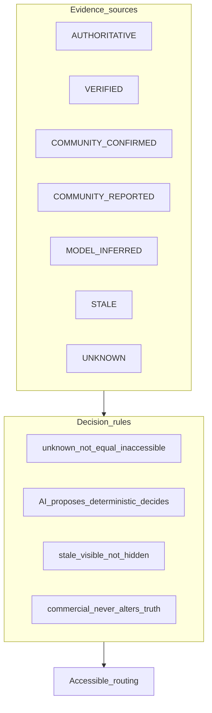

# MapAble Innovation — Research Translation Model

**Document type:** Research-to-impact architecture rationale  
**Status:** Prompt 00 baseline  
**Date:** 2026-09-02

---

## Disclaimer (mandatory)

The **2016–2021 Australian Medical Research and Innovation Strategy** is used in this programme as a **historical translation framework** — a precedent for how research moves from discovery to community benefit through co-design, infrastructure, collaboration, trials, commercialisation, and impact measurement.

It is **not**:

- The current 2026 MRFF funding strategy
- Proof of present grant eligibility
- A substitute for ethics approval, NDIS governance, or disability-led programme sign-off

All funding, ethics, and partnership decisions require contemporary authoritative sources and disability-community governance.

---

## Why this model applies to MapAble

The historical strategy identified weak early consumer involvement as a barrier to successful translation. MapAble's innovation sequencing addresses the same structural failure mode: building accessibility technology **for** disabled people without building it **with** them, without evidence infrastructure, and without measurable journey outcomes.

MapAble's programme principle mirrors the strategy's emphasis on **data and infrastructure before spectacle**:

> Data and trust before spectacle. AR, advanced conversational agents, and digital twins come only after the evidence graph, routing, provenance, real-time conditions, and privacy architecture are demonstrably reliable.

---

## Translation pillars mapping

| MRFF pillar (2016–2021) | MapAble prompt(s) | What it means technically | Repository anchor (today) |
|-------------------------|-------------------|---------------------------|---------------------------|
| **Consumer co-design** | 01 | Disability-led governance domain; paid participation; research ≠ service consent | `docs/co-design-protocol.md`, `lib/research/` |
| **Data & infrastructure** | 02, 03 | Evidence graph, ingestion, provenance, Neon/Postgres | `prisma/schema.prisma`, `lib/access/infrastructure/` |
| **Systems research** | 10 | Health-access journey protocol; aggregate outcomes; not clinical CDS | `lib/research/research-project-service.ts` |
| **Collaboration** | 01, 11, 12 | Partner APIs, municipal SaaS, enterprise integrations | `app/api/v1/*`, `lib/billing/*` |
| **Trials & translation** | 10, 14 | Research pilot + bounded demonstrator with production gates | `docs/operations/CONTROLLED_PILOT_CHARTER.md` |
| **Commercialisation** | 11, 12, 13 | Enterprise API, MapAble+, impact measurement — without selling mobility histories | `lib/billing/*`, portfolio E13/E14 |
| **Impact measurement** | 13, 15 | VAJSR north star; multi-domain dashboard; independent release review | `docs/innovation/PORTFOLIO_KPIS.md` |

---

## Evidence hierarchy (non-negotiable)



| Rule | Implementation requirement |
|------|---------------------------|
| Unknown ≠ inaccessible | Routing must not treat missing evidence as proof of access |
| AI proposes; services decide | Model output enters as `MODEL_INFERRED`; never auto-verified |
| Stale must be visible | UI and API expose freshness; stale incurs uncertainty cost |
| Commercial separation | Payment cannot change confidence, suppress evidence, or prefer unsafe routes |

---

## Ethical non-negotiables

1. **Research participation is never required for core navigation.**
2. **Research consent ≠ service consent** — separate records, separate enforcement, auditable.
3. **Precise mobility histories must not become advertising profiles.**
4. **Do not store unnecessary disability diagnoses** — use functional access requirements.
5. **No public scoring of disabled contributors** — reputation for evidence quality only.
6. **A paying customer cannot purchase higher accessibility confidence** or suppression of legitimate barrier reports.

---

## Outcome metrics

### North star

**Verified Accessible Journey Success Rate (VAJSR)**

```
VAJSR = completed_verified_accessible_journeys / total_completed_journeys
```

A journey is "verified accessible" only when route evidence meets defined provenance thresholds — not when a user merely completes a trip.

### Supporting measures (Prompts 10, 13)

| Domain | Examples |
|--------|----------|
| Journey outcomes | Unexpected barrier rate, abandonment, accessibility-induced reroutes |
| Data quality | % graph with verified evidence, median evidence age, report-to-validation time |
| Consumer experience | Participant confidence, geographic coverage inequality |
| Enterprise adoption | API usage, barriers referred to infrastructure owners, barriers resolved |
| Mission & equity | Research participation, co-design engagement |
| Privacy & security | Privacy incidents, consent revocation enforcement |
| Research translation | Pilot completion, ethics-compliant exports |
| Commercialisation | Recurring revenue (without mobility history sales) |

**Do not use engagement metrics alone as evidence of social impact.**

---

## Prompt sequencing rationale

```mermaid
flowchart LR
  subgraph phase1 [Data_and_trust]
    P01[01_Governance]
    P02[02_Evidence_graph]
    P03[03_Provenance]
    P04[04_Routing]
  end
  subgraph phase2 [Reliable_OS]
    P05[05_Events]
    P06[06_Field_validation]
    P07[07_Offline]
    P08[08_Privacy]
    P09[09_AI]
  end
  subgraph phase3 [Translation]
    P10[10_Research]
    P11[11_Enterprise_API]
    P12[12_MapAble_plus]
    P13[13_Impact]
  end
  subgraph phase4 [Release]
    P14[14_Demo]
    P15[15_Gate]
  end
  phase1 --> phase2 --> phase3 --> phase4
```



| Phase | MRFF alignment | Why this order |
|-------|----------------|----------------|
| 01–04 | Co-design + data infrastructure | Without governance and evidence, routing claims are unsafe |
| 05–09 | Infrastructure + systems reliability | Real-time conditions and privacy must wrap the graph |
| 10–13 | Trials + commercialisation + impact | Translation only after the operating system is trustworthy |
| 14–15 | Translation + measurement | Demonstrator proves real-world value; independent gate verifies |

---

## Portfolio epic cross-reference

The [MAPABLE_INNOVATION_PORTFOLIO.md](./MAPABLE_INNOVATION_PORTFOLIO.md) remains the programme index (E01–E15). The prompt series resequences delivery:

| Portfolio epic | Prompt series disposition |
|----------------|--------------------------|
| E01 Access Graph | **Prompt 02** (primary) |
| E02 Personal Access Passport | Absorbed into **Prompts 04, 08** |
| E03 MapAble Navigate | **Prompt 04** (primary) |
| E04 Access Intelligence Vision | Superseded by **Prompt 09** |
| E05 Digital Twins | **Deferred** post-demonstrator |
| E06 Accreditation OS | **Parallel track** (archive plan) |
| E07–E12 | Out of critical path; portfolio continues separately |
| E13 Access API | **Prompt 11** |
| E14 Observatory | **Prompt 13** |
| E15 Academy | Out of critical path |

---

## Relationship to co-design protocol

[`docs/co-design-protocol.md`](../co-design-protocol.md) establishes policy for HITL AI features. **Prompt 01** extends this into a first-class technical domain (`packages/research/`, co-design entities, payment records, consent separation) so governance is enforceable in code — not only in policy documents.

---

## Related documents

- [Architecture baseline](./architecture-baseline.md)
- [Gap analysis](./gap-analysis.md)
- [Implementation roadmap](./implementation-roadmap.md)
- [MAPABLE_INNOVATION_PORTFOLIO.md](./MAPABLE_INNOVATION_PORTFOLIO.md)
- [co-design-protocol.md](../co-design-protocol.md)
