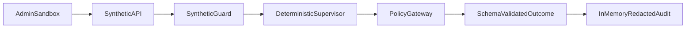

# Architecture

The library is intentionally isolated at `lib/intelligence/mainframe`. It
does not import database clients, production CareOS tools, provider SDKs, or
network adapters. Fixtures are the sole information source.
