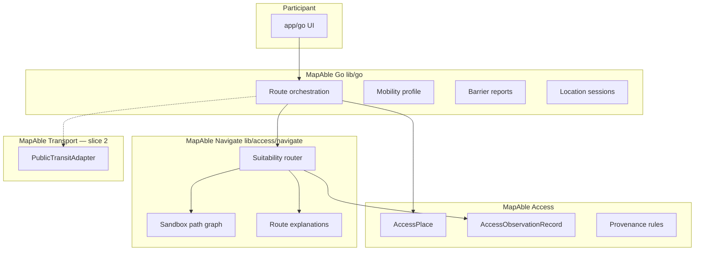

# MapAble Go — Architecture

**Claim state:** IN_DEVELOPMENT

## Layer diagram

## Domain ownership

Per [DOMAIN_OWNERSHIP.md](../remediation/DOMAIN_OWNERSHIP.md):

- **Access** owns evidence, path graph segments, observations
- **Navigate** (under `lib/access/navigate/`) owns outdoor suitability routing
- **Go** (`lib/go/`) orchestrates participant flows; does not mutate foreign aggregates
- **Transport** remains consume-only until slice 2

## API layering

1. `POST /api/access/navigate/route` — canonical routing engine (Epic 03)
2. `POST /api/go/routes/plan` — participant facade; calls same engine, persists `GoRoutePlan`, audits

No duplicate scoring logic.

## Data flow (route planning)

1. Load mobility profile from `AccessMobilityRoutingPreference` (via passport)
2. Load sandbox graph + active temporary barriers
3. Apply hard constraints → weighted multi-criteria scoring
4. Return 2–3 options with provenance-backed confidence
5. Participant selects → persist `GoRoutePlan` + optional `AccessJourneyRecord`

## Feature flags

Fail-closed: routes return 404/disabled when flags off. See `lib/config/mapable-go.ts`.
