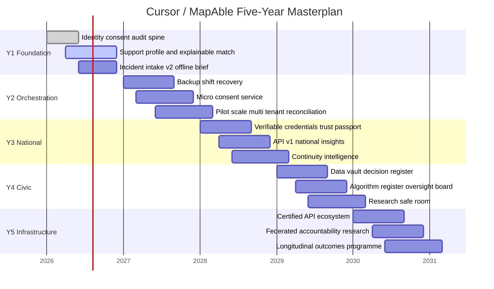

# Cursor — Five-Year Masterplan

**Platform:** MapAble (implementation codebase)  
**Horizon:** Five years from pre-scale to rights-governed care infrastructure  
**Status:** Board-quality strategic plan — legal/regulatory items marked **unspecified** unless noted  
**Last updated:** June 2026

---

## Executive summary

**Cursor** is a five-year masterplan for a disability care and support platform that evolves from coordinated service delivery into **rights-governed care infrastructure**. The implementation in this repository is **MapAble**: care, transport, bookings, billing, matching, consent, and civic governance modules already scaffolded across Phases 1–12.

**Central problem:** People with disability lose time, trust, and autonomy in fragmented systems—spreadsheets, message threads, opaque marketplaces, and handoffs that optimise provider efficiency over participant continuity.

**Strategic answer:** Build an **orchestration layer** that preserves trusted relationships, makes consent operational (not cosmetic), and gives every stakeholder a legitimate view without surveillance.

**Five-year ambition:** By year five, Cursor should be the **consent system-of-record and continuity engine** for a multi-sided care ecosystem—not “another marketplace,” not a clinical record, not an autonomous care allocator.

**Year-one wedge:** **Participant-controlled support profile + explainable matching + backup shift recovery** — solves urgent reliability pain while establishing trust infrastructure competitors cannot copy quickly.

**What we will not do:** Autonomous worker assignment, automated regulator submissions, surveillance-style “participant memory,” or claims of legal/compliance certification we have not earned.

---

## Strategic vision and mission

### Vision

Disability support becomes **infrastructure for autonomy, trust, continuity, and participation**—not a stream of disconnected transactions.

### Mission

Cursor gives participants, families, workers, and coordinators a shared, accessible, consent-driven operating layer so support arrangements stay **understood, stable, and adaptable** as life changes.

### Three-part strategic thesis

1. **From marketplace to orchestration:** Listing and booking are table stakes. Defensibility comes from coordinating workers, transport, contingencies, and funding visibility in one workflow—with human override always available.
2. **From orchestration to rights-governed ecosystem:** Long-term moat is **portable trust** (verifiable credentials), **micro-consent**, and **explainable automation** that regulators and advocacy groups can audit without receiving raw participant data.
3. **From platform to public-interest infrastructure:** National scale requires civic accountability—algorithm registers, decision transparency, privacy-preserving analytics, and community governance—not growth-at-all-costs marketplace dynamics.

### What Cursor is / is not / avoids

| Cursor **is** | Cursor **is not** | Cursor **deliberately avoids** |
|---------------|-------------------|--------------------------------|
| Consent-driven orchestration for disability supports | A generic gig marketplace | Competing on lowest price or fastest match alone |
| Continuity and trust infrastructure | An EHR or clinical system of record | Storing clinical diagnoses beyond what users choose to share |
| Accessible, co-designed participant control surface | Surveillance or “compliance theatre” | Fully automated safeguarding or assignment decisions |
| Multi-sided ops layer for workers, coordinators, funders | A single-provider SaaS bolt-on | Lock-in via non-portable data traps |

---

## Problem definition and market thesis

### Central problem (single)

**Support arrangements fall apart at the seams**—matching, scheduling, communication, funding visibility, and continuity are managed in incompatible tools, so participants absorb the integration cost and bear the human cost of failed handoffs.

### Supporting problem clusters

| Cluster | Manifestation | Consequence if unsolved |
|---------|---------------|-------------------------|
| **Trust & fit** | Opaque matching, credential re-uploads, scam anxiety | Avoidance, churn, informal grey-market arrangements |
| **Continuity & reliability** | Worker turnover, no-shows, backup gaps | Regression in routines, safeguarding near-misses, family burnout |
| **Administrative fragmentation** | Budget guesswork, duplicated messaging, invoice disputes | Plan underspend/overspend, coordinator overload, worker payment delays |

### Market thesis

Incumbent categories optimise for **provider throughput** (marketplaces), **back-office billing** (provider software), or **plan administration** (plan managers)—not **participant continuity under consent**. Technically feasible now but rarely implemented at scale:

- Explainable matching with fairness review
- Micro-consent with audit trails
- Offline-first field ops with encrypted sync
- Verifiable worker credentials
- Backup shift recovery with preference preservation
- Privacy-preserving national insights

**Why now:** Mature identity (passkeys), verifiable credentials, event-driven architectures, and on-device/offline patterns make a rights-based platform buildable without waiting for sector-wide standards—while pressure for safeguarding transparency and interoperability is rising (**regulatory specifics: unspecified**).

---

## Stakeholder and user segmentation

### Stakeholder map (condensed)

| Stakeholder | Primary goals | Anxieties | Power | Influence on adoption |
|-------------|---------------|-----------|-------|------------------------|
| **Participant** | Choice, reliability, dignity, participation | Bad fit, scams, loss of control | Consent & exit | Direct — core user |
| **Family / carer** | Visibility, reduced admin, safety | Overload, being locked out | Delegated access | High for onboarding |
| **Support worker** | Fair work, timely pay, clear expectations | Surveillance, wage theft, unclear scope | Supply side | High — continuity |
| **Support coordinator** | Plan alignment, fewer fires | Liability, tool sprawl | Plan navigation | B2B2C gatekeeper |
| **Plan manager** | Invoice integrity, audit trail | Fraud, NDIA-style disputes (**jurisdiction unspecified**) | Funding flow | Integration dependency |
| **Provider org** | Utilisation, compliance evidence | Margin, reputation | Employment & rostering | Enterprise track |
| **Regulator / funder** | Safeguarding, outcomes evidence | Opaque AI, data breaches | Policy & funding | Slow, high leverage |
| **Community org** | Inclusion, local participation | Platform extraction | Trust & referral | Pilot partnerships |

### Primary personas (five)

1. **Maya — self-manager, moderate complexity:** High digital confidence; wants control, explainable matches, budget visibility without legal advice pretence.
2. **David — family nominee, high admin load:** Manages supports for adult child; needs delegated access, urgent vs procedural messaging, backup shift alerts.
3. **Aisha — independent support worker:** Multi-participant roster; needs offline shift brief, timesheets, portable credentials, reliable pay visibility.
4. **Tom — support coordinator, 40+ caseload:** Needs single thread per participant, handoff checklist, incident triage—not another inbox.
5. **Priya — provider ops lead:** Roster gaps, quality scores, reconciliation; sceptical of AI; needs human dispatch override (already reflected in MapAble governance).

### Segmentation model (complexity × decision capacity)

| Segment | Design implication |
|---------|-------------------|
| Low complexity, full capacity | Self-serve matching, lightweight onboarding |
| High complexity, full capacity | Adaptive support plan, multi-party circle, advanced contingencies |
| Intermittent capacity | Time-bound consent, nominee prompts, simplified default UI |
| High complexity, supported decisions | Guardianship-aware permissions, enhanced safeguarding signals, never hide material changes |

---

## Prioritized feature set

### Table-stakes vs strategic differentiators vs frontier

| Category | Examples (MapAble module alignment) |
|----------|-------------------------------------|
| **Table stakes** | Identity, roles, bookings, messaging, documents, invoices, care shifts, transport trips, incidents, calendar |
| **Strategic differentiators** | Explainable matching, support profile, backup shift recovery, micro-consent, trust passport (VCs), continuity intelligence, dynamic budget guidance (non-advisory), shared circle of support |
| **Frontier (years 4–5)** | Federated research safe room, privacy-preserving national insights, certified API ecosystem, constitutional safeguards, longitudinal outcome waves |

### Feature comparison table

| Feature | Impact | Complexity | Strategic value | Implementation risk | Phase / year |
|---------|--------|------------|-----------------|---------------------|--------------|
| Participant support profile | High | Medium | High — trust wedge | Privacy over-collection | Y1 |
| Explainable match scores | High | Medium | High — differentiation | Bias, false certainty | Y1 (Phase 5 AI matching) |
| Backup shift recovery | High | High | High — reliability moat | Wrong auto-match harm | Y1–2 |
| Micro-consent service | High | High | Very high — moat | Legal interpretation **unspecified** | Y2 |
| Care orchestration (multi-module) | High | High | High | Scope creep | Y2 (orchestration exists) |
| Trust passport (verifiable credentials) | Medium | High | Very high | Issuer trust chain | Y3 |
| Worker assist copilot (in-shift) | Medium | Medium | Medium | Surveillance perception | Y2–3 |
| Community participation planner | Medium | Medium | High — outcomes narrative | Funding rule mismatch **unspecified** | Y3 |
| Privacy-preserving analytics | Medium | High | High — civic trust | Re-identification | Y4 (Phase 10) |
| Automated NDIA/regulator submit | Low (rejected) | High | Negative | Compliance catastrophe | **Never** |

### Phased feature stack

**Year 1 — Trust wedge & foundation**  
Support profile, consent UI maturity, explainable matching v1, incident intake v2, offline read-only worker brief, dispatch console with **human-only** assignment.

**Year 2 — Orchestration & pilot scale**  
Backup shift recovery, care+transport orchestration, micro-consent, plan manager/coordinator integrations (export/API), payment reconciliation, multi-tenant provider workspaces.

**Year 3 — Portable trust & national ops**  
Verifiable credentials for workers, continuity intelligence, dynamic budget guidance, API v1/v2, national insights (suppressed aggregates), assessor network.

**Year 4 — Civic platform**  
Data vault, public decision register, research safe room, provider benchmarking (safeguarded), algorithm register, oversight board tooling.

**Year 5 — Rights-governed infrastructure**  
Certified partner API ecosystem, federated accountability, privacy-preserving research federation, community governance membership, long-term outcomes measurement.

---

## Technical architecture blueprint

### Reference architecture (narrative)

```
┌─────────────────────────────────────────────────────────────────┐
│  Clients: Participant / Family │ Worker (offline) │ Admin/Ops   │
│  Provider │ Coordinator │ Plan manager │ Assessor │ Public      │
└───────────────┬─────────────────────────────────────────────────┘
                │ HTTPS / WSS
┌───────────────▼─────────────────────────────────────────────────┐
│  Edge: CDN, WAF, rate limits, accessibility-aware UI shell      │
└───────────────┬─────────────────────────────────────────────────┘
                │
┌───────────────▼─────────────────────────────────────────────────┐
│  API Gateway: REST (/api, /api/v1, /api/v2), webhooks, auth     │
└───────────────┬─────────────────────────────────────────────────┘
                │
    ┌───────────┼───────────┬──────────────┬──────────────┐
    ▼           ▼           ▼              ▼              ▼
 Identity   Consent    Scheduling     Messaging      Billing
 (Keycloak/  service    & matching     (realtime)     Stripe/Xero
  passkeys)  (SoR)      engine                        hooks
    │           │           │              │              │
    └───────────┴───────────┴──────┬───────┴──────────────┘
                                   ▼
                    Event bus (shift, incident, consent, budget)
                                   │
         ┌─────────────────────────┼─────────────────────────┐
         ▼                         ▼                         ▼
   Operational DB            Document/media vault      Analytics zone
   (PostgreSQL/Prisma)       (encrypted, scanned)       (de-identified)
         │                         │
         └─────────────┬───────────┘
                       ▼
              Rules engine + AI services (governed)
                       │
         Integrations: FHIR (optional), ERPNext, NDIA readiness (**dry-run**),
         maps/OSRM, identity VC issuers, n8n/Temporal workflows
```

**Rationale:** MapAble already centralises domain logic in `lib/*` with feature flags; Cursor extends this with **consent as system-of-record**, **event-driven ops**, and **zone-separated analytics** rather than a monolithic rewrite.

### Domain model (core entities)

| Entity | Relationships |
|--------|---------------|
| **ParticipantProfile** | User, AccessibilityProfile, SupportProfile, ConsentRecords, FundingSource |
| **SupportProfile** | Routines, preferences, boundaries, escalation instructions (versioned) |
| **WorkerProfile** | Credentials, AvailabilityWindow, TrustPassport refs |
| **Organisation** | Providers, tenants, accreditation |
| **ServiceAgreement** | Participant ↔ org/worker terms |
| **CareShift / Booking** | Tasks, timesheets, incidents |
| **MatchRun** | Explainable scores, human approval |
| **ConsentRecord** | Scope, delegate, expiry, purpose, audit chain |
| **Incident** | Severity, safeguarding workflow |
| **OrchestrationEvent** | Cross-module (care + transport + invoice) |
| **BudgetSnapshot** | Informational burn rate (non-advisory) |

### End-to-end data flows

1. **Onboarding:** Identity → accessibility prefs → support profile draft → consent templates → delegate invites  
2. **Booking:** Request → rules + matching → **human-approved** assignment → notifications  
3. **Delivery:** Offline brief sync → shift check-in → tasks/notes → incident if needed  
4. **Payment:** Timesheet → invoice draft → plan manager review → Stripe/Xero (**no auto-funder submit**)  
5. **Compliance:** Audit events → evidence bundles → retention job → export/deletion via data vault  

**Critical events:** `shift.assigned`, `shift.failed`, `backup.recovery.started`, `consent.granted|revoked`, `incident.reported`, `match.score.explained`, `budget.threshold informational`

### Integration priorities

| Priority | System | Pattern | Notes |
|----------|--------|---------|-------|
| P0 | Payments (Stripe), accounting (Xero) | Webhooks + reconciliation batches | Already scaffolded |
| P0 | Identity (Keycloak / passkeys) | OIDC, delegated sessions | Admin at `/admin/identity/keycloak` |
| P1 | Maps / OSRM | Routing adapter | Transport eligibility |
| P1 | Plan manager exports | File + API | No claim submission |
| P2 | FHIR | Read-only, consent-gated | **Health regulation unspecified** |
| P2 | NDIA / PACE APIs | Dry-run only until formal approval | `NDIA_REAL_SUBMISSION_ENABLED=false` |
| P3 | VC issuers | OID4VCI / presentation | Trust passport |

### API strategy

| Domain | Style | Example |
|--------|-------|---------|
| CRUD resources | REST | `/api/v1/bookings`, `/api/v1/care/shifts` |
| Admin ops | REST + pagination | `/api/admin/dispatch` |
| Partner integrations | Webhooks + signed payloads | Invoice status, shift updates |
| Real-time ops | WebSocket (Socket.IO server) | Dispatch queue, messaging |
| Analytics / insights | Batch exports, suppressed aggregates | Open data packs (flag-gated) |
| Legacy funders | File exchange | CSV/JSON where API immature |

GraphQL: **defer** until partner demand clear; REST + OpenAPI matches current `developer-api` direction.

### Offline / edge (worker mobile)

- Encrypted local store for shift brief, routines, emergency contacts (participant-approved scope only)  
- Sync on reconnect with conflict resolution (server wins for safeguarding flags; merge for notes with audit)  
- Remote wipe on credential revoke  
- Degraded UX: read-only brief + offline incident capture queue  

### Privacy-preserving analytics architecture

| Zone | Contents | Access |
|------|----------|--------|
| **Operational** | Live PII, messages, notes | Role + consent enforced |
| **Reporting** | Aggregates, small-cell suppressed | Admin/reporting roles |
| **Experimentation** | Cohort flags, A/B metadata | Product, de-identified |
| **Model training** | Synthetic or ethics-approved exports | AI governance approval only |

---

## Governance, consent, ethics, and explainability

### Ethics charter (obligations)

1. **Dignity default:** No dark patterns; accessible language; participant override always visible  
2. **Autonomy:** Micro-consent for each non-obvious share; easy withdrawal  
3. **Safety without surveillance:** Safeguarding signals on patterns, not continuous monitoring  
4. **Accountable innovation:** Algorithm register, fairness reviews, public decision register (Phase 9–10)  
5. **Honest limits:** Never imply legal/financial advice or certification not held  

### Consent framework

| Consent type | Product behaviour |
|--------------|-------------------|
| Informed | Plain-language purpose, before data flows |
| Delegated | Nominee/coordinator scopes time-bound |
| Emergency override | Break-glass with mandatory post-incident review |
| Withdrawal | Immediate effect on new shares; retention per policy |
| Expiry | Auto-revoke + notify |

### Human-in-the-loop — decisions that must **never** be fully automated

| Decision | Automation allowed |
|----------|-------------------|
| Worker/participant **final assignment** | Suggest only; human confirms |
| Safeguarding escalation outcome | Detect/semi-triage; human decides |
| Funding / plan **approval** | Informational guidance only |
| Regulator / funder **submission** | Draft assist only; human submit |
| Credential **revocation** | Recommend; human/provider confirm |
| Removal from platform (ban) | Human review panel |

### Explainability standard (minimum)

- **Match scores:** Top 3 factors in plain language; link to full policy  
- **Risk flags:** What triggered, confidence band, how to dispute  
- **Automated workflows:** What ran, what data used, how to undo  
- **Checklist:** User-facing explanation present? Dispute path? Audit logged? Bias review date?

### Safeguarding framework (non-surveillance)

**Signals:** repeated no-shows, boundary keywords in incidents, sudden roster churn, credential expiry, participant-initiated flags  
**Escalation:** tiered — worker alert → coordinator → safeguarding queue → external authority (**mandatory reporting rules unspecified**)

---

## Compliance mapping

| Domain | Likely obligations | Status |
|--------|-------------------|--------|
| Disability / NDIS-style supports | Registration, incident reporting, worker checks | **Unspecified** — MapAble uses dry-run NDIA readiness only |
| Privacy (general) | Lawful basis, breach notice, DPIA | **Unspecified** — privacy-by-design applied |
| Health information | If FHIR/clinical notes stored | **Unspecified** — minimise clinical data |
| Aged care (adjacent) | If expanded | **Unspecified** — adjacency only year 4+ |
| Employment / payroll | Worker classification, payslips | **Unspecified** |
| Digital identity / VCs | Issuer accreditation | **Unspecified** |
| Accessibility | WCAG 2.2 AA target | Engineering standard (not legal claim) |

---

## Five-year roadmap

### Phases, dependencies, milestones, kill criteria

| Phase | Timeline | Milestone | Depends on | Kill criteria |
|-------|----------|-----------|------------|---------------|
| **Foundation** | Y1 Q1–Q4 | Support profile + explainable matching live | Identity, consent, audit | Match disputes >15% without resolution path |
| **Trust ops** | Y2 Q1–Q2 | Backup shift recovery pilot | Dispatch, worker pool depth | Auto-recovery causes 2+ serious misfits |
| **Orchestration** | Y2 Q3–Q4 | Care+transport unified workflows | Phase 3 orchestration stable | Coordinator NPS flat; abandon unified UX |
| **Pilot scale** | Y2–Y3 | Multi-tenant providers, reconciliation | Stripe/Xero mature | Reconciliation error >2% unpaid |
| **Portable trust** | Y3 | VC trust passport pilot | Issuer partnership | Issuer or worker adoption <20% target |
| **National infra** | Y3–Y4 | API v1 stable, national insights | Suppression pipeline proven | Re-identification risk in audit |
| **Civic layer** | Y4 | Decision register, data vault, oversight | Governance charter ratified | Community governance disengagement |
| **Ecosystem OS** | Y5 | Certified API, federated research | Phase 10 complete | Partner concentration >40% single vendor |

### Mermaid Gantt — five-year timeline



### Team shape (rough FTE by phase)

| Function | Y1 | Y3 | Y5 |
|----------|----|----|-----|
| Product + design | 4 | 8 | 12 |
| Engineering | 8 | 18 | 28 |
| Accessibility & research | 2 | 4 | 6 |
| Trust, safety, compliance | 2 | 5 | 8 |
| Data / ML (governed) | 1 | 4 | 6 |
| Ops + partnerships | 2 | 6 | 10 |
| **Total (approx.)** | **19** | **45** | **70** |

### Prerequisites before advanced capabilities

| Capability | Must exist first |
|------------|------------------|
| AI matching at scale | Fairness pipeline, human approval, AI governance monitors |
| Verifiable credentials | Identity stable, issuer legal review (**unspecified**) |
| Automated orchestration | Backup recovery proven, dispatch override culture |
| National insights | Small-cell suppression audited, council governance |
| Federated research | Ethics board, synthetic data baseline |

---

## KPIs and success metrics

### North Star

**Continuity-adjusted supported weeks** — participant-weeks where planned primary support occurred without unplanned break in trusted worker relationship (or successful backup with participant approval).

### Secondary metrics

| Metric | Why it matters |
|--------|----------------|
| First-booking trust completion rate | Measures trust journey |
| Backup recovery success within SLA | Operational reliability |
| Match dispute rate (down) | Explainability working |
| Worker credential reuse rate | Portable trust adoption |
| Coordinator hours per active participant (down) | Orchestration value |
| Safeguarding time-to-acknowledge | Safety ops |
| Accessibility task success rate (usability tests) | Not vanity DAU |
| Community participation goals logged | Outcomes beyond billable hours |

### Anti-metrics (do not optimise blindly)

- Raw GMV or take rate at expense of continuity  
- Match volume without fit quality  
- Time-on-platform for workers (surveillance proxy)  
- Unbounded data collection “for future AI”  

---

## Risk register (top items)

| Risk | L | I | Mitigation |
|------|---|---|------------|
| Platformification erodes trust | M | H | Co-design, transparency, no auto-assign |
| AI bias in matching | M | H | Fairness lib, register, human override |
| Regulatory action from overreach | L | H | Dry-run only; legal review gates (**unspecified**) |
| Partner/data breach | M | H | Encryption, zones, DR exercises |
| Worker supply shortage | H | M | Worker UX, fair pay visibility, credentials |
| Scope creep (clinical/EHR) | M | M | Domain guardrails in STRATEGY docs |
| Re-identification in open data | L | H | Suppression, council review |
| Incumbent copy features | H | M | Moat = consent SoR + continuity graph |

---

## Competitive landscape and partnerships

### Market map

| Category | Players (archetypes) | Gap |
|----------|---------------------|-----|
| Care marketplaces | Gig-style disability platforms | Continuity, explainability, consent depth |
| Provider SaaS | Roster, CRM, billing | Participant-facing orchestration weak |
| Coordination tools | Plan tracking spreadsheets + portals | No worker/participant real-time ops |
| Workforce platforms | General staffing | No disability-specific trust model |
| Health/aged adjacent | EHR, aged care systems | Wrong abstraction for self-directed supports |

**Whitespace:** Consent-governed **continuity engine** linking participant profile → match → shift → transport → incident → invoice with portable trust.

### Partner / vendor evaluation template

| Partner role | Strengths | Weaknesses | Lock-in risk | Likely use |
|--------------|-----------|------------|--------------|------------|
| Keycloak | OIDC, federation | Ops complexity | Medium | Identity |
| Stripe | Payments | Not funder-native | Low | Private pay + cards |
| Xero | SMB accounting | Not sector-specific | Medium | Provider books |
| Temporal / n8n | Workflow | Needs governance | Medium | Async ops |
| OSRM / MapLibre | Maps/routing | Self-host ops | Low | Transport |
| VC platform (TBD) | Portable credentials | Immature standards | Medium | Trust passport |
| Directus | CMS | Not care domain | Low | Content |
| FHIR server | Interop | Clinical scope creep | Medium | Optional health |

---

## Go-to-market and adoption

### Positioning

**Not another marketplace.** Category: **Continuity-first care orchestration with consent as infrastructure.**

Pillars: (1) Trusted relationships preserved, (2) Explainable recommendations, (3) Operational recovery when shifts fail, (4) Civic accountability at scale.

### Business model recommendation

**Hybrid:** SaaS for provider/coordinator workspaces + modest transaction/workflow fee on orchestrated shifts + enterprise/government licensing for insights/API (**rates unspecified**). Avoid race-to-bottom take rates.

### Pilot thesis

- **Segment:** Self-managers + independent workers + one coordinator org  
- **Geography:** Single region (**unspecified**)  
- **Service:** Core daily living + transport link  
- **Success:** Backup recovery SLA, continuity metric, NPS, coordinator admin time −20%

### Route to market

| Track | Y1–2 | Y3–5 |
|-------|------|------|
| B2B2C via coordinators/providers | Primary | Scaled |
| Direct participant | Secondary (trust content) | Growing with word-of-mouth |
| Government/regulator | Transparency reports only | Aggregated insights partnerships |

### Switching strategy

- Import calendars/rosters via CSV  
- Parallel run mode (MapAble + legacy) for 90 days  
- Interop exports from data vault  
- “Explainable match” side-by-side vs old marketplace  

---

## AI modality matrix

| Use case | Modality | Rationale |
|----------|----------|-----------|
| Eligibility, pricing caps | Deterministic rules | Auditability |
| Shift scheduling constraints | Constraint solver + rules | Hard limits |
| Match ranking | ML + rules hybrid | Signal richness; human final say |
| No-show / continuity risk | Predictive (governed) | Ops prioritisation only |
| Incident triage suggestions | Retrieval + templates | Reduce intimidation |
| Participant-facing legal/plan advice | **Prohibited** | Liability |
| Generative care notes | Human-authored default | Surveillance + accuracy risk |

---

## Future-state narrative — year five

A participant opens Cursor (MapAble): their **support profile** reflects current routines and boundaries. A preferred worker’s shift is at risk; **backup shift recovery** proposes two explainable options; the participant taps approve. The worker checked in via **offline brief**; transport linked automatically. A minor incident was logged with structured intake—not a formal complaint unless escalated.

The worker’s **trust passport** cleared onboarding with one tap. The coordinator sees one timeline—not six apps. The plan manager receives a reconciliation batch; no automated funder submission occurred. National policymakers view **suppressed insights** on continuity trends; advocacy groups audit the **algorithm register** and **decision register** without accessing individual stories.

Cursor is no longer “an app people use for bookings.” It is the **consent and continuity layer** the sector interfaces with—replaceable UIs, non-replaceable trust graph and governance.

---

## Alignment with MapAble implementation

This masterplan maps to the repository’s phased delivery:

| Masterplan year | MapAble phases |
|-----------------|----------------|
| Y1 | Phases 1–5 (spine, modules, matching, AI governance scaffold) |
| Y2 | Phases 6–7 (launch, dispatch, pilot, reconciliation) |
| Y3 | Phase 8 (national infra, API versioning) |
| Y4 | Phase 9 (civic platform, data vault) |
| Y5 | Phases 10–12 (public-interest OS, accountability, certified API) |

### Y1 wedge modules (Cursor implementation)

| Wedge | Config flag | Primary modules |
|-------|-------------|-----------------|
| Support profile | `SUPPORT_PROFILE_ENABLED` | `lib/support-profile/`, `app/dashboard/support-profile/`, `app/api/support-profile/` |
| Explainable matching | `PARTICIPANT_MATCH_REVIEW_ENABLED` | `lib/matching/matching-service.ts`, `app/dashboard/care/matches/` |
| Incident intake v2 | `INCIDENT_INTAKE_V2_ENABLED` | `lib/incidents/incident-service.ts`, stepped wizard under `app/dashboard/safety/incidents/new/` |
| Micro-consent | `MICRO_CONSENT_ENABLED` | `lib/consent/micro-consent-service.ts`, `components/consent/ConsentSharingPanel.tsx` |
| Backup shift recovery | `BACKUP_SHIFT_RECOVERY_ENABLED` | `lib/care/backup-shift-recovery-service.ts`, `app/dashboard/care/recovery/` |

Feature flags live in `lib/config/y1-wedge.ts`. Integration tests: `tests/mapable-y1-wedge.test.ts`.

### Y2 orchestration modules (Cursor implementation)

| Theme | Config flag | Primary modules |
|-------|-------------|-----------------|
| Backup recovery pilot | `BACKUP_RECOVERY_PILOT_ENABLED` | `lib/care/backup-shift-recovery-service.ts`, `lib/care/backup-recovery-pilot.ts`, `app/admin/backup-recovery/` |
| Care+transport v2 | `CARE_TRANSPORT_ORCHESTRATION_V2_ENABLED` | `lib/orchestration/care-transport-orchestrator.ts`, `app/api/orchestration/care-transport/` |
| Micro-consent v2 | `MICRO_CONSENT_V2_ENABLED` | `lib/consent/micro-consent-service.ts`, `app/dashboard/consent/`, `app/api/consent/micro/` |
| Plan manager integration | `PLAN_MANAGER_INTEGRATION_ENABLED` | `lib/plan-manager/`, `app/plan-manager/`, `app/api/v1/plan-manager/` |
| Coordinator portal | `SUPPORT_COORDINATOR_PORTAL_ENABLED` | `lib/support-coordinator/`, `app/support-coordinator/`, `app/api/support-coordinator/` |
| Payment reconciliation v2 | `PAYMENT_RECONCILIATION_V2_ENABLED` | `lib/payment-reconciliation/reconciliation-service.ts` |
| Multi-tenant workspaces | `MULTI_TENANT_WORKSPACE_V2_ENABLED` | `lib/multi-tenant-admin/tenant-context.ts`, `lib/enterprise-provider/` |

Y2 flags live in `lib/config/y2-orchestration.ts`. `BACKUP_RECOVERY_PILOT_ENABLED` supersedes `BACKUP_SHIFT_RECOVERY_ENABLED` when enabled. Integration tests: `tests/mapable-y2-orchestration.test.ts`.

### Y3 national trust modules (Cursor implementation)

| Theme | Config flag | Primary modules |
|-------|-------------|-----------------|
| Trust passport pilot | `TRUST_PASSPORT_PILOT_ENABLED` | `lib/trust-passport/`, `app/dashboard/worker/trust-passport/`, `app/admin/workers/trust-passport/` |
| Continuity intelligence | `CONTINUITY_INTELLIGENCE_ENABLED` | `lib/continuity/continuity-intelligence-service.ts`, `app/admin/continuity-intelligence/` |
| Budget guidance (non-advisory) | `BUDGET_GUIDANCE_ENABLED` | `lib/budget/budget-guidance-service.ts`, `app/dashboard/budget/` |
| Public API v2 partners | `PUBLIC_API_V2_PARTNER_ENABLED` | `lib/api-versioning/version-middleware.ts`, `app/api/v2/` |
| National insights v2 | `NATIONAL_INSIGHTS_V2_ENABLED` | `lib/national-insights/insights-service.ts`, `/insights/national` |
| Assessor network pilot | `ASSESSOR_NETWORK_PILOT_ENABLED` | `lib/assessor-network/assessor-network-pilot-service.ts`, `/assessor`, `/admin/assessor-network` |
| Worker assist copilot | `WORKER_ASSIST_COPILOT_ENABLED` | `lib/copilot/worker-assist-service.ts`, `app/dashboard/worker/shifts/[shiftId]/assist/` |
| Participation planner | `PARTICIPATION_PLANNER_ENABLED` | `lib/participation/participation-planner-service.ts`, `app/dashboard/participation/` |

Y3 flags live in `lib/config/y3-national-trust.ts`. Integration tests: `tests/mapable-y3-national-trust.test.ts`.

### Y4 civic platform modules (Cursor implementation)

| Theme | Config flag | Primary modules |
|-------|-------------|-----------------|
| Data vault v2 | `DATA_VAULT_V2_ENABLED` | `lib/personal-data-vault/`, `app/data-vault/`, `app/admin/personal-data-vault/` |
| Decision register v2 | `PUBLIC_DECISION_REGISTER_V2_ENABLED` | `lib/public-decision-register/`, `/decisions`, `/admin/public-decisions` |
| Research safe room pilot | `RESEARCH_SAFE_ROOM_PILOT_ENABLED` | `lib/research-safe-room/safe-room-pilot-service.ts`, `/admin/research-safe-room` |
| Provider benchmarking v2 | `PROVIDER_BENCHMARKING_V2_ENABLED` | `lib/provider-benchmarking/`, `app/provider/benchmarks/` |
| Algorithm register v2 | `ALGORITHM_REGISTER_V2_ENABLED` | `lib/algorithm-register/`, `/algorithms`, `/admin/algorithm-register` |
| Oversight board v2 | `OVERSIGHT_BOARD_V2_ENABLED` | `lib/oversight-board/`, `/oversight`, `/admin/oversight-board` |
| Governance charter gate | `GOVERNANCE_CHARTER_GATE_ENABLED` | `lib/governance-charter/charter-gate-service.ts`, `/governance` |
| Privacy analytics pilot | `PRIVACY_PRESERVING_ANALYTICS_PILOT_ENABLED` | `lib/privacy-preserving-analytics/analytics-pilot-service.ts`, `/admin/privacy-analytics` |

Y4 flags live in `lib/config/y4-civic-platform.ts`. Integration tests: `tests/mapable-y4-civic-platform.test.ts`.

Implementation guardrails from existing docs remain in force: `NDIA_REAL_SUBMISSION_ENABLED=false`, no autonomous dispatch, no false certification claims.

---

## Related documents

- [core-phases.md](./core-phases.md) — Phases 1–12 technical delivery  
- [cursor-prompts-phases-6-10.md](./cursor-prompts-phases-6-10.md) — Cursor prompt packs for build phases  
- [../modules/consent.md](../modules/consent.md) — Consent model  
- [../../STRATEGY.md](../../STRATEGY.md) — Transport strategy example  

---

*Generated from the Cursor Prompt Pack super-prompt (item 100). For individual prompt outputs (strategy memo, wedge analysis, red-team, etc.), run prompts 1–99 from the pack sequentially.*
