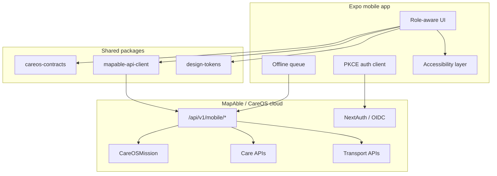

# Mobile architecture

```mermaid
flowchart TB
  subgraph mobile [Expo mobile app]
    UI[Role-aware UI]
    Auth[PKCE auth client]
    Offline[Offline queue]
    A11y[Accessibility layer]
  end
  subgraph packages [Shared packages]
    Contracts[careos-contracts]
    API[mapable-api-client]
    Tokens[design-tokens]
  end
  subgraph cloud [MapAble / CareOS cloud]
    BFF["/api/v1/mobile/*"]
    Missions["CareOSMission"]
    Care[Care APIs]
    Transport[Transport APIs]
    Identity[NextAuth / OIDC]
  end
  UI --> API
  API --> BFF
  Auth --> Identity
  BFF --> Missions
  BFF --> Care
  BFF --> Transport
  Offline --> BFF
  UI --> A11y
  UI --> Contracts
  UI --> Tokens
```

See also `mobile-architecture-decision.md`.
