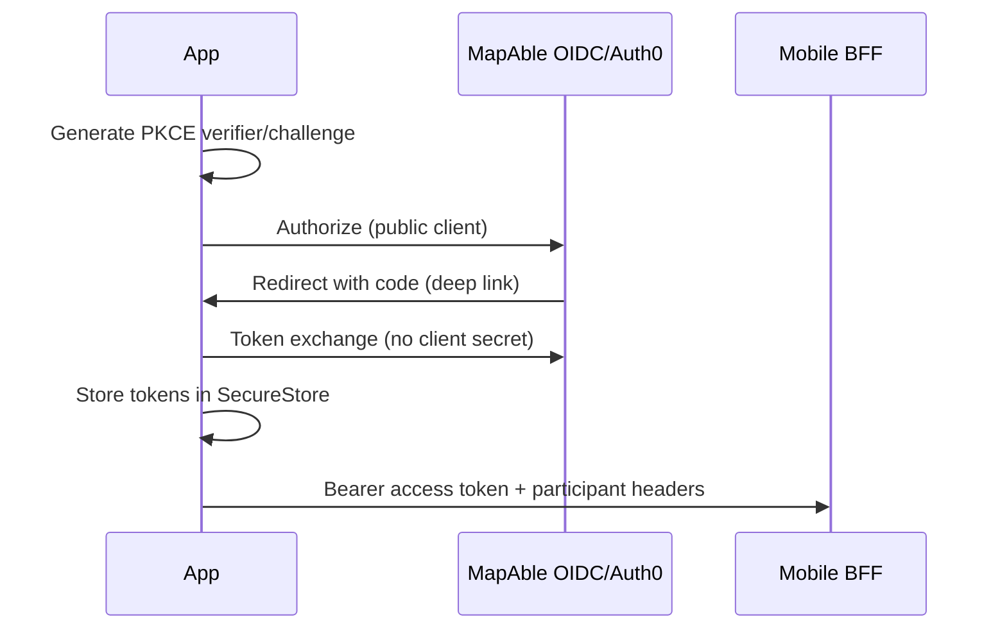

# Mobile authentication

Authority kinds are distinct: authenticated identity, organisation membership, application permission, participant authority, financial authority, clinical authority.

Organisation membership does not imply participant authority.
