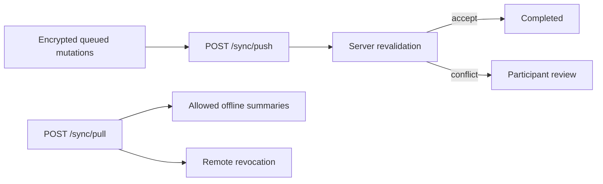

# Offline and sync

```mermaid
flowchart LR
  Queue[Encrypted queued mutations] --> Push[POST /sync/push]
  Push --> Server[Server revalidation]
  Server -->|accept| Done[Completed]
  Server -->|conflict| Review[Participant review]
  Pull[POST /sync/pull] --> Cache[Allowed offline summaries]
  Pull --> Revoke[Remote revocation]
```

Offline state is not authority. Consequential actions are revalidated server-side before execution.
