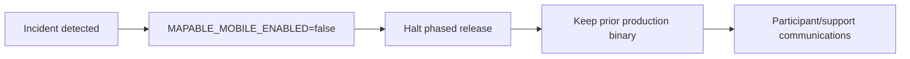

# Mobile rollback

```mermaid
flowchart LR
  Detect[Incident detected] --> Disable[MAPABLE_MOBILE_ENABLED=false]
  Disable --> Halt[Halt phased release]
  Halt --> Prior[Keep prior production binary]
  Prior --> Comms[Participant/support communications]
```
