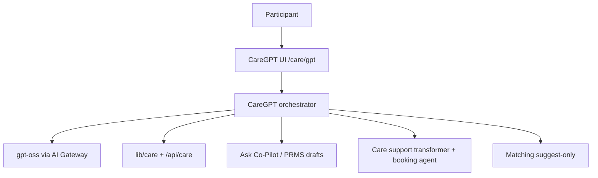
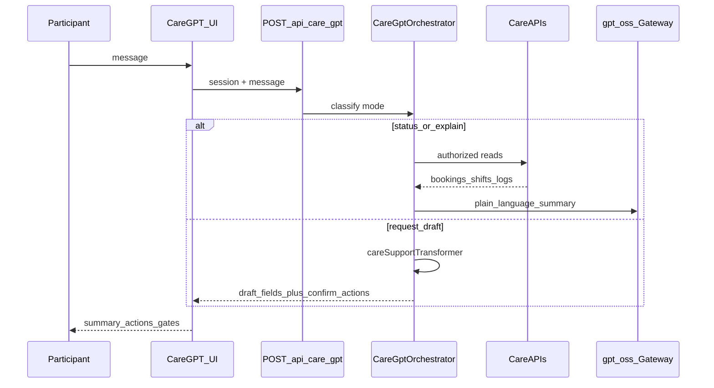

# MapAble CareGPT — Product & Architecture Design

**Maturity:** controlled_pilot (design only — not implemented).  
**Flag (future):** `MAPABLE_CARE_GPT_ENABLED` (default **false**; see `.env.example`).  
**Capability key (future):** `care.gpt` — hybrid, kill-switchable, `publicClaimAllowed: false`.

## Positioning

**CareGPT** is MapAble Care’s conversational front door: plain-language guidance for requesting support, understanding bookings/agreements/shifts/service logs, and preparing drafts that the participant must confirm.

It is **not** a second source of truth, **not** auto-matching, and **not** a rename of Ask MapAble. Ask MapAble remains the cross-domain Co-Pilot; CareGPT is care-domain-branded and care-lifecycle-scoped.



## Locked product decisions

| Decision | Choice |
| -------- | ------ |
| Surface | New route `/care/gpt` + entry from Care hub and core nav Care section |
| Audience (v1) | **Participant** (and nominee with existing care consent). Provider/worker CareGPT deferred |
| Model | Same stack as Ask: `SEARCH_INTERPRETER_MODEL` / gpt-oss via Vercel AI Gateway (`lib/search/interpreter/get-model.ts`) |
| Authority | Explain + draft + deep-link. **Never** silent book, assign, accept agreement, confirm service log, escalate, or bill |
| Care SoT | Unchanged: `lib/care/**`, [care.md](./care.md) |
| Relationship to Ask | Separate brand/surface; may call shared Co-Pilot draft/confirm APIs and intent helpers—does not replace `/ask` |

## Jobs to be done (v1)

1. **Request care in plain language** — gather support type, location, access needs, schedule preferences → draft care request fields → hand off to `/care/request` prefilled or Co-Pilot draft + confirm.
2. **Explain my care status** — summarize open requests, bookings, agreement state, upcoming shifts, service-log confirm/dispute (read via existing care APIs + auth).
3. **Prepare, don’t decide** — draft agreement questions, incident wording, preference updates as **drafts** requiring explicit confirm (PRMS/care confirm gates).
4. **Find then request** — bridge Provider Finder / disability-services agent results into “Request care” with honesty that directory ≠ MapAble-verified delivery.
5. **Safeguards** — surface living-alone / high-intensity / consent gaps; never claim AI assigned a worker.

## Non-goals (v1)

- AI auto-match or auto-assign workers ([care.md](./care.md) limitation preserved)
- Billing/NDIA submission, Stripe/Xero, funding approval claims
- Transport booking as CareGPT SoT (may deep-link to Transport / Ask mode Transport)
- Provider inbox triage or worker in-shift assist (existing worker-assist flag stays separate)
- Public marketing claims that CareGPT is “AI care delivery” (`publicClaimAllowed: false`)

## Information architecture

| Element | Spec |
| ------- | ---- |
| Route | `/care/gpt` (App Router under care layout) |
| Nav | Care hub card + link from `/care`; secondary link near Ask in `lib/platform/core-ui/navigation.ts` labeled “CareGPT” |
| UI pattern | Reuse Copilot-style composer + summary + action cards + confirmation gates (`components/copilot/*`), care-branded chrome (MapAble Care, not generic Ask) |
| Auth | Signed-in for status/drafts; guests get discovery + “sign in to request / view bookings” only |
| Model label | “Responses powered by gpt-oss-120b” when that model is active (same pattern as Ask) |

## Conversation modes (orchestrator)

Deterministic mode select first (extend patterns from `lib/copilot/intentRouter.ts`), then optional LLM reply:

| Mode | Trigger examples | Backend |
| ---- | ---------------- | ------- |
| `discover` | “find support worker near…” | Disability-services / Provider Finder ask-bridge (read-only directory) |
| `request_draft` | “I need personal care Tue mornings” | Care support transformer + prefill `/care/request` or PRMS draft |
| `status` | “what’s happening with my booking?” | Authenticated `GET` care bookings/requests/shifts/logs |
| `agreement_help` | “what does this agreement mean?” | Read agreement API + plain-language explainer (no accept) |
| `log_help` | “how do I dispute this visit?” | Explain confirm/dispute + deep-link; no auto-confirm |
| `safety` | “something went wrong on shift” | Incident draft path + QSC escalation only after explicit confirm |
| `out_of_scope` | billing/transport/jobs | Redirect card to Ask MapAble / Transport / Billing |

## Architecture (reuse map)

| Layer | CareGPT uses | Does not replace |
| ----- | ------------ | ---------------- |
| UI | New CareGPT panel on `/care/gpt` | `/ask` CopilotPanel |
| API | New `POST /api/care/gpt` (thin orchestrator) | `/api/care/*` domain writes |
| Orchestrator | New `lib/care-gpt/` (intent → tools → reply) | `lib/care/*` SoT services |
| Model | `getInterpreterModel()` | Separate model registry fork |
| Drafts/confirm | Existing Co-Pilot/PRMS confirm gates + care agreement accept APIs | Silent writes |
| Agents | `server/agents/careSupportTransformer.ts`, booking-services agent (flagged) | New unbounded agent loop |
| Matching | Read suggestions only via existing matching services | Auto-assign |
| Governance | Capability `care.gpt` in AI platform seed: hybrid, controlled_pilot, kill switch, no public claim | Bypass kill switches |

### Request flow (status / draft)



## Guardrails (hard rules)

1. Mirror Co-Pilot rules from [prms-copilot-integration.md](../prms-copilot-integration.md): no silent book/share/claim/pay/close.
2. Every mutating suggestion returns an **action card** + **confirmation gate**; execution hits existing care/PRMS routes only after confirm.
3. Consent: accessibility/share fields respect `care.accessibility_share` (same as Care module).
4. Honesty copy: directory results and match suggestions labeled as non-verified / human-reviewed.
5. Kill switch: `MAPABLE_CARE_GPT_ENABLED` default **false** until pilot; capability kill switch in AI platform.
6. Telemetry: engine id + mode + tools called; no names/NDIS numbers in logs (ledger redaction patterns).

## API sketch (design only — not implemented)

`POST /api/care/gpt`

```json
{
  "message": "string",
  "sessionId": "string",
  "participantId": "string?"
}
```

Response shape aligned with Co-Pilot ask:

```json
{
  "summary": "string",
  "answer": "string",
  "mode": "discover|request_draft|status|agreement_help|log_help|safety|out_of_scope",
  "actions": [],
  "draftRecords": [],
  "requiredConfirmations": [],
  "warnings": [],
  "engineId": "string"
}
```

## Maturity & ops

- **Maturity:** controlled_pilot (same band as Care module).
- **Prod model:** gpt-oss-120b via AI Gateway on mapable.com.au (see [production-infrastructure.md](../operations/production-infrastructure.md)).
- **Flag:** `MAPABLE_CARE_GPT_ENABLED=false` until a follow-on implementation plan ships `/care/gpt` and `POST /api/care/gpt`.
- **Smoke (when implemented):** `/care/gpt` loads; with flag off, honest “not enabled” state; with flag on + auth, status mode reads participant bookings.

## Implementation status

| Item | Status |
| ---- | ------ |
| This design doc | Done |
| `/care/gpt` UI | Not started |
| `POST /api/care/gpt` | Not started |
| `lib/care-gpt/` orchestrator | Not started |
| AI platform `care.gpt` capability seed | Not started |
| Runtime flag wiring | Not started |

## Related

- [care.md](./care.md) — Care module SoT and routes
- [prms-copilot-integration.md](../prms-copilot-integration.md) — Co-Pilot draft/confirm rules
- [CURRENT_STATE.md](../ai-platform/CURRENT_STATE.md) — AI capability registry
- [agentic-booking-services.md](../agentic-booking-services.md) — booking agent (experimental)
- [agentic-disability-services.md](../agentic-disability-services.md) — directory discovery agent
