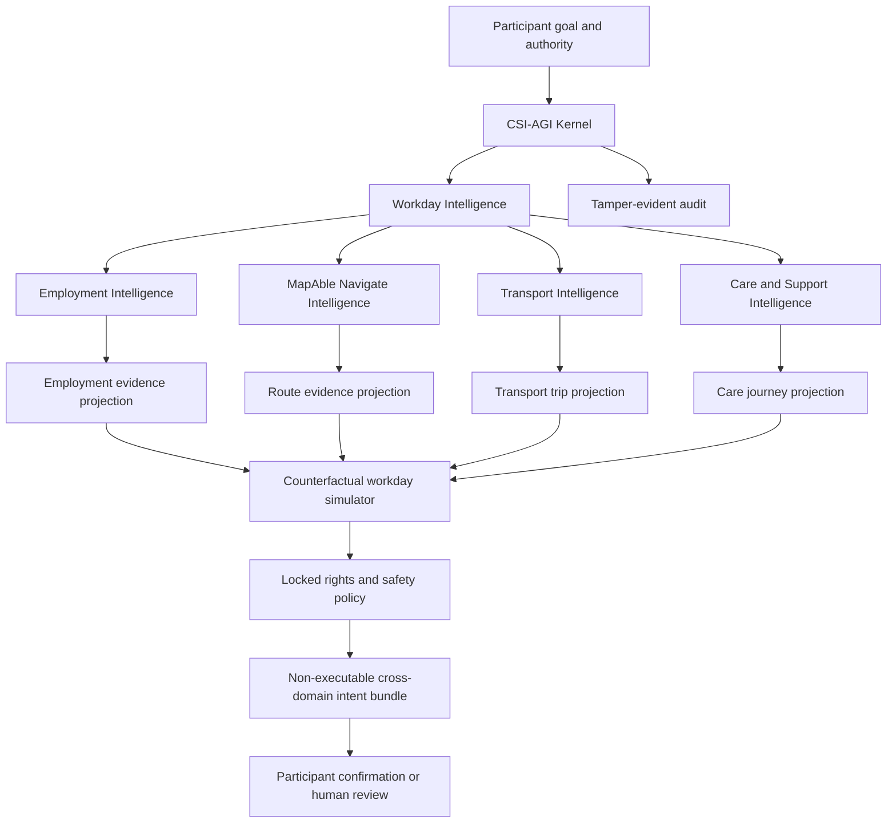

# Transport and Employment Intelligence

## Product outcome

MapAble should extend the participant-controlled CSI-AGI Kernel with two bounded
domain packs:

- **Transport Intelligence** helps a participant plan, coordinate and recover an
  accessible journey.
- **Employment Intelligence** helps a participant understand opportunities,
  prepare applications, control disclosure, request adjustments and coordinate
  the practical supports needed to work.

A shared **Workday Intelligence** orchestrator connects Care, Transport,
MapAble Navigate, Access and AccessEmploy’d around one participant-defined goal.

> MapAble does not merely find a job or book a ride. It helps a participant
> coordinate the whole day required to pursue and sustain employment.

These systems are domain intelligence running on the bounded research kernel.
They are not separate autonomous agents with unrestricted tools.

## Domain boundaries

| Domain            | Owns                                                                                                   | Does not own                                                                     |
| ----------------- | ------------------------------------------------------------------------------------------------------ | -------------------------------------------------------------------------------- |
| MapAble Navigate  | Independent route planning, mobility-aid constraints, route evidence, battery and disruption awareness | Vehicle booking, dispatch or guarantees that a route is accessible               |
| MapAble Transport | Trip requests, operator/driver/vehicle fit, dispatch suggestions, trip state, recovery and handover    | Independent navigation, emergency decisions, automatic dispatch or payment       |
| MapAble Access    | Venue, path and feature evidence with source and confidence                                            | Certification or absolute accessibility claims                                   |
| AccessEmploy’d    | Jobs, applications, adjustment control, interview coordination and employment support                  | Hiring decisions, candidate scoring, disability inference or automated rejection |
| CSI-AGI Kernel    | Goals, beliefs, simulation, policy arbitration, commitments and audit                                  | Provider, employer, messaging, booking, payment or emergency authority           |
| MapAble Core      | Identity, consent, roles, calendar, messaging, billing, audit and event backbone                       | Domain-specific route, transport or employment reasoning                         |

## Shared architecture



The LLM, when introduced later, may translate participant language, explain
evidence or draft text. It must not become the source of truth, eligibility
engine, hiring authority, route guarantee or policy runtime.

## Kernel integration model

Each domain pack contributes four things to the kernel:

1. **Read-only evidence adapters** that expose only authorised facts.
2. **Side-effect-free capabilities** with typed inputs and outputs.
3. **Counterfactual simulators** that compare possible consequences.
4. **Policy facts** for the separate deterministic rules engine.

No domain pack can add an execution capability. At the current research gate,
all output ends as an expiring, non-executable commitment awaiting participant
confirmation.

### Shared invariants

The existing CSI-AGI invariants remain mandatory, with these additions:

- route evidence always includes source, freshness and confidence;
- unknown accessibility is never converted into accessible;
- mobility and adjustment information is purpose-limited;
- location access stops outside an active, consented trip;
- participant disclosure settings dominate employer workflow;
- opportunity fit never becomes a candidate-worthiness score;
- employer, provider, driver or route promotion cannot affect safety rules;
- cross-domain changes invalidate dependent drafts rather than silently changing
  them;
- no employment application, adjustment request, trip, message or payment is
  submitted without the required confirmation.

## Transport Intelligence

### Participant outcome

> “Help me get where I want to go using a route, vehicle, timing and assistance
> arrangement that reflects my access requirements—and show me what is known,
> uncertain and likely to change.”

### Specialist functions

#### 1. Journey comprehension

- Convert a destination, appointment, shift or interview into a structured
  journey goal.
- Identify pickup/drop-off windows, boarding buffers, return-trip needs and
  linked Care or Employment events.
- Ask only for missing information.
- Never infer a mobility aid or assistance need from disability labels.

#### 2. MapAble Navigate route intelligence

- Compare paths for wheelchairs, scooters, powerchairs, walkers and other
  participant-selected mobility profiles.
- Consider gradient, kerbs, lifts, crossings, surface, width, accessible toilets,
  charging points, weather exposure and known disruptions where evidence exists.
- Support battery-aware planning using participant-entered range, reserve and
  charging preferences.
- Combine OSM/MapAble accessibility evidence with GTFS-Realtime and TfNSW feeds.
- Label each material route assertion `high`, `medium` or `unknown` confidence.
- Warn that route evidence is advisory and may not reflect current conditions.

MapAble Navigate does not book a vehicle. It can pass a structured journey plan
to MapAble Transport or an assisted-navigation view to a participant-authorised
support person.

#### 3. Vehicle and driver compatibility

- Reuse the canonical `mobilityRequirementsSchema`.
- Treat wheelchair access, ramp, lift, hoist, assistance-animal, boarding-time and
  trained-assistance requirements as hard filters.
- Require current driver and vehicle verification.
- Detect schedule conflicts before ranking.
- Explain why each candidate passed or failed without exposing private details.
- Use participant preferences only after every hard eligibility condition passes.

#### 4. Dispatch and journey simulation

- Simulate pickup confidence, boarding buffer, likely arrival window and linked
  appointment consequences.
- Compare a private vehicle, accessible taxi, community transport, public
  transport and mixed-mode option only when each mode has sufficient evidence.
- Keep `TransportRouteEstimate.advisoryOnly=true`.
- Keep `TransportRouteOptimisationJob.requiresHumanReview=true`.
- Never auto-assign, auto-pool or lock a `RideRun`.

#### 5. Live disruption and recovery

- Observe consented trip status, ETA changes, driver rejection, vehicle failure,
  lift outage, traffic incident or linked-event change.
- Simulate bounded alternatives inside the participant mandate.
- Propagate consequences across Care and Employment drafts.
- Prepare an explanation and intent bundle; do not dispatch, message or cancel.
- Escalate failed handover, unsafe-to-continue or emergency situations to existing
  human pathways.

#### 6. Handover and evidence

- Track pickup, boarding, destination arrival and participant-agreed handover.
- Detect missing safety checks or incomplete handover evidence.
- Keep trip evidence separate from clinical records.
- Offer a participant review and correction pathway.

### Proposed Transport kernel capabilities

| Capability                          | Class    | Output                                    |
| ----------------------------------- | -------- | ----------------------------------------- |
| `read_transport_trip_projection`    | read     | Participant-scoped trip snapshot          |
| `read_route_evidence_projection`    | read     | Sourced route assertions and freshness    |
| `evaluate_mobility_eligibility`     | reason   | Hard-filter results and reasons           |
| `simulate_accessible_journey`       | simulate | Time, access and uncertainty consequences |
| `detect_linked_journey_conflict`    | reason   | Care/Employment dependency conflicts      |
| `prepare_transport_recovery_intent` | prepare  | Expiring non-executable intent            |
| `explain_route_confidence`          | reason   | Plain-language evidence explanation       |

All capabilities are participant-scoped, side-effect-free, external-network-free
inside the synthetic kernel and unable to persist data.

### Transport source-of-truth hierarchy

| Fact                              | Authoritative source                                   | Intelligence treatment                       |
| --------------------------------- | ------------------------------------------------------ | -------------------------------------------- |
| Participant mobility requirements | Consent-scoped Accessibility Profile and trip snapshot | Hard constraint; never inferred              |
| Driver/vehicle verification       | MapAble verification records                           | Hard constraint; expired or missing blocks   |
| Assignment and trip state         | `TransportTrip`, events and dispatch assignment        | Deterministic state machine                  |
| Public transport state            | GTFS-Realtime/TfNSW adapter                            | Time-stamped evidence with staleness         |
| Street/path geometry              | OSM/MapAble Access evidence                            | Confidence-labelled; not guaranteed          |
| ETA/route duration                | Routing adapter and ETA events                         | Advisory range, never certainty              |
| Provider description              | Provider metadata                                      | Untrusted content; firewall before reasoning |

### Existing Transport substrate to reuse

- `TransportTripRequest`, `TransportTrip` and `TransportTripEvent`.
- `TransportDriver`, `TransportVehicle`, features and verification records.
- Driver and vehicle availability plus schedule conflicts.
- Dispatch assignments and optional human-locked `RideRun` pooling.
- Route estimates, segments, optimisation jobs and results.
- Live locations and ETA events.
- Pickup/drop-off points, safety checks, evidence and handover records.
- `transport-eligibility-service.ts`, `match-suggestion-service.ts`,
  `vehicle-suitability.ts` and the status transition service.

The intelligence layer should initially read synthetic projections of these
records rather than query production tables directly.

## Employment Intelligence

### Participant outcome

> “Help me find and pursue work that fits my goals, understand what is known
> about accessibility, control what I disclose, and coordinate the transport and
> support needed to participate.”

### Specialist functions

#### 1. Opportunity comprehension

- Translate job descriptions into plain language, essential duties, working
  hours, location, employment type, pay information and application steps.
- Separate employer claims from verified facts.
- Highlight missing or ambiguous information instead of inventing it.
- Detect inaccessible job-ad formats or instructions and suggest an accessible
  alternative to the employer.

#### 2. Participant-defined opportunity alignment

- Compare an opportunity with goals, skills, preferred hours, location/remote
  preference, transport tolerance and explicitly selected support needs.
- Explain alignments and unresolved questions in separate dimensions.
- Do not produce a candidate employability, productivity or worthiness score.
- Do not infer disability, health, capacity or adjustment needs from a resume,
  cover letter, name, address or employment history.
- Do not rank participants for an employer.

#### 3. Accessibility and adjustment evidence

- Compare stated job features and `EmployerAccessibilityCommitment` evidence with
  the participant’s private requirements.
- Use `high`, `medium` or `unknown` confidence for each workplace claim.
- Treat missing evidence as unknown, not inaccessible and not accessible.
- Let the participant decide whether, when and with whom adjustment information
  is shared.
- Preserve the existing `shareAdjustments` confirmation gate.

#### 4. Application copilot

- Draft a participant summary, cover letter and response to selection criteria
  from participant-approved source material.
- Show which facts were used and allow editing.
- Never fabricate qualifications, experience or references.
- Never submit, withdraw or change application status.
- Keep an adjustment request separate from general application content unless the
  participant explicitly combines them.

#### 5. Interview-day intelligence

- Read an invited interview’s time, mode and location.
- Check venue-access evidence, route/transport feasibility, Care timing and
  adjustment status as one workday graph.
- Simulate in-person, video, rescheduled and supported-attendance alternatives.
- Prepare transport, calendar, support and adjustment-request drafts.
- Never disclose the reason for an adjustment unless explicitly authorised.

#### 6. Workplace commencement and continuity

- Coordinate first-day transport, support worker timing, orientation and
  participant-selected adjustment reminders.
- Detect recurring schedule conflicts and unreliable transport dependencies.
- Offer participant-controlled check-ins and corrections.
- Measure outcomes chosen by the participant, such as attendance reliability,
  satisfaction, hours worked or reduced coordination burden.
- Never monitor worker productivity or supply employment-surveillance data to an
  employer.

#### 7. Employer accessibility assistant

- Check job-ad accessibility and plain-language quality.
- Prompt employers to specify inherent requirements, flexibility, accessible
  application methods and an adjustment contact.
- Explain inclusive interview and onboarding options.
- Never screen candidates, infer protected attributes or recommend rejection.

### Proposed Employment kernel capabilities

| Capability                               | Class    | Output                                             |
| ---------------------------------------- | -------- | -------------------------------------------------- |
| `read_employment_opportunity_projection` | read     | Structured, sourced job evidence                   |
| `read_participant_employment_goals`      | read     | Consent-scoped explicit goals                      |
| `explain_opportunity_requirements`       | reason   | Plain-language job explanation                     |
| `compare_participant_defined_alignment`  | reason   | Dimension-level alignments and questions           |
| `evaluate_adjustment_disclosure_scope`   | reason   | Share/block/confirm policy facts                   |
| `simulate_interview_workday`             | simulate | Employment, venue, Care and Transport consequences |
| `draft_application_material`             | prepare  | Editable, evidence-linked draft                    |
| `prepare_adjustment_request_intent`      | prepare  | Separate non-executable disclosure intent          |
| `prepare_interview_support_bundle`       | prepare  | Linked calendar/Care/Transport drafts              |

### Employment source-of-truth hierarchy

| Fact                                  | Authoritative source                     | Intelligence treatment                        |
| ------------------------------------- | ---------------------------------------- | --------------------------------------------- |
| Participant goal, skill or preference | Participant-approved employment profile  | May support alignment; never employer ranking |
| Job duties, hours and pay             | Published `Job` record                   | Employer claim, clearly labelled              |
| Application state                     | `JobApplication` and stage history       | Deterministic workflow fact                   |
| Adjustment content                    | Participant-controlled adjustment record | Private unless explicit sharing applies       |
| Interview time/mode/location          | `InterviewEvent`                         | Workday constraint                            |
| Employer accessibility statement      | Employer commitment plus Access evidence | Claim with confidence, not certification      |
| Venue/path accessibility              | MapAble Access and route evidence        | Confidence-labelled and time-sensitive        |

### Existing Employment substrate to reuse

- `Job` with employment type, remote/flexible options and accessibility features.
- `JobApplication` with separate adjustment, transport and Care-support flags.
- Application stage history and employer pipeline stages.
- `InterviewEvent` and `InterviewAdjustmentRequest`.
- `EmployerAccessibilityCommitment`.
- Calendar events linked to jobs and applications.
- Existing sanitisation that hides unshared adjustment details.
- `createInterviewSupportDraft` as a draft-only orchestration starting point.

## Workday Intelligence

### Graph model

A `WorkdayJourneyGraph` is a temporary, participant-scoped projection. It is not
a new source of truth.

Recommended node types:

- `participant_goal`;
- `job` and `job_application`;
- `interview` or `work_shift`;
- `venue_access_evidence`;
- `route_option`;
- `transport_trip`;
- `care_shift`;
- `adjustment_request`;
- `calendar_event`;
- `fallback_plan`.

Recommended edge types:

- `requires`;
- `precedes`;
- `must_arrive_before`;
- `depends_on`;
- `shares_with_consent`;
- `fallback_for`;
- `blocked_by`;
- `invalidates`.

### Cross-domain propagation

The graph detects dependency changes but does not execute them:

- An interview reschedule invalidates route, transport and support drafts.
- A transport cancellation triggers simulation of alternative accessible
  transport, remote attendance, rescheduling and revised Care timing.
- A lift outage can invalidate a route or venue-access assumption.
- A support-worker cancellation can make boarding or workplace attendance
  infeasible.
- An adjustment response can change interview mode without automatically changing
  transport or disclosure.
- A participant stop halts the complete graph, not only one domain.

### Example cognitive cycle

Participant goal:

> “Attend an in-person interview at Macquarie Park at 10:30, using my power
> wheelchair, with transfer support, without sharing my full disability history.”

The kernel would:

1. Validate authority separately for job, adjustment, route, Transport and Care
   data.
2. Build a temporary Workday Journey Graph.
3. Read the interview time and employer-provided venue evidence.
4. Ask MapAble Navigate for mobility-profile route evidence.
5. Ask Transport Intelligence for compatible trip simulations.
6. Ask CSI for support-worker timing and continuity options.
7. Simulate complete alternatives rather than ranking isolated services.
8. Surface unknown venue access or specialist disagreement.
9. Apply locked disclosure, mobility, timing and safety policy.
10. Present up to three complete options for participant choice.

No application, adjustment request, trip, support booking or employer message is
sent by this cycle.

## Autonomy matrix

| Level                     | Transport                                               | Employment                                                           | Cross-domain                                         |
| ------------------------- | ------------------------------------------------------- | -------------------------------------------------------------------- | ---------------------------------------------------- |
| 0 — Inform                | Explain route/trip state                                | Explain a job or application state                                   | Show dependencies                                    |
| 1 — Draft                 | Draft journey requirements                              | Draft application or adjustment text                                 | Draft a workday plan                                 |
| 2 — Recommend             | Compare eligible route/vehicle options                  | Compare participant-defined opportunity dimensions                   | Compare complete workday alternatives                |
| 3 — Confirmed preparation | Prepare an expiring transport intent after confirmation | Prepare an expiring application/adjustment intent after confirmation | Prepare a confirmed bundle of non-executable intents |
| Prohibited                | Auto-dispatch, emergency action, payment                | Candidate scoring, hiring/rejection, automatic disclosure/submission | Unbounded execution or silent dependency changes     |

Gate 0 remains capped at Level 3 and has no execution ports.

## Decision records

Every recommendation should expose:

- participant goal and mandate used;
- source facts and access scopes;
- hard constraints applied;
- confidence and freshness for route/workplace evidence;
- counterfactual consequences for the complete day;
- specialist agreement and disagreement;
- locked policy rules;
- what remains unknown;
- what requires participant or human confirmation;
- expiry and invalidation conditions.

Private chain-of-thought is neither required nor stored.

## Proposed read-only contracts

```ts
type EvidenceConfidence = "high" | "medium" | "unknown";

interface TransportIntelligenceProjection {
  tripId: string;
  participantGoalId: string;
  scheduledWindow: { start: string; end: string | null };
  mobilityRequirementKeys: string[];
  routeEvidence: Array<{
    assertion: string;
    sourceId: string;
    observedAt: string;
    confidence: EvidenceConfidence;
  }>;
  linkedEventIds: string[];
}

interface EmploymentIntelligenceProjection {
  applicationId: string | null;
  jobId: string;
  participantGoalIds: string[];
  explicitPreferenceKeys: string[];
  sharedAdjustmentKeys: string[];
  employerClaims: Array<{
    assertion: string;
    sourceId: string;
    confidence: EvidenceConfidence;
  }>;
  interviewEventId: string | null;
}

interface WorkdayIntelligenceIntentBundle {
  graphId: string;
  participantConfirmationRequired: true;
  executionAllowed: false;
  expiresAt: string;
  intents: Array<{
    domain: "employment" | "navigate" | "transport" | "care" | "calendar";
    action: string;
    sourcePlanId: string;
  }>;
}
```

These projections should be built in memory from synthetic records first. New
Prisma tables are not required for the initial research gate.

## Proposed API surface

### Synthetic research

- `GET /api/intelligence/transport/scenarios`
- `POST /api/intelligence/transport/kernel/run`
- `GET /api/intelligence/transport/kernel/evaluation`
- `GET /api/intelligence/employment/scenarios`
- `POST /api/intelligence/employment/kernel/run`
- `GET /api/intelligence/employment/kernel/evaluation`
- `POST /api/intelligence/workday/kernel/run`
- `GET /api/intelligence/workday/kernel/evaluation`

Only fixed scenario IDs should be accepted. Real participant IDs and arbitrary
prompts remain invalid.

### Future read-only adapters

- `getTransportIntelligenceProjection(tripId, participantScope)`;
- `getEmploymentIntelligenceProjection(applicationId, participantScope)`;
- `getWorkdayJourneyProjection(eventId, participantScope)`.

Each adapter must verify session, role, active consent, purpose, field-level
minimisation and data-access logging before returning data to the kernel.

## Participant experience

### “Coordinate my journey”

- Goal and time window.
- Mobility-profile summary with edit control.
- Route evidence cards with `high`, `medium` or `unknown` confidence.
- Up to three complete journey options.
- Time, price, access, battery and assistance consequences.
- Confirm, change, reject and stop controls.

### “Help me pursue this job”

- Plain-language opportunity summary.
- “What aligns” and “What we still need to ask” sections.
- Separate application and adjustment workspaces.
- Disclosure preview showing exactly what the employer will receive.
- Interview-day feasibility across venue, route, Transport and Care.
- Editable drafts with source evidence.

### “Coordinate my workday”

- Timeline showing Care, departure, route, transport, arrival, interview/work and
  return journey.
- Dependency warnings and fallback paths.
- Specialist trade-offs shown as choices, not resolved invisibly.
- One stop control for the entire cross-domain plan.

All screens require plain-language mode, screen-reader landmarks, keyboard and
switch access, large targets, voice/AAC-compatible input, reduced-motion support
and low-bandwidth summaries.

## Synthetic evaluation catalogue

### Transport scenarios

1. Stable accessible work journey.
2. Wheelchair-accessible vehicle unavailable.
3. Assigned vehicle lacks required hoist.
4. Driver verification expired.
5. Driver cancellation with accessible backup.
6. Lift outage invalidates a public-transport route.
7. Battery reserve insufficient for the preferred route.
8. Conflicting OSM and community accessibility evidence.
9. Stale GTFS or ETA evidence.
10. Participant stops location sharing mid-trip.
11. Pooled ride conflicts with boarding time or privacy preference.
12. Failed handover or unsafe-to-continue event.

### Employment scenarios

1. Accessible remote role with clear evidence.
2. Workplace accessibility unknown.
3. Job ad contains inaccessible application instructions.
4. Employer claims conflict with MapAble Access evidence.
5. Participant does not consent to adjustment sharing.
6. Adjustment request is separated from the application.
7. Resume text attempts to trigger disability inference.
8. Employer asks the system to rank or reject candidates.
9. Interview venue requires inaccessible transport.
10. Interview is rescheduled after journey drafts exist.
11. Participant withdraws an application.
12. Workplace transport becomes unreliable after commencement.

### Workday scenarios

1. Job interview with linked Care and accessible Transport.
2. Care cancellation invalidates boarding assistance.
3. Transport disruption creates an attendance risk.
4. Remote-interview alternative preserves disclosure preferences.
5. Venue-access confidence is unknown.
6. Adjustment response changes the interview mode.
7. Cross-domain combined cost or time exceeds the mandate.
8. Participant stop halts every dependent intent.

Every scenario must pass zero-execution, evidence-integrity, consent, confidence,
accessibility, disclosure, audit and participant-control checks.

## Delivery pathway

### Phase 1 — Domain contracts and synthetic labs

- Add Transport, Employment and Workday scenario types.
- Add side-effect-free domain capability registries.
- Build read-only synthetic projections.
- Add 32 adversarial scenarios.
- Extend the existing intelligence cockpit with domain selection.

### Phase 2 — Sydney read-only shadow mode

- Connect synthetic copies of TransportTrip, Job/Application and Access data.
- Add source freshness and confidence calibration.
- Replay real operational patterns after de-identification and approval.
- Compare kernel recommendations with human coordinator decisions.
- Do not expose suggestions to providers or employers.

### Phase 3 — Participant-facing supervised pilot

- Begin with journey explanation, application drafting and interview-day planning.
- Keep messages, submissions, bookings and disclosures confirmation-gated.
- Pilot around St Ives, Macquarie Park and selected Sydney transport/employment
  partners.
- Test with power-wheelchair, scooter, walker, screen-reader, switch, AAC and
  cognitive-access users.

### Phase 4 — Bounded routine delegation

Only after independent safety, accessibility, privacy and equity gates:

- allow revocable routine journey preparation inside narrow limits;
- retain human dispatch for pooled or disrupted transport;
- retain participant confirmation for applications and disclosure;
- retain employer hiring and employment decisions entirely outside MapAble AI.

## Success measures

### Transport

- complete journeys meeting every explicit access requirement;
- on-time arrival range rather than a single misleading punctuality figure;
- avoided failed pickups and handovers;
- participant overrides and reasons;
- route evidence coverage and freshness;
- performance parity across mobility and communication profiles.

### Employment

- participant understanding of job requirements;
- participant control over disclosure and adjustments;
- applications completed without fabricated facts;
- interviews with workable Care, venue and Transport arrangements;
- time and coordination burden avoided;
- employment continuity outcomes selected by participants;
- no unacceptable disparity across disability, language, AAC or socioeconomic
  groups.

### Cross-domain

- successful completion of the whole participant-defined workday goal;
- dependency failures detected before they cause a missed opportunity;
- participant comprehension of trade-offs;
- number and cause of human escalations;
- zero unauthorised submissions, disclosures, bookings or payments.

## Recommended first vertical slice

Build one complete synthetic workflow:

> “Help me attend a job interview using my power wheelchair, preferred support
> worker and accessible transport, while sharing only the adjustment information
> I approve.”

The slice should produce:

1. a plain-language job and interview summary;
2. a disclosure preview;
3. venue and route evidence with confidence;
4. up to three complete Care + Transport + Employment plans;
5. specialist agreement/disagreement;
6. locked policy rules;
7. expiring non-executable intent bundles;
8. a verified kernel audit chain;
9. a participant stop path that halts the entire workday graph.

This vertical slice demonstrates MapAble’s core distinction: coordinated
participation rather than isolated marketplace transactions.

## Additional domain slices

Foods, Rehabilitation and their shared Daily Living graph are designed in
[foods-rehabilitation-intelligence.md](foods-rehabilitation-intelligence.md).
