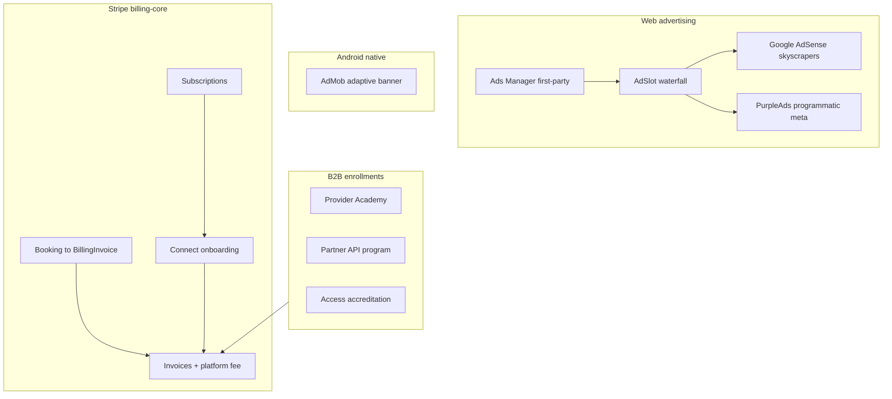

# MapAble monetization spine

This document describes how revenue pathways connect after the monetization spine integration branch.

## Architecture

## Environment variables

| Variable | Purpose |
|----------|---------|
| `STRIPE_SECRET_KEY` | Enables billing-core and checkout |
| `STRIPE_WEBHOOK_SECRET` | Stripe webhook verification |
| `STRIPE_PROVIDER_PRO_PRICE_ID` | Provider Pro subscription |
| `STRIPE_EMPLOYER_PRO_PRICE_ID` | Employer Pro subscription |
| `STRIPE_MARKETPLACE_FEATURED_PRICE_ID` | Featured marketplace listing subscription |
| `BILLING_PLATFORM_FEE_BPS` | Platform take rate on invoices (default 1000 = 10%) |
| `PARTNER_MARKETPLACE_ENABLED` | Public marketplace listings + checkout |
| `NEXT_PUBLIC_GOOGLE_ADSENSE_*` | AdSense skyscraper fallback |
| `NEXT_PUBLIC_ADMOB_*` | Capacitor Android native banners |

## Verification checklist (staging)

1. **Stripe Connect** — `/provider/billing` onboarding link opens Express flow.
2. **Booking bridge** — `POST /api/invoices/draft-from-booking` creates legacy `Invoice` and `BillingInvoice` with platform fee.
3. **Subscriptions** — Provider Pro checkout when price IDs are set.
4. **Ads Manager** — Provider creates campaign, admin moderates, `/api/ads/serve` returns inventory on Provider Finder.
5. **Ad waterfall** — With no first-party inventory, AdSense units render on eligible routes (desktop xl+).
6. **Marketplace** — With `PARTNER_MARKETPLACE_ENABLED=true`, `/marketplace` lists published items and checkout redirects to Stripe.
7. **Enrollments** — `POST /api/monetization/enrollment-checkout` returns checkout URL; webhook marks enrollment paid.
8. **Admin** — `/admin/monetization` shows revenue snapshot.

## Sensitive routes

Ads are blocked on login, dashboard, admin, billing, clinical, and related routes via `lib/ads/ad-page-eligibility.ts`.
