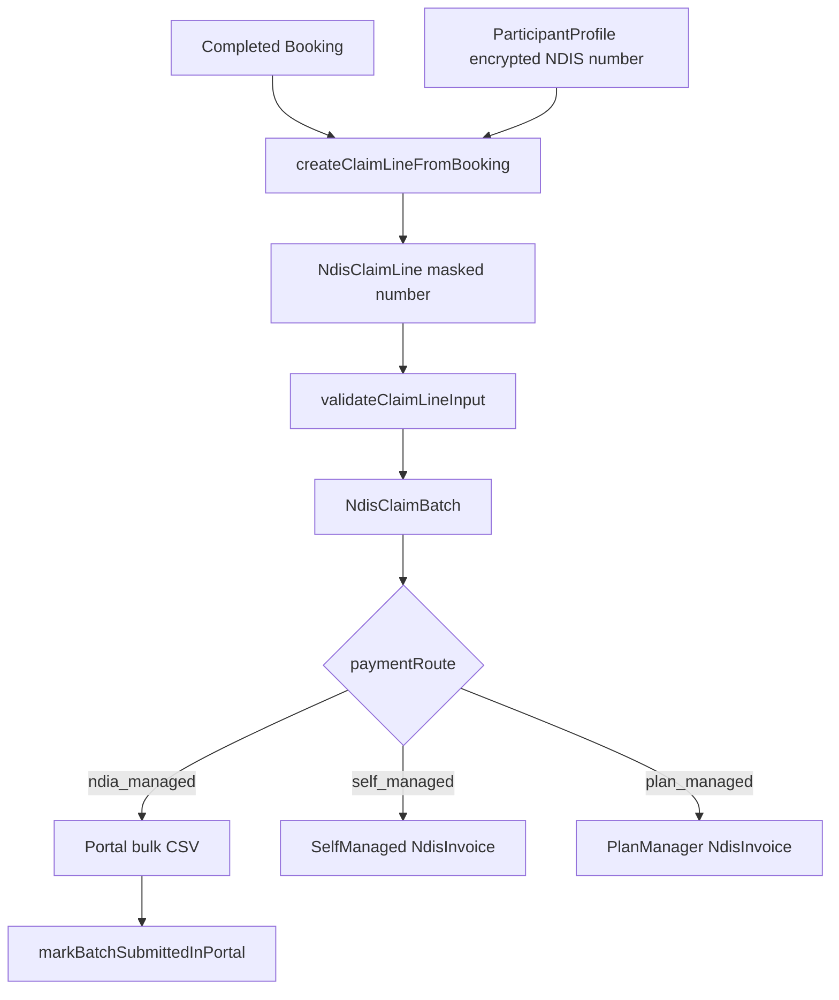
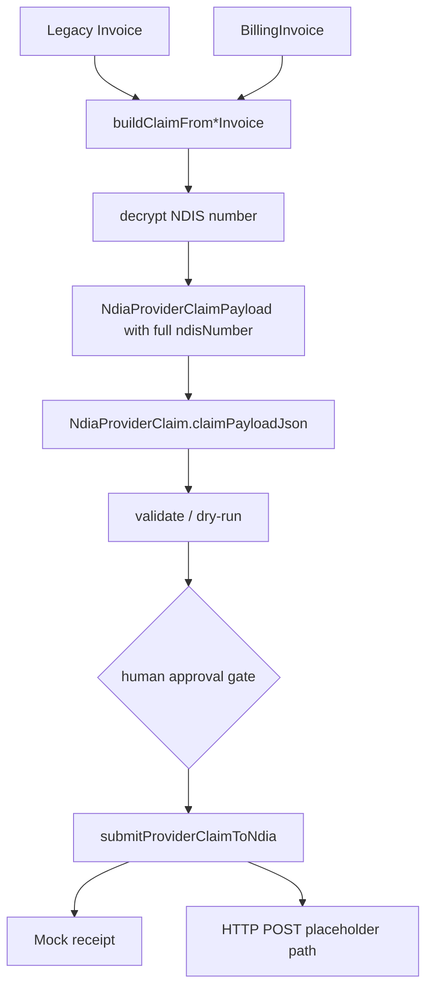
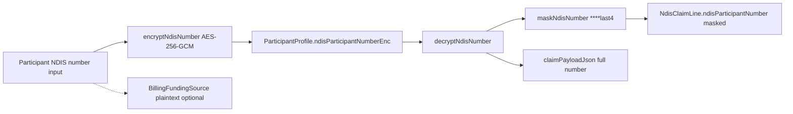
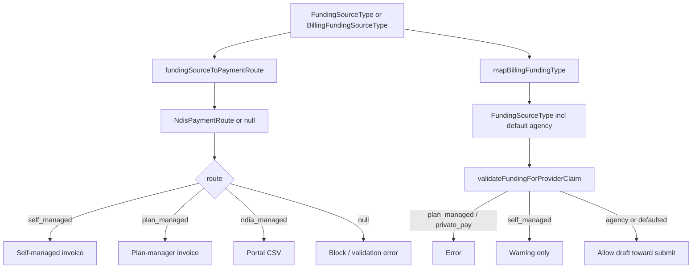
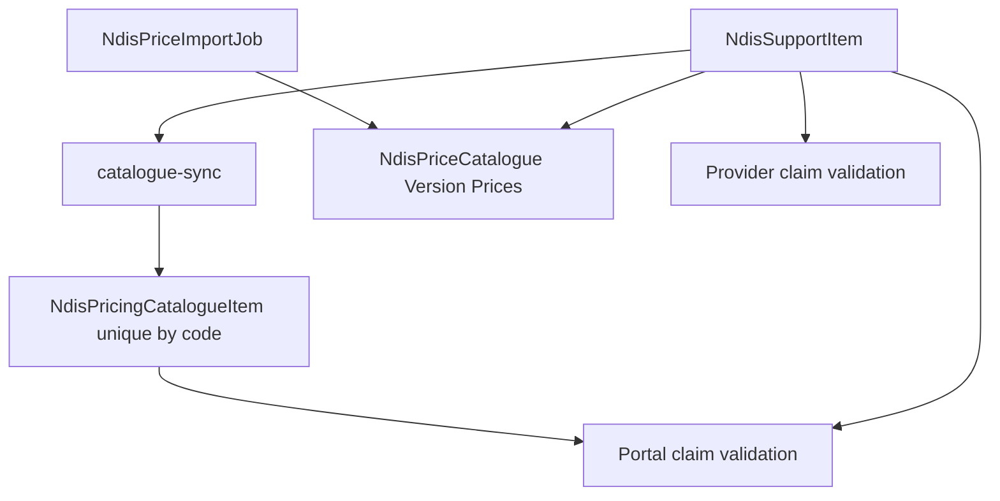
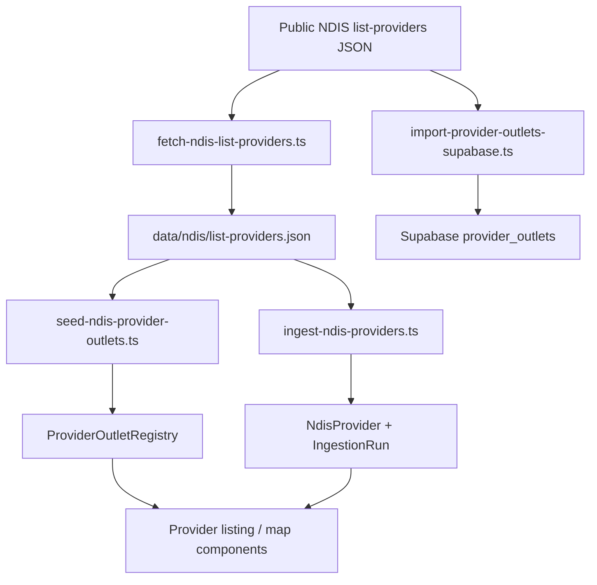
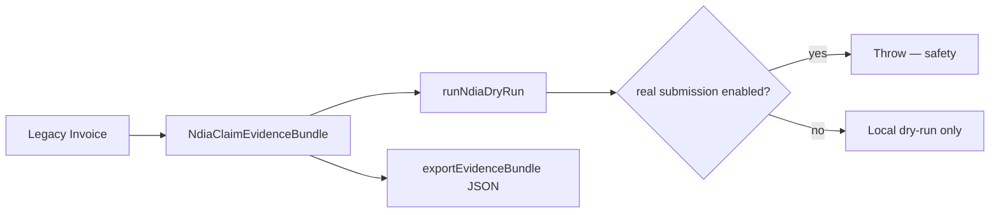
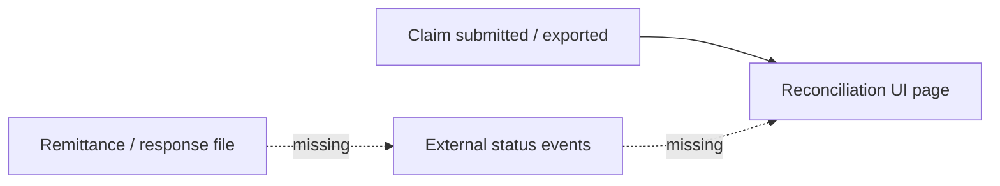
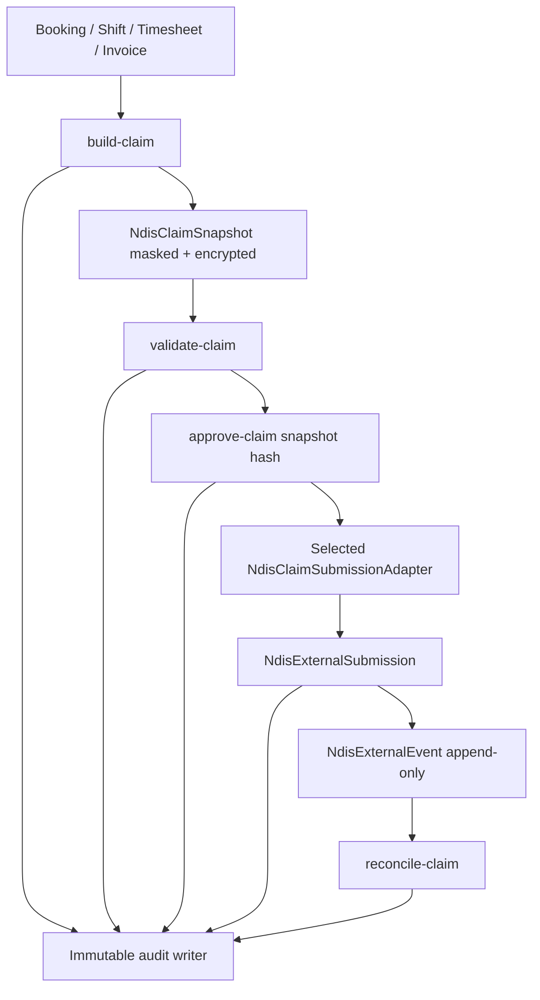

# NDIS Gateway — Data Flow

**Wave:** 0  
**Purpose:** Document how claim, pricing, provider-directory, and identifier data move through the system today, and call out gaps that Waves 1–9 close.

---

## 1. Portal-assisted claiming (multi-route)

**Entry:** `POST /api/ndis/claims/from-booking`  
**Batch:** `POST /api/ndis/claim-batches` → validate → export → optional mark-submitted  
**NDIS number:** decrypted only for create/validate; stored masked; CSV further masks.  
**NDIA HTTP:** not used on this path (`NdiaApiAdapter.stub` throws if invoked).

---

## 2. Registered-provider NDIA claiming

**Entry:** `POST /api/provider/ndia-claims` with `legacyInvoiceId` or `billingInvoiceId`  
**Live gate:** `NDIS_CLAIM_SUBMISSION_ENABLED` + `NDIA_REAL_SUBMISSION_ENABLED` + `adapterMode=http` + `apiBaseUrl`  
**Gaps:**

- Billing invoice service period uses `createdAt` / `dueAt`; line `serviceDate` uses line `createdAt` (no service-date field on `BillingInvoiceLineItem`).
- Full NDIS number persists in `claimPayloadJson`.
- Approval is global pilot record, not claim/org/payload-hash bound; skipped when live is allowed.
- No idempotency key; mock external id uses `Date.now()`.
- Error throws may include external response bodies.
- No remittance / status polling / webhook import loop.

---

## 3. NDIS number encrypt / decrypt / mask

**Key resolution:** `NDIS_ENCRYPTION_KEY` → `NEXTAUTH_SECRET` → hard-coded development fallback.  
**Wave 2 target:** generate external payload just-in-time from encrypted participant data; never store decrypted numbers in ordinary claim JSON, audit JSON, metadata, cache keys, or list responses.

---

## 4. Funding route decision today

**Critical divergence:** portal mapping fails closed for unsupported types; provider mapping defaults many billing types to agency-managed (R1), and only warns on self-managed (R2).

---

## 5. Pricing data flow

**Gap:** claiming path uses mutable unique-by-code catalogue (`NdisPricingCatalogueItem`), not the versioned catalogue. Historical service dates cannot safely resolve against multiple releases. Provider validation does not use claiming catalogue and treats unknown items as warnings.

---

## 6. Provider directory ingestion

**Ops note:** ingestion is scheduled / admin-triggered; user requests must not call undocumented government endpoints. Stale-data warnings and release diffs are Wave 6 work.

---

## 7. Readiness / evidence (legacy adjacent path)

Explicitly **not** submitted to NDIA. Pilot service can record blocked dry-runs.

---

## 8. Billing vs NDIS claiming

| Flow | Module | External money movement |
|------|--------|-------------------------|
| Self-managed / private_card checkout | `lib/billing-core` Stripe | Card payment |
| Plan-managed export | billing export / NDIS PM invoice | Plan manager pays outside MapAble |
| Portal NDIA-managed CSV | claiming portal export | Manual myplace upload by human |
| Registered-provider claim | ndia-provider-claiming | Mock or future partner API |
| Xero sync | billing / invoice status flags | Accounting mirror — not claim source of truth |

Wave 7 will emit accounting events for Xero without making Xero the claim authority.

---

## 9. Reconciliation gap (current)

There is a provider console reconciliation page, but no complete import/polling/webhook path that:

- stores append-only external events,
- maps adapter statuses to canonical statuses,
- reconciles requested / accepted / rejected / paid line-by-line,
- prevents duplicate payment posting.

This is Wave 7.

---

## 10. Target gateway flow (post Wave 7 — reference only)

Wave 0 does not implement this path; it is the migration north star documented in [migration-map.md](./migration-map.md).
