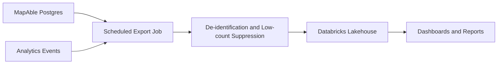

# Databricks data platform plan

This is a future integration plan. Do not connect to or deploy Databricks
resources until a user selects the Databricks profile/workspace.

## Profile selection rule

Never auto-select a Databricks profile.

When implementation is approved:

1. Run `databricks auth profiles`.
2. Present every profile and workspace URL.
3. Ask the user to choose one.
4. Use `--profile <PROFILE>` on every Databricks command.

## Candidate MapAble datasets

Export only privacy-reviewed, purpose-limited data.

Potential de-identified datasets:

- provider finder search aggregates;
- public route usage and SEO landing-page metrics;
- booking lifecycle event counts;
- consent grant/revocation aggregates;
- support ticket and complaint trends;
- incident category counts;
- provider verification status counts;
- LLM analytics latency/error/cost aggregates;
- accessibility place review aggregates.

Do not export raw participant records, NDIS numbers, clinical notes, disability
disclosures, free-text support requests or exact home addresses unless a privacy
and governance review explicitly approves the use case.

## Use cases

- Board-safe de-identified reporting.
- Quality and safeguarding trend dashboards.
- Provider marketplace health analysis.
- Longitudinal outcomes research.
- LLM quality/cost monitoring.
- Experiment and feature adoption analysis.

## Architecture sketch



## Privacy controls

- Remove direct identifiers unless essential and approved.
- Apply low-count suppression before board/public reports.
- Keep participant-facing data access logs in MapAble.
- Track every export in an audit log.
- Use separate development and production workspaces or catalogs.
- Prefer aggregate tables for executive dashboards.

## First implementation milestone

The first Databricks milestone should be read-only and de-identified:

1. define export schema;
2. build local export job producing JSON/CSV;
3. review privacy fields;
4. select Databricks profile;
5. load a sample into a non-production catalog;
6. validate row counts and suppression rules.

## Commands for later use

After profile selection:

```bash
databricks auth profiles
databricks current-user me --profile <PROFILE>
databricks experimental aitools tools get-default-warehouse --profile <PROFILE>
```

Do not run these commands without user-selected profile confirmation.
