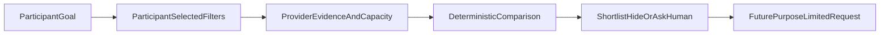

# Participant-controlled marketplace

Participants may browse providers without creating a mission and without AI.
Discovery uses active filters, provider service offerings, separately labelled
evidence and current capacity records. It does not calculate a universal
provider score and sponsored status cannot alter result order.

Provider statements remain unverified until an authorised evidence process
verifies them. Unknown capacity and missing accessibility evidence remain
visible as unknown.

Shortlists and hidden-provider records are participant-owned. Hidden providers
are excluded before discovery results are returned and cannot receive a future
request. Private participant notes are stored separately and are never returned
by provider discovery APIs.

This foundation does not share participant information, contact providers,
create service requests, accept agreements or create bookings. Those actions
require later purpose-specific disclosure and confirmation workflows.
