# CareOS provider and workforce operations

## Service and shift lifecycle

```mermaid
flowchart LR
  Request[CareRequest] --> ProviderReview[ProviderReview]
  ProviderReview --> Shift[ProposedCareShift]
  Shift --> Offer[ShiftOffer]
  Offer --> Participant[ParticipantConfirmation]
  Participant --> Worker[WorkerAcceptance]
  Worker --> Confirmed[ConfirmedAssignment]
  Confirmed --> Delivery[ServiceDelivery]
  Delivery --> Outcome[ParticipantOutcomeOrCorrection]
```

Provider service offerings describe provider-stated service scope and access
features. They do not become verified capability evidence automatically.
Verification remains in the evidence register.

Shift offers are idempotent and separately track participant confirmation and
worker acceptance. A worker can be linked to the shift only after participant
confirmation and acceptance by the worker account linked to the offered worker
profile. Automatic assignment is hard-disabled.

## Continuity recovery

Worker cancellation must link to the exact `CareShift` and `missionId`.
Existing backup recovery may prepare eligible alternatives, but participant or
authorised-human confirmation is required. Unaffected transport and other
mission dependencies remain confirmed.

## Privacy

Organisation membership permits provider operations only within the
organisation scope. Participant records require an active service relationship,
permission, legitimate purpose and participant authority. Worker-facing views
must contain only information needed for the confirmed shift.
