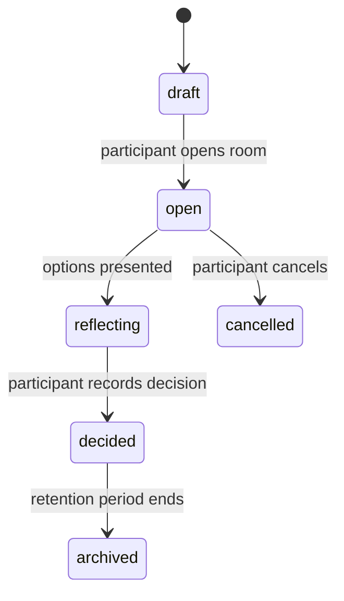

# Supported Decision Room

The Decision Room helps participants make supported choices about data sharing, access arrangements, and rights requests. It is **not** a capacity assessment tool and does not produce clinical or legal determinations.

## Principles

- **Participant wording first:** Records use the participant's own words where possible.
- **Visible dissent:** Supporters may register disagreement without overriding the participant's final choice.
- **Accessible packs:** Options, values, and constraints are rendered in plain language with screen-reader friendly structure.
- **Audit trail:** Every invitation, contribution, dissent, and final record is logged to `AuditEvent`.

## Lifecycle

## Models

- `DecisionRoom` — subject, question, values, constraints
- `DecisionRoomOption` — labelled choices with descriptions
- `DecisionRoomSupporter` — invited supporters with role
- `DecisionRoomContribution` — supporter input (non-binding)
- `DecisionRoomDissent` — recorded disagreement
- `DecisionRoomRecord` — participant's final wording and chosen option
- `DecisionRoomAttestation` — honest limits on what MapAble can verify

## API

- `GET/POST /api/rights/decisions`
- `GET /api/rights/decisions/[decisionId]`
- `POST /api/rights/decisions/[decisionId]/supporters`

## Feature flag

`MAPABLE_DECISION_ROOM_ENABLED=true`

## Scenario C (pilot)

Taylor opens a room about sharing arrival assistance with a new employer contact. A family supporter dissents on sharing equipment dimensions. Taylor records a decision using functional requirements only; dissent remains visible in the audit trail.

## Related

- [ACCESSIBILITY.md](./ACCESSIBILITY.md)
- [POLICY_LANGUAGE.md](./POLICY_LANGUAGE.md)
