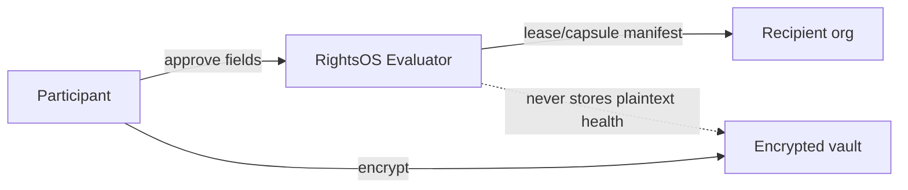

# Threat Model

RightsOS threat model covers participant data misuse, recipient non-compliance, and operational failure modes. It assumes MapAble infrastructure is hardened per platform baseline.

## Assets

- Participant field manifests and policy decisions
- Capability leases and capsule tokens
- Vault ciphertext and device registration metadata
- Decision Room records and supporter dissent

## Threats and mitigations

| Threat | Mitigation | Detection |
| ------ | ---------- | --------- |
| Central vault breach | Encryption, minimisation, no bulk health export | Security audit, access logs |
| Capsule token replay | Hashed tokens, nonce verification, short TTL | `CapsuleVerification` failures |
| Cross-participant IDOR | Session-scoped API guards | `tests/security/rights-os-idor.test.ts` |
| AI policy bypass | Tool allowlist; evaluator not in model path | `ai-boundary.test.ts` |
| False deletion claims | Honest attestation UX | UX review |
| Purpose vagueness | Registry + deny-by-default | Admin review queue |
| Emergency override abuse | Flag default false; human review | Audit `rights.*` |
| Lease over-collection | Field compiler + prohibited lists | Policy evaluation reasons |

## Trust boundaries

## Out of scope

- Recipient infrastructure compromise (attestation only)
- Legal capacity determination
- Government identity federation

## Related

- [ROLLBACK.md](./ROLLBACK.md)
- [PERSONAL_ACCESS_VAULT.md](./PERSONAL_ACCESS_VAULT.md)
