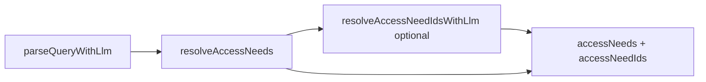

# Natural-language access needs interpreter

Maps free-text **access** phrases from provider search queries to canonical Provider Finder chip ids in [`ACCESS_NEEDS`](../../lib/provider-finder/filters.ts).

The needs stage runs inside the same pipeline as the [natural-language search interpreter](./nl-interpreter.md) (step 3). Service category resolution is unchanged.

## Pipeline

1. **LLM parse** — `parse-query.ts` may return `access` text and optional `accessNeedIds[]` (catalog listed in the system prompt).
2. **Resolve** — `resolveAccessNeeds()` in `lib/search/interpreter/resolve-access-needs.ts`:
   - Validates LLM-suggested ids against the catalog.
   - Merges with keyword scoring (`resolveAccessNeedIdsFromKeywords`).
   - If still empty but `access` text is set, optional **`resolveAccessNeedIdsWithLlm`** (`resolve-access-needs-llm.ts`) when `SEARCH_NEEDS_INTERPRETER_LLM` is enabled and interpreter API keys exist.
3. **Output** — `SearchInterpretation.accessNeedIds` (backward compatible) and `accessNeeds` (`ids`, `confidence`, `source`, optional `unmatchedText`).



## Environment variables

| Variable | Purpose |
| -------- | ------- |
| `SEARCH_NEEDS_INTERPRETER_LLM` | Set to `false` to skip the dedicated needs LLM step (keyword + parse `accessNeedIds` still run). Default: enabled when `SEARCH_INTERPRETER_ENABLED` and AI keys are set. |
| `SEARCH_INTERPRETER_ENABLED`, `AI_GATEWAY_API_KEY` / `GOOGLE_GENERATIVE_AI_API_KEY` | Required for LLM parse and optional needs step |

See [`.env.example`](../../.env.example).

## API

`POST /api/search/interpret` responses include:

- `accessNeedIds`: `string[]` — chip ids for URL `accessNeeds=` and UI filters.
- `accessNeeds`: `{ ids, confidence, source, unmatchedText? }` — `source` is `llm_ids`, `keyword`, `llm_step`, or `none`.

OpenAPI: [`docs/api/openapi-search-interpret.yaml`](../api/openapi-search-interpret.yaml).

## Clarification (Provider Finder Ask)

When the user mentions access in NL but no chip id resolves (`accessNeedIds` empty and `accessNeeds.confidence < 0.4`), Ask may return `agent.status: needs_clarification` even if suburb and support type are already known. Question template: *Which access needs matter most — for example wheelchair access, Auslan, low sensory, or hoist support?*

Logic: `lib/provider-finder/clarification.ts`.

## UI

On `/provider-finder`, if interpretation leaves access text unresolved, the hero shows: *AI suggested access filters — adjust access needs if something looks off.*

## Future: HF needs classifier

Optional small model (similar to [HF category classifier](./hf-category-classifier.md)) could suggest `accessNeedIds` before keyword resolution. Not implemented; the dedicated LLM step covers ambiguous phrases today.

## Testing

```bash
pnpm test tests/search-interpreter.test.ts tests/needs-interpreter.test.ts tests/provider-finder-ask.test.ts
```

## Related

- [Natural-language interpreter](./nl-interpreter.md)
- [MapAble Ask on Provider Finder](./nl-interpreter.md#mapable-ask-on-provider-finder)
