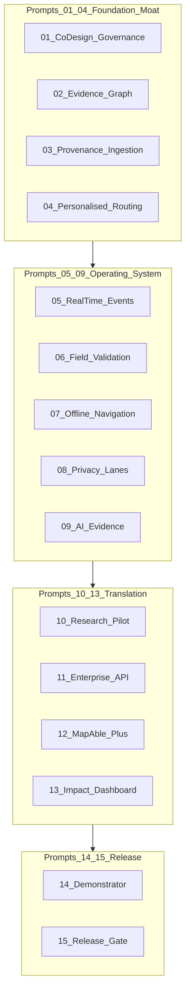

# Prompt 00 — MapAble Innovation Master Orchestrator

## Objective

Establish the execution model for MapAble Innovation Prompts 01–15: one PR per prompt, verification gates between phases, alignment with portfolio claim-state vocabulary, and MRFF-informed sequencing (historical precedent only).

## Non-goals

- Implementing feature code from Prompts 01–15 in this phase
- Replacing [MAPABLE_INNOVATION_PORTFOLIO.md](../../innovation/MAPABLE_INNOVATION_PORTFOLIO.md) as programme SoT
- Presenting the 2016–2021 MRFF strategy as current 2026 funding policy or grant eligibility proof
- Calendar-date commitments (use technical gates instead)

## Prerequisites

- Repository on `main` with Prompt 00 merged
- Reviewer agreement on prompt sequencing (this document)

## Deliverables (Prompt 00 PR — documentation only)

| File | Purpose |
|------|---------|
| [architecture-baseline.md](../../innovation/architecture-baseline.md) | As-built architecture snapshot |
| [gap-analysis.md](../../innovation/gap-analysis.md) | Current vs target gaps |
| [implementation-roadmap.md](../../innovation/implementation-roadmap.md) | Sequenced PR programme |
| [research-translation-model.md](../../innovation/research-translation-model.md) | MRFF-informed rationale |
| [README.md](./README.md) | Plan index and dependency graph |
| [00-orchestrator.md](./00-orchestrator.md) | This file |
| [01-co-design-governance.md](./01-co-design-governance.md) … [15-final-readiness-review.md](./15-final-readiness-review.md) | Executable phase plans |
| [archive/](./archive/) | Superseded epic-aligned plans (preserved) |
| [research-status.md](./research-status.md) | Deep research auth status |

## MRFF disclaimer (mandatory in all programme docs)

The **2016–2021 Australian Medical Research and Innovation Strategy** is used as a **historical translation framework** for research-to-impact architecture. It is **not** the current 2026 funding strategy and does **not** constitute proof of present grant eligibility.

## Orchestration rules

### 1. One prompt, one PR

- Branch naming: `cursor/<descriptive-name>-dee8`
- Use the **exact** commit message specified in each plan
- Do not batch multiple prompts into one PR unless explicitly waived by programme governance

### 2. Stop after each PR

Before starting the next prompt:

- [ ] PR merged or explicitly approved to continue on stacked branch
- [ ] Plan verification checklist completed with evidence (CI logs, test output, screenshots where UI)
- [ ] Claim states updated only when verification evidence exists
- [ ] No unresolved **BLOCKER** findings from prior prompt review

### 3. Claim state discipline

From portfolio SoT:

| State | Agent behaviour |
|-------|-----------------|
| Verified live | Requires independent production verification evidence |
| Implemented, not verified | May reference code; must not claim external audit |
| In development | Flag-gated; document flag names |
| Proposed / Exploratory | Plan and scaffold only; no production claims |
| Historical | Do not extend without migration plan |

### 4. Prompt 15 is review-only

Prompt 15 produces [docs/innovation/final-readiness-review.md](../../innovation/final-readiness-review.md). **No feature commits.**

### 5. Sequencing rationale (series v2)



**Principle:** Data and trust before spectacle. Prompts 01–04 strengthen governance and the evidence moat. Prompts 05–09 build the reliable operating system. Prompts 10–13 establish translation, enterprise value, and measurable impact. Prompts 14–15 move through demonstrator readiness and independent release review.

### 6. Portfolio epic cross-reference

| Prompt | Innovation epic | Notes |
|--------|-----------------|-------|
| 01 | Governance (new) | Disability-led co-design domain |
| 02 | E01 Access Graph | Production evidence graph v1 |
| 03 | E01 infrastructure | Provenance and ingestion |
| 04 | E03 Navigate + E02 absorbed | Personalised routing |
| 05 | E01 + E03 | Real-time event overlay |
| 06 | E01 community evidence | Field validation workflow |
| 07 | E03 + mobile | Offline resilience |
| 08 | Cross-cutting + E02 absorbed | Four-lane privacy architecture |
| 09 | E04 superseded | Governed AI evidence pipeline |
| 10 | Research | Health-access pilot — not clinical CDS |
| 11 | E13 Access API | Enterprise intelligence API |
| 12 | E13 + billing | MapAble+ commercialisation |
| 13 | E14 Observatory | Impact measurement |
| 14 | Pilot ops | Demonstrator readiness |
| 15 | Release gate | Independent review |

Deferred/archive: E05 Digital Twins, E06 Accreditation OS (parallel track) — see [archive/README.md](./archive/README.md).

### 7. Verification tiers (apply per plan)

| Tier | Commands / evidence |
|------|---------------------|
| **Always** | `pnpm type-check`, `pnpm test` (unit) |
| **API changes** | Integration tests, OpenAPI diff |
| **UI changes** | Playwright, axe, manual AT spot-check |
| **Privacy** | Lane separation regression tests |
| **Routing** | False-safe accessibility test suite |
| **Release** | Full production gates in Prompt 14 |

### 8. Rollback

- All prompts must ship behind feature flags where behaviour changes are user-visible
- Database migrations must be reversible or documented as forward-only with rollback procedure
- Prompt 14 documents incident response and rollback in operations runbooks

## Commit message (exact)

```
docs: establish MapAble innovation architecture baseline
```

## Verification checklist

- [ ] Four innovation docs exist under `docs/innovation/`
- [ ] All 16 active plan files exist under `docs/superpowers/plans/`
- [ ] Six superseded plans archived with [archive/README.md](./archive/README.md)
- [ ] README index matches filenames and commit messages
- [ ] Dependency graph matches sequencing rules
- [ ] MRFF disclaimer present in orchestrator and research-translation-model
- [ ] `pnpm type-check` and `pnpm test` run with pre-existing failures documented
- [ ] No feature code changes in this PR

## Rollback notes

Revert the docs commit. No runtime impact.
