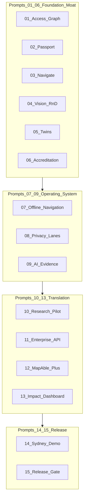

# Prompt 00 — MapAble Innovation Master Orchestrator

## Objective

Establish the execution model for MapAble Innovation Prompts 01–15: one PR per prompt, verification gates between phases, and alignment with the portfolio claim-state vocabulary.

## Non-goals

- Implementing feature code from Prompts 01–15 in this phase
- Replacing [MAPABLE_INNOVATION_PORTFOLIO.md](../innovation/MAPABLE_INNOVATION_PORTFOLIO.md) as programme SoT
- Calendar-date commitments (use technical gates instead)

## Prerequisites

- Repository on `main` with clean working tree
- Reviewer agreement on prompt sequencing (this document)

## Deliverables (this PR)

| File | Purpose |
|------|---------|
| [README.md](./README.md) | Index, dependency graph, run checklist |
| [00-orchestrator.md](./00-orchestrator.md) | This file |
| [01-access-graph.md](./01-access-graph.md) … [15-final-readiness-review.md](./15-final-readiness-review.md) | Executable phase plans |
| [research-status.md](./research-status.md) | Deep research auth status |

## Orchestration rules

### 1. One prompt, one PR

- Branch naming: `cursor/<descriptive-name>-bf70`
- Use the **exact** commit message specified in each plan
- Do not batch multiple prompts into one PR unless explicitly waived by programme governance

### 2. Stop after each PR

Before starting the next prompt:

- [ ] PR merged or explicitly approved to continue on stacked branch
- [ ] Plan verification checklist completed with evidence (CI logs, test output, screenshots where UI)
- [ ] Claim states updated only when verification evidence exists
- [ ] No unresolved **BLOCKER** findings from prior prompt review

### 3. Claim state discipline

From portfolio SoT:

| State | Agent behaviour |
|-------|-----------------|
| Verified live | Requires independent production verification evidence |
| Implemented, not verified | May reference code; must not claim external audit |
| In development | Flag-gated; document flag names |
| Proposed / Exploratory | Plan and scaffold only; no production claims |
| Historical | Do not extend without migration plan |

### 4. Prompt 15 is review-only

Prompt 15 produces [docs/innovation/final-readiness-review.md](../innovation/final-readiness-review.md). **No feature commits.**

### 5. Sequencing rationale



**Principle:** Data and trust before spectacle. Prompts 01–06 strengthen the evidence moat. Prompts 07–09 build the reliable operating system (offline resilience, privacy, AI governance). Prompts 10–13 establish translation, enterprise value, and measurable impact. Prompts 14–15 move through demonstrator readiness and independent release review.

### 6. Portfolio epic cross-reference

| Prompt | Innovation epic | Notes |
|--------|-----------------|-------|
| 01 | E01 Access Graph | Delta from in-development |
| 02 | E02 Personal Access Passport | Harden existing implementation |
| 03 | E03 Navigate | False-safe routing |
| 04 | E04 Access Intelligence Vision | Exploratory; superseded in production path by Prompt 09 |
| 05 | E05 Digital Twins | Evidence-backed twins only |
| 06 | E06 Accreditation OS | Graph publication pipeline |
| 07 | E03 + mobile | Offline/a11y resilience |
| 08 | Cross-cutting | Four-lane privacy architecture |
| 09 | E04 + E01 | Governed AI evidence (production path) |
| 10 | Research | Health-access pilot — not clinical CDS |
| 11 | E13 Access API | Enterprise intelligence API |
| 12 | E13 + billing | MapAble+ commercialisation |
| 13 | E14 Observatory | Impact measurement |
| 14 | Pilot ops | Sydney/NSW demonstrator |
| 15 | Release gate | Independent review |

### 7. Verification tiers (apply per plan)

| Tier | Commands / evidence |
|------|---------------------|
| **Always** | `pnpm typecheck`, `pnpm test` (unit) |
| **API changes** | Integration tests, OpenAPI diff |
| **UI changes** | Playwright, axe, manual AT spot-check |
| **Privacy** | Lane separation regression tests |
| **Routing** | False-safe accessibility test suite |
| **Release** | Full production gates in Prompt 14 |

### 8. Rollback

- All prompts must ship behind feature flags where behaviour changes are user-visible
- Database migrations must be reversible or documented as forward-only with rollback procedure
- Prompt 14 documents incident response and rollback in operations runbooks

## Commit message (exact)

```
docs: add MapAble innovation superpowers orchestrator and phase plans
```

## Verification checklist

- [ ] All 16 plan files exist under `docs/superpowers/plans/`
- [ ] README index matches filenames and commit messages
- [ ] Dependency graph matches sequencing rules
- [ ] research-status.md documents parallel-cli state
- [ ] No feature code changes in this PR

## Rollback notes

Revert the docs commit. No runtime impact.
