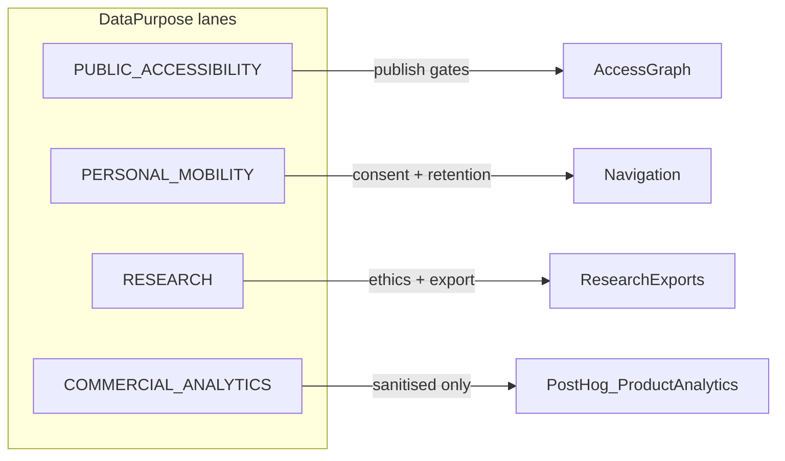

# Prompt 08 — Mobility Data Purpose Separation

## Objective

Implement four-lane privacy architecture separating PUBLIC ACCESSIBILITY DATA, PERSONAL MOBILITY DATA, RESEARCH DATA, and COMMERCIAL ANALYTICS with purpose-bound consent, retention policies, and PostHog guards.

## Non-goals

- Selling mobility histories for advertising
- Combining research and marketing datasets by shared ID
- Physical database partitioning (logical separation first)

## Prerequisites

- Prompt 07 merged
- Prompt 01 merged (research consent lane)
- Existing: `lib/consent/*`, `lib/platform/privacy/*`, `lib/trust/fabric/*`, `lib/ads/privacy/*`

## Architecture



## Files to create / modify

| Action | Path |
|--------|------|
| Create | `lib/platform/privacy/data-lanes.ts` — `DataPurpose` enum + scope mapping |
| Create | `lib/platform/privacy/lane-consent.ts` — independent consent purposes |
| Create | `lib/platform/privacy/retention-policies.ts` |
| Create | `lib/platform/privacy/location-sharing.ts` — expiry + active indicator |
| Create | `lib/platform/privacy/participant-export.ts` |
| Create | `lib/platform/privacy/participant-deletion.ts` |
| Extend | `lib/analytics/llm-analytics.ts` — lane consent middleware |
| Extend | `lib/analytics/product-analytics.ts` — consent gate |
| Create | `lib/analytics/posthog-sanitizer.ts` — deny-list |
| Extend | `prisma/schema.prisma` — `dataLane` on consent/export records |
| Extend | `components/consent/*` — lane-specific UI |
| Create | `app/participant/privacy/data-lanes/page.tsx` |
| Create | `tests/privacy/analytics/mobility-lane-separation.test.ts` |
| Create | `tests/privacy/analytics/posthog-deny-list.test.ts` |
| Create | `docs/privacy/mobility-data.md` |
| Create | `docs/privacy/research-data.md` |

## Consent purposes (independent)

| Purpose | Lane | Default |
|---------|------|---------|
| Core navigation | PERSONAL_MOBILITY | Required for nav features |
| Saved travel history | PERSONAL_MOBILITY | Opt-in |
| Research participation | RESEARCH | Opt-in; separate from nav |
| Product analytics | COMMERCIAL_ANALYTICS | Opt-in |
| Personalisation | COMMERCIAL_ANALYTICS | Opt-in |
| Location sharing | PERSONAL_MOBILITY | Opt-in with expiry |

## Data controls

- Pseudonymous identifiers: extend `lib/platform/privacy/deidentification/pseudonymisation.ts`
- Data export: participant self-service bundle
- Deletion: beyond contact form — automated erasure API for lane-scoped data
- Consent revocation: immediate enforcement on analytics and sharing
- Location-sharing expiration + active-sharing indicator in UI

## PostHog rules (never by default)

- Precise route history
- Medical information
- Sensitive accessibility profile values
- Raw participant location traces

## Tests required

- Commercial analytics cannot access protected mobility profile fields
- PostHog capture blocked without `COMMERCIAL_ANALYTICS` consent
- Research export blocked after withdrawal
- Location sharing expires and indicator clears

## Docs to write

- `docs/privacy/mobility-data.md`
- `docs/privacy/research-data.md`

## Commit message (exact)

```
feat: enforce mobility data purpose separation
```

## Verification checklist

- [ ] `pnpm typecheck`
- [ ] `pnpm test tests/privacy`
- [ ] Privacy review sign-off
- [ ] Consent UI shows all six independent purposes
- [ ] Regression: `tests/ads/mapable-ads-foundation.test.ts` still passes

## Rollback notes

Disable lane enforcement middleware; existing consent scopes remain functional.
