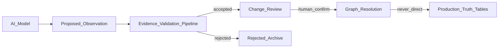

# Prompt 09 — Governed Accessibility AI Evidence Pipeline

## Objective

Implement production AI evidence architecture: AI proposes; deterministic geospatial services decide. Model outputs enter graph as `MODEL_INFERRED` — never `VERIFIED`.

## Non-goals

- AI as authoritative source
- Direct writes to production accessibility truth tables
- Auto-promotion of low-confidence results
- CV-only accreditation

## Prerequisites

- Prompt 03 merged (provenance and ingestion pipeline)
- Prompt 08 merged (privacy lanes)
- Supersedes archived [04-access-intelligence-vision.md](./archive/04-access-intelligence-vision.md) for production AI path
- Portfolio epic: [E04 Access Intelligence Vision](../../innovation/epics/04-access-intelligence-vision.md) (superseded in production path)

## Architecture



## Files to create / modify

| Action | Path |
|--------|------|
| Create | `packages/accessibility-ai/package.json` |
| Create | `packages/accessibility-ai/src/proposal-schema.ts` |
| Create | `packages/accessibility-ai/src/model-metadata.ts` |
| Create | `packages/accessibility-ai/src/index.ts` |
| Create | `lib/access/ai-evidence/proposal-ingest.ts` |
| Create | `lib/access/ai-evidence/validation-pipeline.ts` |
| Create | `lib/access/ai-evidence/graph-resolver.ts` |
| Create | `lib/access/ai-evidence/performance-telemetry.ts` |
| Align | `packages/contracts/src/evidence-provenance.ts` — `MODEL_INFERRED` |
| Align | `lib/access/intelligence-next/evidence/classes.ts` — `model_candidate` mapping |
| Create | `tests/accessibility-ai/low-confidence-cannot-verify.test.ts` |
| Create | `tests/accessibility-ai/hallucination-no-routing-edge.test.ts` |
| Create | `tests/accessibility-ai/rejected-no-route-impact.test.ts` |
| Create | `tests/accessibility-ai/model-version-audit.test.ts` |

## Proposal schema (required fields)

Every model output must include:

- `model` / `version`
- `confidence` (0–1)
- `inputSource` (imagery type, capture method)
- `timestamp`
- `geographicLocation`
- `proposedAccessibilityFeature` (sidewalk, curb ramp, steps, surface, entrance, obstacle)

## Proposed features (non-exhaustive)

- Sidewalk presence
- Likely curb ramp
- Steps
- Surface type
- Entrance
- Potential obstacle

## Graph rules

| Rule | Enforcement |
|------|-------------|
| AI cannot write truth tables | Proposal ingest only |
| Low confidence cannot become verified | Validation pipeline threshold |
| Rejected proposal cannot affect route | Graph resolver isolation test |
| Model version auditable | `model-metadata` + audit events |
| Safety-critical claims need human policy | Configurable per feature class |

## Performance telemetry (no participant PII)

Track by: feature type, city/region, imagery type, environmental condition

## Tests required

- Low-confidence result cannot become verified
- Model hallucination cannot create routing edge
- Rejected proposal cannot affect route
- Model version remains auditable in audit trail

## Docs to write

- `docs/access-intelligence-next/AI_EVIDENCE_PIPELINE.md`

## Commit message (exact)

```
feat: add governed accessibility AI evidence pipeline
```

## Verification checklist

- [ ] `pnpm typecheck`
- [ ] `pnpm test tests/accessibility-ai`
- [ ] Security review for proposal ingest endpoint
- [ ] No path from `packages/accessibility-ai` to direct Prisma truth writes

## Rollback notes

Disable AI proposal ingest flag; existing `model_candidate` review queue unaffected.
