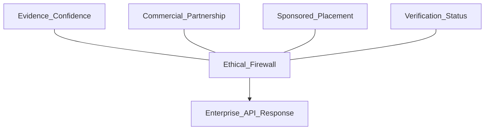

# Prompt 12 — MapAble+ Commercialisation Without Exploitation

## Objective

Connect accessibility intelligence to MapAble+ enterprise products without selling individual mobility histories or allowing commercial relationships to alter accessibility truth.

## Non-goals

- Selling precise mobility histories
- Parallel billing platform (use existing billing)
- Collapsing evidence confidence, commercial partnership, sponsored placement, and verification into one ranking field

## Prerequisites

- Prompt 11 merged (enterprise API)
- Prompt 08 merged (privacy lanes)
- Existing: `lib/billing/partner/billing-service.ts`, `PartnerBillingAccount`

## CRITICAL ETHICAL RULE

A paying customer **cannot** purchase:

- Higher accessibility confidence
- Suppression of negative evidence
- Removal of legitimate barrier reports
- Preferred safety routing

## Primary commercial products

| Product | Description |
|---------|-------------|
| Municipal accessibility SaaS | Council dashboards + API |
| Transport analytics | Aggregate gap analysis (no PII) |
| Venue navigation | White-label accessible wayfinding |
| Enterprise Accessibility API | Prompt 11 surface |
| SDK licensing | `packages/mapable-sdk` |
| Data-quality services | Evidence validation tooling |
| Verified accessibility management | Accreditation workflow (E06) |
| Integration services | Partner onboarding + webhooks |

## Files to create / modify

| Action | Path |
|--------|------|
| Create | `lib/commercial/mapable-plus/products.ts` |
| Create | `lib/commercial/mapable-plus/ethical-firewall.ts` |
| Create | `lib/commercial/mapable-plus/subscription-tiers.ts` |
| Extend | `lib/billing/partner/billing-service.ts` — usage metering |
| Create | `lib/commercial/audit/commercial-data-access-log.ts` |
| Extend | `prisma/schema.prisma` — commercial access audit |
| Create | `tests/commercial/ethical-firewall.test.ts` |
| Create | `tests/commercial/payment-cannot-alter-truth.test.ts` |
| Create | `tests/commercial/mobility-history-not-sold.test.ts` |
| Update | `docs/strategy/OPERATING_LANES.md` |

## Separation model



These four dimensions must remain **independent fields** in API responses and internal models.

## Billing integration

- Enterprise subscription via existing `PartnerBillingAccount`
- Usage metering for API calls (extend Orb/Stripe paths as configured)
- Audit record for every commercial data access event
- Essential consumer navigation remains free of commercial ranking distortion

## Tests required

- Paying partner cannot modify graph verification state via API
- Commercial tier does not elevate `inferred` to `verified`
- Negative barrier reports from community cannot be suppressed by partner payment
- Mobility history fields absent from commercial analytics exports
- Sponsored placement clearly labelled and separate from routing suitability

## Docs to write

- `docs/commercial/mapable-plus-ethics.md`

## Commit message (exact)

```
feat: connect accessibility intelligence to MapAble+ enterprise products
```

## Verification checklist

- [ ] `pnpm typecheck`
- [ ] `pnpm test tests/commercial`
- [ ] Legal/privacy review of commercial terms alignment
- [ ] Ethical firewall tests pass

## Rollback notes

Disable MapAble+ product flags; API remains available on standard partner plan.
