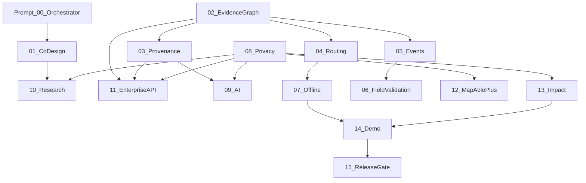

# MapAble Innovation Superpowers — Phase Plans (Series v2)

Executable, PR-sized implementation plans for the MapAble Innovation programme. Each plan maps to one prompt, one branch (`cursor/<name>-dee8`), one commit message, and one verification gate before the next phase begins.

> **MRFF disclaimer:** The 2016–2021 Australian Medical Research and Innovation Strategy is referenced as a **historical translation framework** only. It is not the 2026 funding strategy and does not prove present grant eligibility. See [research-translation-model.md](../../innovation/research-translation-model.md).

## Source of truth hierarchy

1. **Repository implementation** — code, schema, tests, deployed flags
2. **[MAPABLE_INNOVATION_PORTFOLIO.md](../../innovation/MAPABLE_INNOVATION_PORTFOLIO.md)** — programme index and claim states
3. **[Innovation architecture docs](../../innovation/architecture-baseline.md)** — baseline, gaps, roadmap, translation model
4. **These plans** — execution sequencing and delta from current state
5. **Strategy documents** — supplementary; never override verified repo state

## Claim states (mandatory vocabulary)

| State | Meaning |
|-------|---------|
| **Verified live** | Independently verified in production |
| **Implemented, not independently verified** | Code/schema exists; not externally verified |
| **In development** | Partial, flagged, or pilot |
| **Proposed** | Documented; little/no product implementation |
| **Exploratory** | Research/synthetic sandbox |
| **Historical** | Superseded stack |

Never mark **Verified live** without evidence. See [00-orchestrator.md](./00-orchestrator.md).

## Plan index

| Prompt | Plan | Portfolio epic | Claim state | Commit message |
|--------|------|----------------|-------------|----------------|
| 00 | [00-orchestrator.md](./00-orchestrator.md) | Programme | — | `docs: establish MapAble innovation architecture baseline` |
| 01 | [01-co-design-governance.md](./01-co-design-governance.md) | Governance | Proposed | `feat: establish disability-led research governance` |
| 02 | [02-accessibility-evidence-graph.md](./02-accessibility-evidence-graph.md) | E01 | In development | `feat: add accessibility evidence graph foundation` |
| 03 | [03-provenance-data-ingestion.md](./03-provenance-data-ingestion.md) | E01 infra | Proposed | `feat: add provenance-aware accessibility ingestion` |
| 04 | [04-personalised-accessible-routing.md](./04-personalised-accessible-routing.md) | E03 (+E02) | In development | `feat: add evidence-aware personalised routing` |
| 05 | [05-real-time-accessibility-events.md](./05-real-time-accessibility-events.md) | E01+E03 | In development | `feat: add real-time accessibility event layer` |
| 06 | [06-field-validation-community-reporting.md](./06-field-validation-community-reporting.md) | E01 | Proposed | `feat: add accessible evidence contribution workflow` |
| 07 | [07-resilient-offline-navigation.md](./07-resilient-offline-navigation.md) | E03 + mobile | In development | `feat: add resilient offline accessible navigation` |
| 08 | [08-mobility-data-purpose-separation.md](./08-mobility-data-purpose-separation.md) | Cross-cutting | In development | `feat: enforce mobility data purpose separation` |
| 09 | [09-governed-ai-evidence-pipeline.md](./09-governed-ai-evidence-pipeline.md) | E04 superseded | Exploratory | `feat: add governed accessibility AI evidence pipeline` |
| 10 | [10-health-access-research-pilot.md](./10-health-access-research-pilot.md) | Research | Proposed | `feat: add accessible journey research measurement framework` |
| 11 | [11-enterprise-accessibility-api.md](./11-enterprise-accessibility-api.md) | E13 | Proposed | `feat: expose governed accessibility intelligence API` |
| 12 | [12-mapable-plus-commercialisation.md](./12-mapable-plus-commercialisation.md) | E13 + billing | Proposed | `feat: connect accessibility intelligence to MapAble+ enterprise products` |
| 13 | [13-innovation-impact-measurement.md](./13-innovation-impact-measurement.md) | E14 | Proposed | `feat: add MapAble innovation impact measurement` |
| 14 | [14-sydney-demonstrator-readiness.md](./14-sydney-demonstrator-readiness.md) | Pilot ops | In development | `chore: prepare MapAble accessibility demonstrator` |
| 15 | [15-final-readiness-review.md](./15-final-readiness-review.md) | Release gate | — | *(review only)* |

**Archived plans:** [archive/README.md](./archive/README.md) — epic-aligned series v1 (preserved, not active).

## Dependency graph

**Hard dependencies:**

- **01** before **10** (research governance before health-access pilot)
- **02** before **03, 04, 05, 11** (evidence graph foundation)
- **03** before **09, 11** (provenance before AI and enterprise API)
- **08** blocks **09, 10, 11, 12, 13** (privacy lanes must exist first)
- **04** before **07** (routing before offline packs)
- **05** before **06** (events before field validation corroboration)
- **14** requires **07–13** materially complete or explicitly deferred with documented risk
- **15** requires all prior prompts merged or waived with evidence

## Architecture principles (non-negotiable)

- **AI proposes; deterministic geospatial services decide.**
- **Data and trust before spectacle.** AR, conversational agents, and digital twins come after evidence graph, routing, provenance, real-time conditions, and privacy architecture are demonstrably reliable.
- **False-safe accessibility:** unknown ≠ accessible; inferred ≠ verified; stale must be visible.
- **Commercial relationships must never change accessibility truth.**
- **Research participation is never required for core navigation.**

## How to run one phase

1. Read [00-orchestrator.md](./00-orchestrator.md) and the target plan file.
2. Confirm prerequisite PRs are merged on `main`.
3. Create branch: `cursor/<descriptive-name>-dee8`.
4. Implement only the scope in the plan; do not expand.
5. Run the plan's verification checklist (`pnpm type-check`, `pnpm test`, Playwright/axe as applicable).
6. Commit with the **exact** commit message from the plan.
7. Open PR; wait for review before starting the next prompt.
8. Update claim states in portfolio docs only when verification evidence exists.

## Innovation architecture documents

| Document | Purpose |
|----------|---------|
| [architecture-baseline.md](../../innovation/architecture-baseline.md) | As-built snapshot |
| [gap-analysis.md](../../innovation/gap-analysis.md) | Gaps vs target |
| [implementation-roadmap.md](../../innovation/implementation-roadmap.md) | Full PR programme |
| [research-translation-model.md](../../innovation/research-translation-model.md) | MRFF-informed rationale |

## Deep research

See [research-status.md](./research-status.md) for parallel-cli deep research status and cross-check notes.
