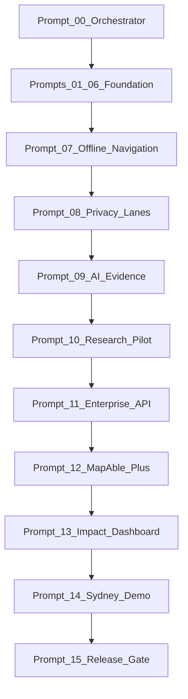

# MapAble Innovation Superpowers — Phase Plans

Executable, PR-sized implementation plans for the MapAble Innovation programme. Each plan maps to one prompt, one branch, one commit message, and one verification gate before the next phase begins.

## Source of truth hierarchy

1. **Repository implementation** — code, schema, tests, deployed flags
2. **[MAPABLE_INNOVATION_PORTFOLIO.md](../innovation/MAPABLE_INNOVATION_PORTFOLIO.md)** — programme index and claim states
3. **[Innovation epics](../innovation/epics/)** — detailed epic specifications (E01–E15)
4. **These plans** — execution sequencing and delta from current state
5. **Strategy documents** — supplementary; never override verified repo state

## Claim states (mandatory vocabulary)

| State | Meaning |
|-------|---------|
| **Verified live** | Independently verified in production |
| **Implemented, not independently verified** | Code/schema exists; not externally verified |
| **In development** | Partial, flagged, or pilot |
| **Proposed** | Documented; little/no product implementation |
| **Exploratory** | Research/synthetic sandbox |
| **Historical** | Superseded stack |

Never mark **Verified live** without evidence. See [00-orchestrator.md](./00-orchestrator.md).

## Plan index

| Prompt | Plan | Portfolio epic | Claim state | Commit message |
|--------|------|----------------|-------------|----------------|
| 00 | [00-orchestrator.md](./00-orchestrator.md) | Programme | — | `docs: add MapAble innovation superpowers orchestrator and phase plans` |
| 01 | [01-access-graph.md](./01-access-graph.md) | E01 | In development | `feat: strengthen access evidence graph provenance` |
| 02 | [02-personal-access-passport.md](./02-personal-access-passport.md) | E02 | Implemented, not verified | `feat: harden personal access passport disclosure controls` |
| 03 | [03-navigate.md](./03-navigate.md) | E03 | In development | `feat: add false-safe accessible routing foundations` |
| 04 | [04-access-intelligence-vision.md](./04-access-intelligence-vision.md) | E04 | Exploratory | `feat: scaffold access intelligence vision capture` |
| 05 | [05-accessibility-digital-twins.md](./05-accessibility-digital-twins.md) | E05 | In development | `feat: extend evidence-backed digital twin publication` |
| 06 | [06-accreditation-os.md](./06-accreditation-os.md) | E06 | Implemented, not verified | `feat: complete accreditation-to-graph publication pipeline` |
| 07 | [07-resilient-offline-navigation.md](./07-resilient-offline-navigation.md) | E03 + mobile | In development | `feat: add resilient offline accessible navigation` |
| 08 | [08-mobility-data-purpose-separation.md](./08-mobility-data-purpose-separation.md) | Cross-cutting | In development | `feat: enforce mobility data purpose separation` |
| 09 | [09-governed-ai-evidence-pipeline.md](./09-governed-ai-evidence-pipeline.md) | E04 + E01 | Exploratory | `feat: add governed accessibility AI evidence pipeline` |
| 10 | [10-health-access-research-pilot.md](./10-health-access-research-pilot.md) | Research | Proposed | `feat: add accessible journey research measurement framework` |
| 11 | [11-enterprise-accessibility-api.md](./11-enterprise-accessibility-api.md) | E13 | Proposed | `feat: expose governed accessibility intelligence API` |
| 12 | [12-mapable-plus-commercialisation.md](./12-mapable-plus-commercialisation.md) | E13 + billing | Proposed | `feat: connect accessibility intelligence to MapAble+ enterprise products` |
| 13 | [13-innovation-impact-measurement.md](./13-innovation-impact-measurement.md) | E14 | Proposed | `feat: add MapAble innovation impact measurement` |
| 14 | [14-sydney-demonstrator-readiness.md](./14-sydney-demonstrator-readiness.md) | Pilot ops | In development | `chore: prepare MapAble accessibility demonstrator` |
| 15 | [15-final-readiness-review.md](./15-final-readiness-review.md) | Release gate | — | *(review only — no feature commit)* |

## Dependency graph

**Hard dependencies:**

- **08** blocks **09**, **10**, **11**, **12**, **13** (privacy lanes must exist before analytics, AI, research, API, commercialisation)
- **01** and **06** block **11** (verified graph pipeline before enterprise API)
- **09** blocks production AI promotion (governed pipeline before scale)
- **10** requires **08** research consent lane
- **14** requires **07–13** materially complete or explicitly deferred with documented risk
- **15** requires all prior prompts merged or waived with evidence

## How to run one phase

1. Read [00-orchestrator.md](./00-orchestrator.md) and the target plan file.
2. Confirm prerequisite PRs are merged on `main`.
3. Create branch: `cursor/<descriptive-name>-bf70`.
4. Implement only the scope in the plan; do not expand.
5. Run the plan's verification checklist (typecheck, unit, integration, Playwright, axe as applicable).
6. Commit with the **exact** commit message from the plan.
7. Open PR; wait for review before starting the next prompt.
8. Update claim states in portfolio docs only when verification evidence exists.

## Architecture principles (non-negotiable)

- **AI proposes; deterministic geospatial services decide.**
- **Data and trust before spectacle.** AR, conversational agents, and digital twins come after evidence graph, routing, provenance, real-time conditions, and privacy architecture are demonstrably reliable.
- **False-safe accessibility:** unknown ≠ accessible; inferred ≠ verified; stale must be visible.
- **Commercial relationships must never change accessibility truth.**

## Deep research

See [research-status.md](./research-status.md) for parallel-cli deep research status and cross-check notes.
