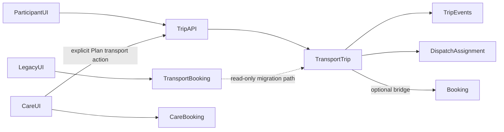

# MapAble Transport — Architecture Decisions

Repository: `ausdisau/mapableau-new`.  
Aligned with [PRODUCT_REQUIREMENTS.md](./PRODUCT_REQUIREMENTS.md) and [CURRENT_STATE_AUDIT.md](./CURRENT_STATE_AUDIT.md).  
Governing rule: [`.cursor/rules/mapable-transport.mdc`](../../.cursor/rules/mapable-transport.mdc).

## ADR-1: Stack and module boundaries

**Decision:** Keep Next.js App Router + Prisma + NextAuth. Do not introduce Express/Drizzle or a second SPA framework.

| Layer | Location |
|-------|----------|
| Pages / shells | `app/transport/**`, `app/dashboard/transport/**`, `app/provider/**/transport/**`, `app/driver/**`, `app/admin/transport/**` |
| HTTP adapters | Thin `app/api/transport/**`, `app/api/provider/transport/**`, `app/api/driver/transport/**` route handlers |
| Domain services | `lib/transport/*` |
| Routing adapters | `lib/transport/routing/*`, config `lib/config/transport-routing.ts` |
| Shared types | `types/transport*.ts` + Zod schemas colocated with services |
| Persistence | Prisma models in `prisma/schema.prisma` + migrations under `prisma/migrations/` |
| Cross-cutting | `lib/auth`, `lib/audit`, `lib/consent`, `lib/notifications`, `lib/incidents`, `lib/billing/core` |

**Rationale:** Substantial transport domain already exists here; rewriting the stack would break Care and other modules.

## ADR-2: Dual-model compatibility (safe migration)

**Decision:** `TransportTrip` (+ request/events/assignments) is the **operational source of truth** for new MapAble Transport work. Legacy `TransportBooking` remains readable; generic `Booking` is used only via an explicit bridge for claims/attestation flows that already depend on it.

**Rules:**

1. Do not perform a destructive big-bang rewrite or delete Care/`Booking` behaviour.
2. New participant UI must stop treating legacy booking endpoints as the primary write path.
3. `legacyTransportBookingId` / bridge flags document transition; bridge remains feature-flagged (`TRANSPORT_BOOKING_BRIDGE_ENABLED`).
4. Care booking create/update must not silently mutate confirmed transport trips (conflict workflow in P15).

## ADR-3: Target route map and aliases

**Decision:** Preserve public `/transport` marketing landing. Add aliases/shells that match the pack without overwriting that page.

| Canonical (target) | Implementation approach |
|--------------------|-------------------------|
| `/transport` | Keep [`app/transport/page.tsx`](../../app/transport/page.tsx); later drive capability copy from claim registry |
| `/transport/request` | Alias or page → existing create flow (`/dashboard/transport/new`) inside a transport shell |
| `/transport/book` | Compatibility → `/transport/request` |
| `/transport/profile` | New participant profile page |
| `/transport/dashboard` | Alias → trip dashboard (today `/dashboard/transport`) |
| `/dashboard/transport` | Keep working |
| `/transport/trips/:id` | Role-aware detail (wrap/extend `/dashboard/transport/[tripId]`) |
| `/transport/operator` | Alias/shell over provider dispatch |
| `/transport/operator/fleet` | Fleet workspace |
| `/transport/driver` | Alias/shell over `/driver/trips` |
| `/admin/transport` | Keep; deepen compliance |

Avoid nested duplicate chrome (marketing shell vs dashboard shell).

## ADR-4: State machine

**Decision:** Extend and document the existing `TransportTripStatus` enum and transition maps in `lib/platform/av-framework/trip-transitions` + `lib/transport/transport-status-service.ts`. Do not create a second client-owned state machine.

- Server validates actor, preconditions, and transition.
- Persist event + status update in one transaction.
- Idempotency keys on mobile/external event writes.
- Append-only events; compensating events for corrections.
- Map pack vocabulary (requested, quoting, assigned, …) in PRODUCT_REQUIREMENTS; add missing statuses (e.g. quote lifecycle) only via Prisma migration when P2/P3 require them.

## ADR-5: Location privacy model

**Decision:** Default responses are masked (suburb / coarse). Exact address and precise coordinates require an authorisation decision and audit.

Phases:

1. **Now:** Role serializers via `transport-access-policy` + response shaping (tighten provider access to post-acceptance).
2. **P4:** Dedicated protected location records and/or authenticated encryption for exact payloads; never return ciphertext to clients; decrypt helper audits every reveal.
3. Driver exact access time-boxed around active trip statuses; expire after retention window.
4. Logs, notifications, webhooks use masked fields only.

## ADR-6: Eligibility and assignment

**Decision:** Single eligibility engine (`lib/transport/transport-eligibility-service.ts` and successors) is authoritative. Client results are informational only.

- Re-evaluate on assign, reassign, dispatch, and departure-related transitions.
- Persist immutable eligibility snapshots used for approve/reject.
- Ordinary dispatchers cannot override safety-critical failures.
- Failed prestart blocks departure when policy requires.

Public claim `driver_vehicle_verification` stays planned/sandbox/pilot until PC-1 gates pass.

## ADR-7: Adapter model

**Decision:** Pluggable adapters behind interfaces and env/feature flags.

| Adapter | Purpose | Fail behaviour |
|---------|---------|----------------|
| RoutingAdapter | Distance/duration/geometry/ETA | Unavailable or sandbox; always `advisory` unless operator_confirmed |
| OperatorAvailability / Booking | Quotes and partner booking | Unavailable; never invent live supply |
| PricingRuleAdapter | Versioned rules | No hard-coded GST/fares |
| NotificationAdapter | SMS/email/push | Queued/failed/unavailable honesty |
| PublicTransitAdapter (P16) | GTFS / GTFS-RT | Flagged; advisory only |
| Mock* | Local/dev/tests only | `sandbox: true` always |

Missing keys never fabricate bookings, live ETAs, lift alerts, or funding approval.

## ADR-8: Quotes vs estimates vs bookings

**Decision:** Introduce first-class `transport_quotes` (P2) separate from `TransportRouteEstimate`.

- Route estimate cannot create a booking.
- Pricing-rule estimate cannot impersonate an operator-confirmed quote.
- Participant accept quote is an explicit, idempotent command creating/confirming the trip path.
- Sandbox quotes labelled in API and UI.

## ADR-9: Feature flags and production claims

**Decision:**

- Keep env gates (`TRANSPORT_ROUTING_*`, `TFNSW_*`, bridge/pooling, future transit/SMS/push flags).
- Add a machine-readable production claim registry (PC-0) for:
  - `driver_vehicle_verification`
  - `trip_status_evidence_review`
  - `routing_adapters`
- Server is authoritative; public `/transport` renders from registry with safe fallback if the endpoint is down.
- `production_ready` only when dependencies + release tests pass in the deployed environment.

## ADR-10: Money, time, locale

- Integer cents for monetary values; AUD.
- UTC in database; display default `Australia/Sydney`.
- Australian English copy.
- Versioned pricing rules; historical trips recalculate from stored rule version.

## ADR-11: Realtime delivery

**Decision:** Prefer existing authenticated session infrastructure (and any established WebSocket/Pusher patterns in-repo) for role-filtered trip events; fall back to TanStack Query polling. Never trust client-supplied userId for auth. Persist events before broadcast.

## ADR-12: Testing and verification

Every implementation prompt: `pnpm type-check` and `pnpm build` must pass. Transport suites under `tests/**/transport*` must not call live payment, routing, SMS, or partner APIs.

## Open follow-ups (not decided in Prompt 0)

- Exact encryption KMS vs app-level sealed payloads (inspect existing security helpers in P4).
- Whether operator console stays under `/provider/*` with aliases only, or also mounts under `/transport/operator` as primary.
- WebSocket vs Pusher Beams for trip realtime (inspect existing stack in P12).
