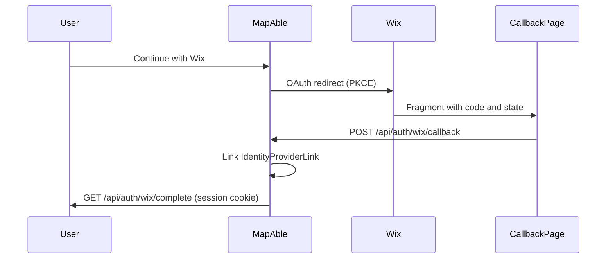

# Wix authentication bridge

MapAble can authenticate **existing** users through [Wix Headless](https://dev.wix.com/docs/go-headless) site members OAuth. Wix proves member identity; MapAble links that member to a `User` row by email and issues a Supabase JWT session.

## Prerequisites

1. A Wix Headless project with a **published** site (required for managed login).
2. A MapAble user account with the same email as the Wix member.
3. Environment variables configured (see below).

## Wix dashboard setup

1. Open **Headless settings** for your project and copy the **Client ID**.
2. Under **Allowed authorization redirect URIs**, add your callback URL exactly:
   - Production: `https://mapable.com.au/login/wix/callback`
   - Also add `https://www.mapable.com.au/login/wix/callback` if that host serves the app
   - Local: `http://localhost:3000/login/wix/callback`
3. Publish the connected Wix site from the project dashboard.

## Environment variables

```env
WIX_ENABLED=true
NEXT_PUBLIC_WIX_ENABLED=true
WIX_CLIENT_ID=your-headless-client-id
NEXT_PUBLIC_APP_URL=https://mapable.com.au
# Optional overrides (defaults derive from NEXT_PUBLIC_APP_URL):
# WIX_REDIRECT_URI=https://mapable.com.au/login/wix/callback
# WIX_LOGIN_ORIGIN_URI=https://mapable.com.au/login
APP_SECRET=... # required for bridge token signing (legacy NEXTAUTH_SECRET also works)
NEXT_PUBLIC_SUPABASE_URL=...
NEXT_PUBLIC_SUPABASE_ANON_KEY=...
SUPABASE_SERVICE_ROLE_KEY=... # required for session minting after link
```

Run `pnpm run check:integrations-env` after enabling Wix.

## Sign-in flow



## Routes

| Route | Purpose |
|-------|---------|
| `GET /api/auth/wix/login` | Start OAuth (optional `returnTo`) |
| `POST /api/auth/wix/callback` | Exchange code, link identity |
| `GET /api/auth/wix/complete` | Mint NextAuth session |
| `GET /api/auth/wix/logout` | Clear MapAble session and Wix logout |
| `/login/wix/callback` | Client page that reads URL fragment |

## Policies

- **No auto-registration:** If no MapAble user exists for the member email, sign-in fails with `no_account`.
- **Pending links:** If email collision rules apply, a pending `AuthIdentityLink` is created (same as Keycloak).
- **Operational permissions** are unchanged; Wix only establishes identity.

## Admin

- Status panel: `/admin/identity/wix`
- Integration key: `wix` in the integrations registry

## Troubleshooting

| Symptom | Likely cause |
|---------|----------------|
| Empty fragment on callback | Redirect URI mismatch or login not using `responseMode: fragment` |
| `wix_exchange_failed` | Unpublished Wix site or invalid client ID |
| `wix_no_email` | Member has no login email on Wix |
| `no_account` | No MapAble user with matching email |
| `wix_invalid_state` | Expired OAuth cookie or multiple tabs |

## Out of scope

- Auto-provisioning MapAble users from Wix members
- Using Wix member tokens for MapAble API authorization
- Wix CLI app OAuth (dashboard extensions)
